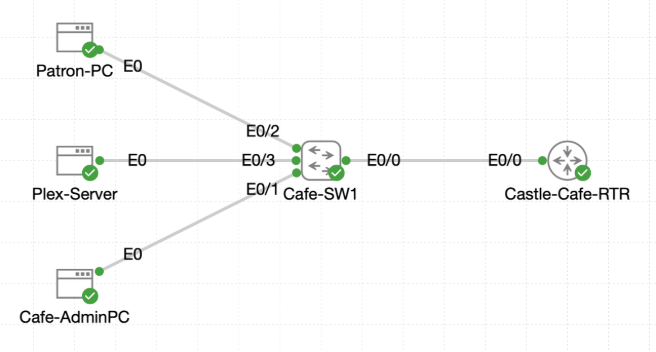

# Lab 054 - Deploying Access Control at Castle Rysen

<p class="back-link">
  <a href="../../Lab-index.html">← Back to Lab Index</a>
</p>

<table>
<tr>
<td colspan="2" valign="top">

<h1>Objective</h1>

<h4>Map the cafe patron, admin and management address spaces before applying access control.</h4>

<h4>Build and deploy a named extended ACL that allows approved Plex services from the patron VLAN into the admin VLAN.</h4>

<h4>Block all other patron-to-admin traffic while preserving wider network reachability.</h4>

<h4>Create a standard management ACL that limits remote access to trusted admin and Fallout Core management subnets.</h4>

<h4>Apply the management ACL to VTY lines on both Castle-Cafe-RTR and Cafe-SW1.</h4>

</td>
</tr>

<tr>
<td valign="top">

</td>
</tr>
</table>

---

## Scenario

This lab focuses on deploying access-control policy at the Castle Rysen cafe edge.

The cafe network contains a patron VLAN and an admin VLAN. Patrons need access to selected Plex services hosted in the admin network, but they should not have general access to the admin subnet. A second policy layer was also required for device management: only trusted admin and Fallout Core management addresses should be able to reach router and switch remote-login lines.

The deployment used two ACL types:

* A **named extended ACL** called `CAFE-FILTER` to control patron-to-admin traffic.
* A **named standard ACL** called `ADMIN-MGMT-ONLY` to control VTY management access.

---

## Devices Used

* Castle-Cafe-RTR
* Cafe-SW1
* patron-pc
* Cafe-AdminPC

---

## Addressing and Policy Plan

| Segment | Addressing | Role |
| --- | --- | --- |
| Admin VLAN | 10.0.18.0/27 | Admin hosts and Plex server subnet |
| Patron VLAN | 10.0.18.32/27 | Patron client subnet |
| Fallout Core management | 10.0.16.0/25 | Trusted management subnet |
| Plex server evidence target | 10.0.18.6 | Admin-side Plex service host |
| Cafe switch management target | 10.0.18.3 | Telnet/remote-management test target |

---

## Allowed Plex Services

| Protocol | Port | Purpose |
| --- | ---: | --- |
| TCP | 443 | HTTPS / secure service access |
| TCP | 32400 | Plex web/app access |
| TCP | 32469 | Plex discovery / service support |
| UDP | 1900 | SSDP / discovery |
| UDP | 5353 | mDNS / service discovery |

---

## Task 0 - Sketch the Access Control Plan

### Step 1 - Verify Router Interfaces

The router interface summary was checked first.

```bash
show ip interface brief
```

### Result

```bash
Interface              IP-Address      OK? Method Status                Protocol
Ethernet0/0            unassigned      YES TFTP   up                    up
Ethernet0/0.10         10.0.18.1       YES TFTP   up                    up
Ethernet0/0.20         10.0.18.33      YES TFTP   up                    up
Ethernet0/1            10.0.16.1       YES TFTP   up                    up
```

### Explanation

This confirmed the routed cafe VLAN interfaces and the management-facing interface were operational before applying ACLs.

---

### Step 2 - Confirm Cafe-SW1 Trunking

The switch trunk toward the router was checked.

```bash
show interfaces trunk
```

### Result

```bash
Port           Mode             Encapsulation  Status        Native vlan
Et0/0          on               802.1q         trunking      1

Port           Vlans allowed on trunk
Et0/0          10,20

Port           Vlans allowed and active in management domain
Et0/0          10,20

Port           Vlans in spanning tree forwarding state and not pruned
Et0/0          10,20
```

### Explanation

This proved that VLANs 10 and 20 were both permitted, active and forwarding on the trunk.

---

## Task 1 - Author the Cafe Extended Filter

### Step 3 - Build the Extended ACL

The named extended ACL `CAFE-FILTER` was created on `Castle-Cafe-RTR`.

```bash
configure terminal
ip access-list extended CAFE-FILTER
 remark Allow patron Plex access while shielding admin LAN
 permit tcp 10.0.18.32 0.0.0.31 10.0.18.0 0.0.0.31 eq 443
 permit tcp 10.0.18.32 0.0.0.31 10.0.18.0 0.0.0.31 eq 32400
 permit tcp 10.0.18.32 0.0.0.31 10.0.18.0 0.0.0.31 eq 32469
 permit udp 10.0.18.32 0.0.0.31 10.0.18.0 0.0.0.31 eq 1900
 permit udp 10.0.18.32 0.0.0.31 10.0.18.0 0.0.0.31 eq 5353
 deny ip 10.0.18.32 0.0.0.31 10.0.18.0 0.0.0.31
 permit ip any any
end
```

### Verification

```bash
show ip access-lists CAFE-FILTER
```

### Result

```bash
Extended IP access list CAFE-FILTER
    10 permit tcp 10.0.18.32 0.0.0.31 10.0.18.0 0.0.0.31 eq 443
    20 permit tcp 10.0.18.32 0.0.0.31 10.0.18.0 0.0.0.31 eq 32400
    30 permit tcp 10.0.18.32 0.0.0.31 10.0.18.0 0.0.0.31 eq 32469
    40 permit tcp 10.0.18.32 0.0.0.31 10.0.18.0 0.0.0.31 eq 1900
    50 permit tcp 10.0.18.32 0.0.0.31 10.0.18.0 0.0.0.31 eq 5353
    60 deny ip 10.0.18.32 0.0.0.31 10.0.18.0 0.0.0.31
    70 permit ip any any
```

### Important Correction

The later ACL counter output showed the final intended protocol mix:

```bash
40 permit udp 10.0.18.32 0.0.0.31 10.0.18.0 0.0.0.31 eq 1900
50 permit udp 10.0.18.32 0.0.0.31 10.0.18.0 0.0.0.31 eq 5353
```

This matters because ports 1900 and 5353 are UDP-based discovery services. The final counter output is the best evidence of the corrected ACL behaviour.

---

## Task 2 - Attach and Validate the Patron Filter

### Step 4 - Baseline Test from Patron PC

Before applying the ACL, the patron PC successfully reached Plex-style services and could also ping the admin-side host.

```bash
nc -vz -w 2 10.0.18.6 443
nc -vz -w 2 10.0.18.6 32400
ping -c 3 10.0.18.6
```

### Result

```bash
10.0.18.6 (10.0.18.6:443) open
10.0.18.6 (10.0.18.6:32400) open
```

```bash
3 packets transmitted, 3 packets received, 0% packet loss
```

### Explanation

This proved that before the ACL was applied, the patron VLAN had open access into the admin VLAN.

---

### Step 5 - Apply the ACL Inbound on the Patron Subinterface

The ACL was applied inbound on `Ethernet0/0.20`, the patron-facing router subinterface.

```bash
configure terminal
interface ethernet0/0.20
ip access-group CAFE-FILTER in
end
```

### Verification

```bash
show ip interface Ethernet0/0.20 | include access list
```

### Result

```bash
Inbound  access list is CAFE-FILTER
```

### Explanation

The ACL was placed close to the traffic source. This is the recommended placement for extended ACLs because it stops unwanted traffic before it travels further through the network.

---

### Step 6 - Validate Permitted Plex Traffic

After the ACL was applied, patron access to the permitted Plex ports still worked.

```bash
nc -vz -w 2 10.0.18.6 443
nc -vz -w 2 10.0.18.6 32400
```

### Result

```bash
10.0.18.6 (10.0.18.6:443) open
10.0.18.6 (10.0.18.6:32400) open
```

### Explanation

The required Plex-style services remained reachable from the patron VLAN.

---

### Step 7 - Validate Blocked Patron-to-Admin Traffic

Normal ping traffic into the admin VLAN was blocked.

```bash
ping -c 3 10.0.18.6
ping -c 3 10.0.18.4
```

### Result

```bash
3 packets transmitted, 0 packets received, 100% packet loss
```

### Explanation

The explicit deny statement blocked patron-to-admin traffic that did not match the approved Plex service permits.

---

### Step 8 - Review ACL Counters

```bash
show ip access-lists CAFE-FILTER
```

### Result

```bash
Extended IP access list CAFE-FILTER
    10 permit tcp 10.0.18.32 0.0.0.31 10.0.18.0 0.0.0.31 eq 443 (4 matches)
    20 permit tcp 10.0.18.32 0.0.0.31 10.0.18.0 0.0.0.31 eq 32400 (4 matches)
    30 permit tcp 10.0.18.32 0.0.0.31 10.0.18.0 0.0.0.31 eq 32469
    40 permit udp 10.0.18.32 0.0.0.31 10.0.18.0 0.0.0.31 eq 1900
    50 permit udp 10.0.18.32 0.0.0.31 10.0.18.0 0.0.0.31 eq 5353
    60 deny ip 10.0.18.32 0.0.0.31 10.0.18.0 0.0.0.31 (6 matches)
    70 permit ip any any (32 matches)
```

### Explanation

The counters confirmed the ACL was enforcing the intended policy:

* Permitted Plex ports generated matches.
* Blocked patron-to-admin traffic hit the deny rule.
* Other non-admin traffic continued to match the final `permit ip any any`.

---

## Task 3 - Lock Down Remote Access Paths

### Step 9 - Create the Management ACL on Castle-Cafe-RTR

A named standard ACL was created to control remote access to router VTY lines.

```bash
configure terminal
ip access-list standard ADMIN-MGMT-ONLY
 remark Restrict remote access to trusted desks
 permit 10.0.18.0 0.0.0.31
 permit 10.0.16.0 0.0.0.127
exit
line vty 0 4
 access-class ADMIN-MGMT-ONLY in
 transport input ssh telnet
end
write memory
```

### Verification

```bash
show running-config | section line vty
```

### Result

```bash
line vty 0 4
 access-class ADMIN-MGMT-ONLY in
 password cisco
 login
 transport input telnet ssh
```

### Explanation

The router now allowed VTY remote access only from:

* The cafe admin subnet: `10.0.18.0/27`
* The Fallout Core management subnet: `10.0.16.0/25`

All other sources were implicitly denied by the standard ACL.

---

### Step 10 - Apply the Same Management ACL on Cafe-SW1

The same VTY restriction was added to `Cafe-SW1`.

```bash
configure terminal
ip access-list standard ADMIN-MGMT-ONLY
 remark Restrict remote access to trusted desks
 permit 10.0.18.0 0.0.0.31
 permit 10.0.16.0 0.0.0.127
exit
line vty 0 4
 access-class ADMIN-MGMT-ONLY in
 transport input ssh telnet
end
write memory
```

### Explanation

This applied the same trusted-source management policy to the switch.

---

### Step 11 - Validate Unauthorized Patron Telnet Failure

From the patron PC:

```bash
telnet 10.0.18.3
```

### Result

```bash
telnet: can't connect to remote host (10.0.18.3): No route to host
```

### Explanation

The patron workstation was unable to establish the remote session. In the context of this lab, that confirmed unauthorized patron management access was not permitted.

---

### Step 12 - Validate Admin Telnet Success

From the admin PC:

```bash
telnet 10.0.18.3
```

### Result

```bash
Connected to 10.0.18.3

User Access Verification
Password:
```

### Explanation

The admin PC was allowed to reach the switch management session, confirming the management ACL permitted trusted admin access.

---

## Troubleshooting and Notes

### Issue 1 - Incorrect command entry while filtering interface output

#### Symptom

```bash
Castle-Cafe-RTR#enshow ip interface brief | include ethernet0/0 |ethernet0/1
                  ^
% Invalid input detected at '^' marker.
```

#### Cause

`en` was accidentally prefixed to the `show` command, and the pipe syntax was malformed.

#### Fix

The command was re-run with a valid filter:

```bash
show ip int brief | include Ethernet0/0|Ethernet0/1
```

---

### Issue 2 - ACL text was partially pasted with broken characters

Several ACL entry lines appeared with stray `$` characters in the command history. Despite the messy paste, the final `show ip access-lists CAFE-FILTER` output confirmed that the intended ACL entries were created.

---

### Issue 3 - UDP Plex discovery entries

The first ACL display showed TCP entries for ports 1900 and 5353, but the later counter output showed the corrected UDP versions:

```bash
40 permit udp ... eq 1900
50 permit udp ... eq 5353
```

The final counter output should be treated as the stronger verification evidence.

---

### Issue 4 - AdminPC transcript included copied patron prompt text

The `Cafe-AdminPC` section included pasted lines beginning with `cisco@patron-pc`. Those were command-entry artefacts. The meaningful final evidence is the successful admin Telnet session:

```bash
Connected to 10.0.18.3
User Access Verification
```

---

## Key Learning Points

* Extended ACLs can match source, destination, protocol and port.
* Named ACLs are easier to read and maintain than numbered ACLs.
* Extended ACLs should usually be placed close to the traffic source.
* Specific permit statements must be placed before broad deny statements.
* An explicit `deny ip` documents the intended block more clearly than relying only on the implicit deny.
* A final `permit ip any any` can preserve wider connectivity outside the protected path.
* Standard ACLs are suitable for VTY access control because only the source address matters.
* `access-class` applies to remote management lines, while `ip access-group` applies to routed interfaces.
* ACL counters are useful proof that a policy is matching the expected traffic.
* Service validation should test both allowed and denied traffic.

---

## Completion Check

The lab was completed successfully.

* Castle-Cafe-RTR interface status was verified.
* Cafe-SW1 trunk Et0/0 was confirmed as 802.1Q trunking.
* VLANs 10 and 20 were allowed, active and forwarding on the trunk.
* The extended ACL `CAFE-FILTER` was created.
* Plex service ports 443 and 32400 were tested successfully from the patron PC.
* The ACL was applied inbound on `Ethernet0/0.20`.
* `show ip interface Ethernet0/0.20` confirmed `Inbound access list is CAFE-FILTER`.
* Patron access to approved Plex ports continued to work.
* Patron ping traffic into the admin VLAN was blocked.
* ACL counters showed matches on the permit, deny and catch-all statements.
* The standard ACL `ADMIN-MGMT-ONLY` was created on Castle-Cafe-RTR.
* `ADMIN-MGMT-ONLY` was applied to the router VTY lines.
* The router configuration was saved.
* `ADMIN-MGMT-ONLY` was also created on Cafe-SW1.
* The switch VTY lines were restricted with the same ACL.
* Patron Telnet to the switch failed.
* Admin Telnet to the switch succeeded.
