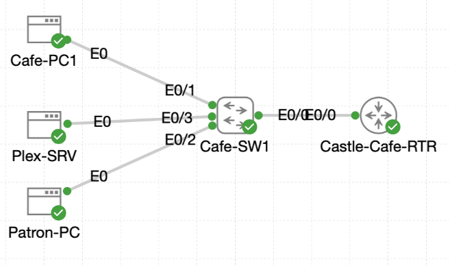

# Lab 055 - Consolidating Castle Cafe Access Control

<p class="back-link">
  <a href="../../Lab-index.html">← Back to Lab Index</a>
</p>

<table>
<tr>
<td colspan="2" valign="top">

<h1>Objective</h1>

<h4>Remove any legacy access-control references from the cafe router before introducing new ACL policy.</h4>

<h4>Use a named standard ACL to isolate a single problem workstation while preserving the rest of the cafe VLAN.</h4>

<h4>Use named extended ACLs to control ICMP and Plex-related traffic between the patron and cafe/admin segments.</h4>

<h4>Restrict remote management access so only trusted admin and Fallout management subnets can reach device consoles.</h4>

<h4>Capture interface bindings, ACL counters, reachability tests and saved configuration evidence for the portfolio record.</h4>

</td>
</tr>

<tr>
<td valign="top">

</td>
</tr>
</table>

---

## Scenario

This lab consolidates several access-control tasks across the Castle Rysen cafe network.

The cafe router terminates two VLANs using router-on-a-stick subinterfaces:

* VLAN 10, the cafe/admin segment, using `10.0.18.0/27`.
* VLAN 20, the patron segment, using `10.0.18.32/27`.

The Plex server sits inside VLAN 10 at `10.0.18.6`, while the patron workstation sits in VLAN 20 as `10.0.18.34`. The lab required a layered ACL approach:

1. Clean up old VTY ACL references.
2. Isolate `Cafe-PC1` with a standard ACL.
3. Permit only controlled ICMP behaviour from the patron VLAN.
4. Replace that with a Plex-focused perimeter ACL.
5. Restrict remote management access using a standard ACL on the router and switch VTY lines.

---

## Devices Used

* Castle-Cafe-RTR
* Cafe-SW1
* Cafe-PC1
* Patron-PC
* Plex-SRV

---

## Addressing Summary

| Device / Segment | Address | Purpose |
| --- | --- | --- |
| Castle-Cafe-RTR Ethernet0/0.10 | 10.0.18.1/27 | VLAN 10 cafe/admin gateway |
| Castle-Cafe-RTR Ethernet0/0.20 | 10.0.18.33/27 | VLAN 20 patron gateway |
| Castle-Cafe-RTR Ethernet0/1 | 10.0.16.1 | Fallout management-side connection |
| Cafe-PC1 | 10.0.18.2 | Workstation isolated by `PC1-FILTER` |
| Plex-SRV | 10.0.18.6 | Plex service target in VLAN 10 |
| Patron-PC | 10.0.18.34 | Patron workstation in VLAN 20 |
| Cafe-SW1 Vlan10 | 10.0.18.3/27 | Switch management SVI |
| Fallout management subnet | 10.0.16.0/25 | Trusted management subnet |

---

## ACL Summary

| ACL | Type | Purpose | Applied To |
| --- | --- | --- | --- |
| `PC1-FILTER` | Standard | Deny `10.0.18.2`, permit remaining VLAN 10 hosts | Inbound on `Ethernet0/0.10` |
| `S18-L03-FILTER` | Extended | Permit Patron-PC ICMP echo only to Plex-SRV, deny other Patron-PC echo traffic, permit other IP | Initially inbound on `Ethernet0/0.20` |
| `CAFE-FILTER` | Extended | Permit approved Plex ports from patron subnet to Plex-SRV, deny other patron-to-cafe traffic, permit everything else | Final inbound ACL on `Ethernet0/0.20` |
| `ADMIN-MGMT-ONLY` | Standard | Permit only cafe admin subnet and Fallout management subnet to remote management lines | VTY lines on router; intended for switch VTY lines |

---

## Task 1 - Purge the Legacy Filters

### Step 1 - Confirm Interface Baseline

The cafe router interfaces were checked before making ACL changes.

```bash
show ip int brief
```

### Result

```bash
Interface              IP-Address      OK? Method Status                Protocol
Ethernet0/0            unassigned      YES TFTP   up                    up
Ethernet0/0.10         10.0.18.1       YES TFTP   up                    up
Ethernet0/0.20         10.0.18.33      YES TFTP   up                    up
Ethernet0/1            10.0.16.1       YES TFTP   up                    up
```

### Explanation

This confirmed that both cafe VLAN gateways were up before applying access-control policy.

---

### Step 2 - Confirm No Active VTY Access-Class

The router VTY section was checked.

```bash
show running-config | section line vty
show running-config | include access-class
```

### Result

```bash
line vty 0 4
 password CastleRysen!
 login
 transport input telnet ssh
```

No active `access-class` statement was present.

---

### Step 3 - Remove Legacy ACL 50 References

Even though ACL 50 was not active, the cleanup commands were run.

```bash
configure terminal
line vty 0 4
no access-class 50 in
exit
no access-list 50
end
```

### Result

```bash
% Access-class 50 is not configured
```

### Explanation

The router reported that ACL 50 was not currently bound to the VTY lines. This still proved the configuration was clean before new policies were introduced.

---

## Task 2 - Isolate the Streaming Offender

### Step 4 - Create `PC1-FILTER`

A named standard ACL was created to block only Cafe-PC1 while allowing the rest of VLAN 10.

```bash
configure terminal
ip access-list standard PC1-FILTER
 deny host 10.0.18.2
 permit 10.0.18.0 0.0.0.31
exit
interface Ethernet0/0.10
 ip access-group PC1-FILTER in
end
```

### Verification

```bash
show ip interface Ethernet0/0.10
show ip access-lists PC1-FILTER
```

### Result

```bash
Inbound  access list is PC1-FILTER
```

```bash
Standard IP access list PC1-FILTER
    20 deny   10.0.18.2
    30 permit 10.0.18.0, wildcard bits 0.0.0.31
```

### Explanation

The ACL was applied inbound on the VLAN 10 subinterface. This meant traffic entering the router from the cafe/admin VLAN was checked immediately.

---

### Step 5 - Prove Cafe-PC1 Is Blocked

From Cafe-PC1:

```bash
ping -c 4 10.0.18.1
```

### Result

```bash
4 packets transmitted, 0 packets received, 100% packet loss
```

The ACL counter then confirmed deny matches:

```bash
Standard IP access list PC1-FILTER
    20 deny   10.0.18.2 (8 matches)
    30 permit 10.0.18.0, wildcard bits 0.0.0.31
```

### Explanation

This confirmed Cafe-PC1 was intentionally isolated from the router.

---

### Step 6 - Prove Other VLAN 10 Hosts Are Still Permitted

The Plex server was used as another VLAN 10 endpoint.

```bash
ping -c 4 10.0.18.1
```

### Result

```bash
4 packets transmitted, 4 packets received, 0% packet loss
```

The ACL then showed permit matches:

```bash
Standard IP access list PC1-FILTER
    20 deny   10.0.18.2 (8 matches)
    30 permit 10.0.18.0, wildcard bits 0.0.0.31 (8 matches)
```

### Explanation

The policy blocked only the offending host, not the whole cafe/admin VLAN.

---

## Task 3 - Balance Inter-VLAN Echo Traffic

### Step 7 - Create `S18-L03-FILTER`

An extended ACL was created so Patron-PC could send ICMP echo requests only to Plex-SRV.

```bash
configure terminal
ip access-list extended S18-L03-FILTER
 permit icmp host 10.0.18.34 host 10.0.18.6 echo
 deny icmp host 10.0.18.34 any echo
 permit ip any any
exit
interface Ethernet0/0.20
 ip access-group S18-L03-FILTER in
end
```

### Verification

```bash
show ip interface Ethernet0/0.20
```

### Result

```bash
Inbound  access list is S18-L03-FILTER
```

### Explanation

The ACL was applied inbound on the VLAN 20 subinterface because that is where Patron-PC traffic first reaches the router.

---

### Step 8 - Verify Allowed ICMP to Plex-SRV

From Patron-PC:

```bash
ping -c 4 10.0.18.6
```

### Result

```bash
4 packets transmitted, 4 packets received, 0% packet loss
```

ACL evidence:

```bash
Extended IP access list S18-L03-FILTER
    20 permit icmp host 10.0.18.34 host 10.0.18.6 echo (4 matches)
    30 deny icmp host 10.0.18.34 any echo
    40 permit ip any any (34 matches)
```

### Explanation

Patron-PC could ping Plex-SRV because that specific ICMP echo flow was explicitly permitted.

---

### Step 9 - Verify Other Patron ICMP Is Blocked

Patron-PC then attempted to ping the VLAN 20 gateway and Cafe-PC1.

```bash
ping -c 4 10.0.18.33
ping -c 4 10.0.18.2
```

### Result

```bash
4 packets transmitted, 0 packets received, 100% packet loss
```

ACL evidence:

```bash
Extended IP access list S18-L03-FILTER
    20 permit icmp host 10.0.18.34 host 10.0.18.6 echo (4 matches)
    30 deny icmp host 10.0.18.34 any echo (8 matches)
    40 permit ip any any (114 matches)
```

### Explanation

The deny statement blocked other ICMP echo traffic from Patron-PC, while the final permit kept non-ICMP traffic available.

---

## Task 4 - Lock Down the Plex Corridor

### Step 10 - Confirm VLAN Placement

Cafe-SW1 confirmed VLAN placement.

```bash
show vlan brief
```

### Result

```bash
10   VLAN0010                         active    Et0/1, Et0/3
20   VLAN0020                         active    Et0/2
```

### Explanation

This confirmed that VLAN 10 and VLAN 20 were present on the switch before replacing the ICMP-focused ACL with the Plex-focused ACL.

---

### Step 11 - Create and Apply `CAFE-FILTER`

The perimeter ACL was built to allow only approved Plex ports from the patron subnet to Plex-SRV.

```bash
configure terminal
ip access-list extended CAFE-FILTER
 remark Allow approved Patron-to-Plex services
 permit tcp 10.0.18.32 0.0.0.31 host 10.0.18.6 eq 443
 permit tcp 10.0.18.32 0.0.0.31 host 10.0.18.6 eq 32400
 permit tcp 10.0.18.32 0.0.0.31 host 10.0.18.6 eq 32469
 permit udp 10.0.18.32 0.0.0.31 host 10.0.18.6 eq 1900
 permit udp 10.0.18.32 0.0.0.31 host 10.0.18.6 eq 5353
 deny ip 10.0.18.32 0.0.0.31 10.0.18.0 0.0.0.31
 permit ip any any
exit
interface Ethernet0/0.20
 no ip access-group S18-L03-FILTER in
 ip access-group CAFE-FILTER in
end
```

### Verification

```bash
show ip interface Ethernet0/0.20
```

### Result

```bash
Inbound  access list is CAFE-FILTER
```

### Explanation

The final patron-facing policy became `CAFE-FILTER`. The earlier `S18-L03-FILTER` remained in the configuration for evidence, but it was no longer the active inbound ACL on `Ethernet0/0.20`.

---

### Step 12 - Validate Approved Plex Ports

From Patron-PC:

```bash
nc -vz -w 2 10.0.18.6 443
nc -vz -w 2 10.0.18.6 32400
nc -vz -w 2 10.0.18.6 32469
nc -vzu -w 2 10.0.18.6 1900
nc -vzu -w 2 10.0.18.6 5353
```

### Result

```bash
10.0.18.6 (10.0.18.6:443) open
10.0.18.6 (10.0.18.6:32400) open
10.0.18.6 (10.0.18.6:32469) open
10.0.18.6 (10.0.18.6:1900) open
10.0.18.6 (10.0.18.6:5353) open
```

### Explanation

The approved Plex-related services remained reachable from the patron subnet.

---

### Step 13 - Validate Unauthorised Patron-to-Cafe Traffic Is Blocked

From Patron-PC:

```bash
nc -vz -w 2 10.0.18.6 80
ping -c 4 10.0.18.6
```

### Result

```bash
nc: 10.0.18.6 (10.0.18.6:80): No route to host
```

```bash
4 packets transmitted, 0 packets received, 100% packet loss
```

### ACL Counter Evidence

```bash
Extended IP access list CAFE-FILTER
    20 permit tcp 10.0.18.32 0.0.0.31 host 10.0.18.6 eq 443 (4 matches)
    30 permit tcp 10.0.18.32 0.0.0.31 host 10.0.18.6 eq 32400 (4 matches)
    40 permit tcp 10.0.18.32 0.0.0.31 host 10.0.18.6 eq 32469 (3 matches)
    50 permit udp 10.0.18.32 0.0.0.31 host 10.0.18.6 eq 1900 (2 matches)
    60 permit udp 10.0.18.32 0.0.0.31 host 10.0.18.6 eq 5353 (2 matches)
    80 deny ip 10.0.18.32 0.0.0.31 10.0.18.0 0.0.0.31 (1 match)
    90 permit ip any any (62 matches)
```

### Explanation

The ACL allowed the approved Plex services and denied other patron-to-cafe traffic.

---

## Task 5 - Secure Console Access Across the Site

### Step 14 - Create `ADMIN-MGMT-ONLY` on Castle-Cafe-RTR

A named standard ACL was created for trusted management access.

```bash
configure terminal
ip access-list standard ADMIN-MGMT-ONLY
 10 remark Permit Cafe admin subnet
 10 permit 10.0.18.0 0.0.0.31
 30 remark Permit Fallout management subnet
 40 permit 10.0.16.0 0.0.0.127
exit
line vty 0 4
 access-class ADMIN-MGMT-ONLY in
 transport input ssh telnet
end
```

### Verification

```bash
show running-config | section line vty
show ip access-lists ADMIN-MGMT-ONLY
```

### Result

```bash
line vty 0 4
 access-class ADMIN-MGMT-ONLY in
 password CastleRysen!
 login
 transport input telnet ssh
```

```bash
Standard IP access list ADMIN-MGMT-ONLY
    10 permit 10.0.18.0, wildcard bits 0.0.0.31
    40 permit 10.0.16.0, wildcard bits 0.0.0.127
```

### Explanation

The router VTY lines were restricted to the cafe admin subnet and Fallout management subnet.

---

### Step 15 - Configure Management Access on Cafe-SW1

The same standard ACL was created on Cafe-SW1.

```bash
configure terminal
ip access-list standard ADMIN-MGMT-ONLY
 10 remark Permit Cafe admin subnet
 20 permit 10.0.18.0 0.0.0.31
 30 remark Permit Fallout management subnet
 40 permit 10.0.16.0 0.0.0.127
exit
line vty 0 4
 access-class ADMIN-MGMT-ONLY in
 transport input ssh telnet
end
```

The switch was also given a management SVI and default gateway.

```bash
configure terminal
interface vlan 10
 ip address 10.0.18.3 255.255.255.224
 no shutdown
exit
ip default-gateway 10.0.18.1
end
```

### Verification

```bash
show ip interface brief
```

### Result

```bash
Vlan10                 10.0.18.3       YES manual up                    up
```

### Important Note

The final captured switch running configuration contains a typo in the VTY access-class name:

```bash
line vty 0 4
 access-class ADIN-MGMT-ONLY in
 password CastleRysen!
 login
 transport input telnet ssh
```

The intended ACL is `ADMIN-MGMT-ONLY`, but the VTY line shows `ADIN-MGMT-ONLY`. This should be corrected before treating the switch management ACL as fully complete.

Corrective command:

```bash
configure terminal
line vty 0 4
 no access-class ADIN-MGMT-ONLY in
 access-class ADMIN-MGMT-ONLY in
end
copy running-config startup-config
```

---

### Step 16 - Validate Patron Remote Access Failure

From Patron-PC:

```bash
telnet 10.0.18.3
```

### Result

```bash
telnet: can't connect to remote host (10.0.18.3): No route to host
```

### Explanation

The patron workstation was unable to establish a remote session to the switch management address.

---

### Step 17 - Validate Admin Remote Access Success

From Cafe-PC1:

```bash
telnet 10.0.18.3
```

### Result

```bash
Connected to 10.0.18.3

User Access Verification
Password:
Cafe-SW1>
```

### Explanation

Cafe-PC1 could open a VTY session to Cafe-SW1 because it was in the permitted VLAN 10 subnet and reached the switch directly within that VLAN.

A live Cafe-PC1 Telnet test to the router was not possible because `PC1-FILTER` intentionally blocked Cafe-PC1 at the router subinterface before the traffic reached the VTY lines.

---

## Final Evidence Captured on Castle-Cafe-RTR

### Startup Configuration Saved

```bash
copy running-config startup-config
```

### ACL Counter Summary

```bash
Standard IP access list PC1-FILTER
    20 deny   10.0.18.2 (8 matches)
    30 permit 10.0.18.0, wildcard bits 0.0.0.31 (21 matches)
```

```bash
Extended IP access list S18-L03-FILTER
    20 permit icmp host 10.0.18.34 host 10.0.18.6 echo (4 matches)
    30 deny icmp host 10.0.18.34 any echo (8 matches)
    40 permit ip any any (270 matches)
```

```bash
Extended IP access list CAFE-FILTER
    20 permit tcp 10.0.18.32 0.0.0.31 host 10.0.18.6 eq 443 (4 matches)
    30 permit tcp 10.0.18.32 0.0.0.31 host 10.0.18.6 eq 32400 (4 matches)
    40 permit tcp 10.0.18.32 0.0.0.31 host 10.0.18.6 eq 32469 (3 matches)
    50 permit udp 10.0.18.32 0.0.0.31 host 10.0.18.6 eq 1900 (2 matches)
    60 permit udp 10.0.18.32 0.0.0.31 host 10.0.18.6 eq 5353 (2 matches)
    80 deny ip 10.0.18.32 0.0.0.31 10.0.18.0 0.0.0.31 (6 matches)
    90 permit ip any any (380 matches)
```

```bash
Standard IP access list ADMIN-MGMT-ONLY
    10 permit 10.0.18.0, wildcard bits 0.0.0.31
    40 permit 10.0.16.0, wildcard bits 0.0.0.127
```

### Interface Binding Summary

```bash
Ethernet0/0.10
  Inbound  access list is PC1-FILTER
```

```bash
Ethernet0/0.20
  Inbound  access list is CAFE-FILTER
```

---

## Troubleshooting and Notes

### Issue 1 - Legacy ACL cleanup messages

When `no access-class 50 in` was entered, IOS reported that ACL 50 was not configured. This was acceptable because the goal was to confirm and clean any inherited ACL references.

---

### Issue 2 - Incorrect login attempts on Linux hosts

Several login attempts used the wrong credentials before the correct account was used. For example, Cafe-PC1 eventually accepted the `patron` login.

---

### Issue 3 - Broken pasted ACL commands

Several ACL lines appeared in the raw CLI with `$` characters because of pasted command artefacts. The important evidence is the later `show ip access-lists` output, which confirms the actual ACL entries present in IOS.

---

### Issue 4 - Placeholder command used literally

The command below was entered literally on a Linux host:

```bash
telnet <SW1-MGMT-IP>
```

The shell returned:

```bash
-sh: syntax error: unexpected newline
```

The correct command used the real management IP:

```bash
telnet 10.0.18.3
```

---

### Issue 5 - Cafe-SW1 access-class typo

The final switch output showed:

```bash
access-class ADIN-MGMT-ONLY in
```

This appears to be a typo. The intended ACL name was:

```bash
ADMIN-MGMT-ONLY
```

This should be corrected on the switch VTY lines before the lab is considered fully clean.

---

## Key Learning Points

* Standard ACLs match source IP only and are useful for simple source-based filtering.
* Extended ACLs can match source, destination, protocol and port.
* Inbound ACLs on router subinterfaces are useful for stopping traffic as it enters the router.
* ACL order matters: specific permits must come before broader deny statements.
* A final `permit ip any any` prevents the ACL from blocking unrelated traffic through the implicit deny.
* VTY access control uses `access-class`, not `ip access-group`.
* Interface traffic filtering uses `ip access-group`, not `access-class`.
* ACL counters are valuable verification evidence because they prove which rules matched real traffic.
* Management ACL names must be typed exactly the same on the ACL definition and the VTY access-class statement.
* A host can be blocked from reaching the router while still reaching devices in its own VLAN directly.

---

## Completion Check

The lab was substantially completed, with one correction required on Cafe-SW1.

Completed successfully:

* Castle-Cafe-RTR interfaces were operational.
* Legacy ACL 50 was not present after cleanup.
* `PC1-FILTER` was created and applied inbound on `Ethernet0/0.10`.
* Cafe-PC1 was blocked from reaching the router gateway.
* Other VLAN 10 traffic was permitted.
* `S18-L03-FILTER` was created and tested for controlled ICMP behaviour.
* Patron-PC could ping Plex-SRV while other echo probes were denied.
* `CAFE-FILTER` replaced `S18-L03-FILTER` as the active patron-facing ACL.
* Patron-PC could reach the approved Plex service ports.
* Patron-PC was blocked from unauthorised patron-to-cafe traffic.
* Router ACL counters showed permit and deny matches.
* `ADMIN-MGMT-ONLY` was created on Castle-Cafe-RTR.
* Castle-Cafe-RTR VTY lines used `access-class ADMIN-MGMT-ONLY in`.
* Cafe-SW1 management SVI `Vlan10` was configured as `10.0.18.3/27` and came up/up.
* Patron-PC failed to Telnet to Cafe-SW1.
* Cafe-PC1 successfully opened a Telnet session to Cafe-SW1.
* Castle-Cafe-RTR running configuration was saved.

Correction still needed:

* Cafe-SW1 final VTY configuration shows `access-class ADIN-MGMT-ONLY in` instead of `access-class ADMIN-MGMT-ONLY in`. This should be corrected and saved.
