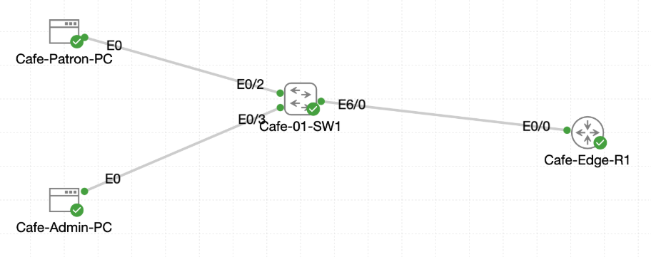

# Lab 056 - Configuring Switch Port Security

<p class="back-link">
  <a href="../../Lab-index.html">← Back to Lab Index</a>
</p>

<table>
<tr>
<td colspan="2" valign="top">

<h1>Objective</h1>

<h4>Secure the Admin workstation access port on Cafe-01-SW1 using Cisco switch port security.</h4>

<h4>Allow only one authorised MAC address on Ethernet0/3.</h4>

<h4>Trigger and observe a port-security violation using a spoofed rogue MAC address.</h4>

<h4>Recover the port from err-disabled state after a shutdown-mode violation.</h4>

<h4>Tune the violation response to restrict mode so future rogue frames are dropped while the port remains operational.</h4>

<h4>Enable sticky MAC learning and verify the secure address is stored in the running configuration.</h4>

</td>
</tr>

<tr>
<td valign="top">

</td>
</tr>
</table>

---

## Scenario

Castle Rysen needed to harden a single café access switchport used by the Admin workstation. The aim was to prevent an unauthorised device from being connected to the same access drop.

The lab used `Cafe-01-SW1` and focused on `Ethernet0/3`, which was connected to `Cafe-Admin-PC` in VLAN 10. First, the normal MAC address on the port was identified. Port security was then enabled with the default violation action of `shutdown`. A spoofed rogue MAC address was applied on the Linux host to simulate an unauthorised device, causing the switchport to become err-disabled.

After recovering the port, the policy was changed to `restrict` mode and sticky MAC learning was enabled. A second rogue MAC test confirmed that the interface stayed up while the violation counter increased.

---

## Devices Used

* Cafe-01-SW1
* Cafe-Admin-PC

---

## Addressing and Interface Summary

| Device | Interface | IP Address / VLAN | Purpose |
| ------ | --------- | ----------------- | ------- |
| Cafe-01-SW1 | Ethernet0/3 | VLAN 10 | Admin workstation access port |
| Cafe-Admin-PC | eth0 | 10.0.18.10/27 | Admin workstation |
| Default gateway | Router gateway | 10.0.18.1 | Test destination |

---

## Port Security Plan

| Setting | Initial Value | Final Value |
| ------- | ------------- | ----------- |
| Interface | Ethernet0/3 | Ethernet0/3 |
| Switchport mode | Access | Access |
| Maximum MAC addresses | 1 | 1 |
| Violation mode | Shutdown | Restrict |
| Sticky learning | Disabled | Enabled |
| Port result on rogue MAC | Err-disabled | Stays up and drops rogue frames |

---

## Task 0 - Verify the Baseline

### Step 1 - Check Switch Interface State

The switch interface summary showed that `Ethernet0/3` was physically up.

```bash
show ip int brief
```

### Evidence

```bash
Ethernet0/3            unassigned      YES unset  up                    up
```

### Explanation

This confirmed the admin workstation link was operational before port security was enabled.

---

### Step 2 - Record the Current MAC Address

The MAC address table was checked for the admin workstation port.

```bash
show mac address-table interface Ethernet0/3
```

### Evidence

```bash
Vlan    Mac Address       Type        Ports
----    -----------       --------    -----
  10    5254.001b.1e8e    DYNAMIC     Et0/3
```

### Explanation

The switch had learned one dynamic MAC address on `Ethernet0/3`: `5254.001b.1e8e`.

This was the original Admin workstation MAC address and was recorded as the intended authorised device identity.

---

### Step 3 - Confirm the Access Port Status

```bash
show interface Ethernet0/3 status
```

### Evidence

```bash
Port         Name               Status       Vlan       Duplex  Speed Type
Et0/3        Admin Workstation  connected    10           full   auto 10/100/1000BaseTX
```

### Explanation

The port was connected, assigned to VLAN 10, and labelled as the Admin Workstation port.

---

## Task 1 - Harden the Admin Drop

### Step 4 - Enable Port Security

Port security was enabled on `Ethernet0/3`.

```bash
configure terminal
interface Ethernet0/3
switchport mode access
switchport port-security
end
```

### Explanation

`switchport port-security` enables Layer 2 source-MAC enforcement on the port. By default, the maximum secure MAC count is 1 and the violation action is `shutdown`.

---

### Step 5 - Verify Port Security Status

```bash
show port-security interface Ethernet 0/3
```

### Evidence

```bash
Port Security              : Enabled
Port Status                : Secure-up
Violation Mode             : Shutdown
Maximum MAC Addresses      : 1
Total MAC Addresses        : 1
Configured MAC Addresses   : 0
Sticky MAC Addresses       : 0
Last Source Address:Vlan   : 5254.001b.1e8e:10
Security Violation Count   : 0
```

### Explanation

The port was secured and still operational. At this stage, the violation mode was the default `shutdown`, meaning a rogue MAC would place the port into an err-disabled state.

---

### Step 6 - Confirm the MAC Became Secure

```bash
show mac address-table interface ethernet 0/3
```

### Evidence

```bash
Vlan    Mac Address       Type        Ports
----    -----------       --------    -----
  10    5254.001b.1e8e    STATIC      Et0/3
```

### Explanation

After port security was enabled, the previously learned address was treated as a secure address on the port.

---

## Task 2 - Handle a Violation

### Step 7 - Record the Admin PC MAC Address

On the Linux host, `ifconfig eth0` showed the original hardware address.

```bash
ifconfig eth0
```

### Evidence

```bash
eth0      Link encap:Ethernet  HWaddr 52:54:00:1B:1E:8E
          inet addr:10.0.18.10  Bcast:10.0.18.31  Mask:255.255.255.224
```

### Explanation

The Linux host represented the same MAC as the switch output, written in Linux format as `52:54:00:1B:1E:8E`.

---

### Step 8 - Spoof a Rogue MAC Address

The Admin PC was temporarily changed to a rogue source MAC address.

```bash
sudo ifconfig eth0 down
sudo ifconfig eth0 hw ether 02:11:22:33:44:55
sudo ifconfig eth0 up
sudo ifconfig eth0 10.0.18.10 netmask 255.255.255.224 up
sudo route add default gw 10.0.18.1 eth0
ping -c 3 10.0.18.1
```

### Evidence

```bash
3 packets transmitted, 0 packets received, 100% packet loss
```

### Explanation

The ping generated frames with the spoofed MAC address. Because the port only allowed one secure MAC address, this triggered a port-security violation.

---

### Step 9 - Observe the Shutdown-Mode Violation

```bash
show port-security
show port-security interface ethernet 0/3
show interface ethernet0/3 status
```

### Evidence

```bash
Secure Port  MaxSecureAddr  CurrentAddr  SecurityViolation  Security Action
---------------------------------------------------------------------------
      Et0/3              1            0                  1         Shutdown
```

```bash
Port Security              : Enabled
Port Status                : Secure-shutdown
Violation Mode             : Shutdown
Last Source Address:Vlan   : 0211.2233.4455:10
Security Violation Count   : 1
```

```bash
Port         Name               Status       Vlan       Duplex  Speed Type
Et0/3        Admin Workstation  err-disabled 10           full   auto 10/100/1000BaseTX
```

### Explanation

The switch detected traffic from the unauthorised MAC address `0211.2233.4455`. Because the port was still using shutdown mode, `Ethernet0/3` moved into an err-disabled secure-shutdown state.

---

### Step 10 - Attempt to Restore the Admin MAC Address

The original MAC was meant to be restored on the Linux host.

```bash
sudo ifconfig eth0 down
sudo ifconfig eth0 hw ether 52:54:00:1B:1E:8E
sudo ifconfig eth0 up
sudo ifconfig eth0 10.0.18.10 netmask 255.255.255.224 up
sudo route add default gw 10.0.18.1 eth0
```

### Note from the Captured Output

The pasted CLI shows a typo during the restore attempt:

```bash
sudo ifconfig eth0 hw ethr 52:54:00:1B:1E:8E
```

Because `ethr` is not valid syntax, BusyBox displayed the `ifconfig` help output. This means the intended MAC restore did not complete at that moment.

This matters later because sticky MAC learning captured the spoofed address rather than the original admin workstation address.

---

### Step 11 - Recover the Err-Disabled Port

The switchport was reset with a shutdown / no shutdown cycle.

```bash
configure terminal
interface ethernet0/3
shutdown
no shutdown
end
```

### Verification

```bash
show port-security interface ethernet 0/3
show ip interface brief | include Ethernet0/3
```

### Evidence

```bash
Port Security              : Enabled
Port Status                : Secure-up
Violation Mode             : Shutdown
Last Source Address:Vlan   : 0211.2233.4455:10
Security Violation Count   : 1
```

```bash
Ethernet0/3            unassigned      YES unset  up                    up
```

### Explanation

The port recovered to an operational `Secure-up` state, but the last violation source remained visible in the port-security output.

---

## Task 3 - Tune the Response

### Step 12 - Change Violation Mode to Restrict and Enable Sticky Learning

```bash
configure terminal
interface ethernet0/3
switchport port-security violation restrict
switchport port-security
switchport port-security mac-address sticky
end
```

### Verification

```bash
show port-security interface Ethernet0/3
```

### Evidence

```bash
Port Security              : Enabled
Port Status                : Secure-up
Violation Mode             : Restrict
Maximum MAC Addresses      : 1
Total MAC Addresses        : 1
Sticky MAC Addresses       : 1
Last Source Address:Vlan   : 0211.2233.4455:10
Security Violation Count   : 1
```

### Explanation

Restrict mode keeps the port up, drops frames from unauthorised MAC addresses, and increments the violation counter. Sticky learning stores the learned secure MAC address in the running configuration.

---

### Step 13 - Verify Sticky MAC Configuration

```bash
show running-config interface Ethernet0/3
show port-security address
```

### Evidence

```bash
interface Ethernet0/3
 description Admin Workstation
 switchport access vlan 10
 switchport mode access
 switchport port-security violation restrict
 switchport port-security mac-address sticky
 switchport port-security mac-address sticky 0211.2233.4455
 switchport port-security
 spanning-tree portfast
```

```bash
Vlan    Mac Address       Type                          Ports   Remaining Age
----    -----------       ----                          -----   -------------
  10    0211.2233.4455    SecureSticky                  Et0/3        -
```

### Important Finding

The switch successfully stored a sticky secure MAC address, but the address stored in the evidence was `0211.2233.4455`, not the original Admin workstation MAC `5254.001b.1e8e`.

This happened because the Admin PC MAC restore command was mistyped before sticky learning was enabled, so the switch learned and stored the spoofed address.

### Recommended Correction

For a production-quality final state, restore the original admin MAC and replace the sticky entry:

```bash
configure terminal
interface Ethernet0/3
no switchport port-security mac-address sticky 0211.2233.4455
shutdown
no shutdown
end
```

Then on the Admin PC:

```bash
sudo ifconfig eth0 down
sudo ifconfig eth0 hw ether 52:54:00:1B:1E:8E
sudo ifconfig eth0 up
sudo ifconfig eth0 10.0.18.10 netmask 255.255.255.224 up
sudo route add default gw 10.0.18.1 eth0
```

Generate traffic and verify the sticky address becomes:

```bash
switchport port-security mac-address sticky 5254.001b.1e8e
```

---

### Step 14 - Repeat Rogue MAC Test in Restrict Mode

A second rogue MAC was applied to prove that restrict mode would keep the port up.

```bash
sudo ifconfig eth0 down
sudo ifconfig eth0 hw ether 02:22:33:44:55:66
sudo ifconfig eth0 up
sudo ifconfig eth0 10.0.18.10 netmask 255.255.255.224 up
sudo route add default gw 10.0.18.1 eth0
ping -c 3 10.0.18.1
```

### Evidence

```bash
3 packets transmitted, 0 packets received, 100% packet loss
```

The switch showed the port remained up while the violation count increased.

```bash
Port Security              : Enabled
Port Status                : Secure-up
Violation Mode             : Restrict
Maximum MAC Addresses      : 1
Total MAC Addresses        : 1
Sticky MAC Addresses       : 1
Last Source Address:Vlan   : 0222.3344.5566:10
Security Violation Count   : 29
```

```bash
Port         Name               Status       Vlan       Duplex  Speed Type
Et0/3        Admin Workstation  connected    10           full   auto 10/100/1000BaseTX
```

### Explanation

The second rogue source MAC was blocked, but the interface stayed connected. This confirmed the difference between `shutdown` and `restrict` modes:

* `shutdown` disables the port after a violation.
* `restrict` drops unauthorised frames but keeps the port up and records violations.

---

## Troubleshooting and Notes

### Issue 1 - Initial Admin PC ping failed before the violation test

The first Admin PC ping to `10.0.18.1` failed even before the rogue MAC test. This did not prevent the port-security lab from working because the purpose of the ping was to generate traffic on the wire. The switch still learned and enforced MAC addresses correctly.

---

### Issue 2 - Interface command spacing

Several verification commands were entered with partial or unusual spacing, for example:

```bash
show port-security interface Ethernet 0/3
```

IOS accepted the command and returned the required port-security output.

---

### Issue 3 - MAC restore typo

The command below was invalid:

```bash
sudo ifconfig eth0 hw ethr 52:54:00:1B:1E:8E
```

The correct syntax is:

```bash
sudo ifconfig eth0 hw ether 52:54:00:1B:1E:8E
```

Because of this typo, the sticky MAC address captured later was the spoofed MAC `0211.2233.4455`.

---

## Key Learning Points

* Port security controls which source MAC addresses may use an access port.
* The default maximum secure MAC count is 1.
* The default violation mode is `shutdown`.
* Shutdown mode places the port into an err-disabled secure-shutdown state after a violation.
* A shutdown / no shutdown cycle can recover the interface after correcting the problem.
* Restrict mode drops unauthorised frames but keeps the port operational.
* Restrict mode increments the violation counter, which is useful for evidence and monitoring.
* Sticky MAC learning writes the learned secure MAC into the running configuration.
* Sticky learning should only be enabled after confirming the authorised device MAC is currently present on the port.
* Linux MAC spoofing in this lab is only a simulation tool; the main learning objective is the Cisco switch behaviour.

---

## Completion Check

The lab was completed with one important sticky-MAC caveat.

* `Ethernet0/3` was confirmed up/up before configuration.
* The original Admin workstation MAC was recorded as `5254.001b.1e8e`.
* Port security was enabled on `Ethernet0/3`.
* The port initially showed `Secure-up` with violation mode `Shutdown`.
* A rogue MAC address `0211.2233.4455` triggered a port-security violation.
* The port entered `Secure-shutdown` / err-disabled state.
* The violation counter increased to 1.
* The port was recovered with a shutdown / no shutdown cycle.
* Violation mode was changed to `restrict`.
* Sticky MAC learning was enabled.
* A sticky MAC address was stored in the running configuration.
* A second rogue MAC address `0222.3344.5566` was blocked while the port stayed connected.
* The violation counter increased to 29 in restrict mode.
* Final evidence showed the port as connected and secure-up.
* Caveat: the sticky MAC stored in the captured output was `0211.2233.4455`, which was the spoofed MAC, not the original Admin workstation MAC. This should be corrected before treating the configuration as production-ready.
