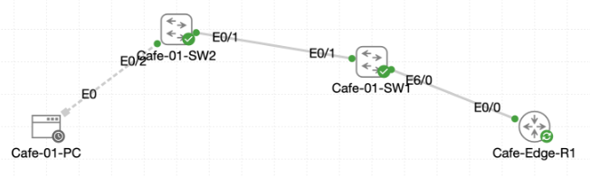

# Lab 057 - Configuring DHCP Snooping

<p class="back-link">
  <a href="../../Lab-index.html">← Back to Lab Index</a>
</p>

<table>
<tr>
<td colspan="2" valign="top">

<h1>Objective</h1>

<h4>Enable DHCP snooping on the cafe switching path for VLANs 10 and 20.</h4>

<h4>Protect access ports from rogue DHCP offers by trusting only the approved uplinks.</h4>

<h4>Configure the router-facing and switch-to-switch links as 802.1Q trunks.</h4>

<h4>Verify that Cafe-01-PC can still receive a DHCP lease through the trusted path.</h4>

<h4>Document DHCP snooping trust state, trunk state, client addressing and the known IOS XE binding-table limitation.</h4>

</td>
</tr>

<tr>
<td valign="top">

</td>
</tr>
</table>

---

## Scenario

This lab hardens DHCP behaviour in the Castle Rysen cafe network.

The network uses a router-on-a-stick design on `Cafe-Edge-R1`, with VLAN 10 and VLAN 20 carried across trunks through `Cafe-01-SW1` and `Cafe-01-SW2`. `Cafe-01-PC` sits in VLAN 20 and receives its IPv4 address from the router.

The goal was to enable DHCP snooping so that only trusted uplinks are allowed to carry DHCP server responses. Access ports remain untrusted by default, preventing a rogue DHCP server from handing out false addressing information to clients.

The lab also included a known IOS XE image warning. In this environment, DHCP leases worked and the router showed the client binding, but the switch DHCP snooping binding tables remained empty. The lab instructions specifically note that this can happen on affected Cat9KV IOS XE images, so the authoritative proof is the correct trunk and trust configuration plus successful DHCP operation.

---

## Devices Used

* Cafe-Edge-R1
* Cafe-01-SW1
* Cafe-01-SW2
* Cafe-01-PC

---

## Addressing and VLAN Plan

| VLAN | Purpose | Gateway | Client Evidence |
| --- | --- | --- | --- |
| 10 | Admin VLAN | 10.1.10.1 | Present on router subinterface Ethernet0/0.10 |
| 20 | Patron / client VLAN | 10.1.20.1 | Cafe-01-PC received 10.1.20.11 |

---

## DHCP Snooping Trust Plan

| Device | Interface | Link Role | Trunk VLANs | DHCP Snooping Trust |
| --- | --- | --- | --- | --- |
| Cafe-01-SW1 | Ethernet6/0 | Uplink to Cafe-Edge-R1 | 10,20 | Trusted |
| Cafe-01-SW1 | Ethernet0/1 | Trunk to Cafe-01-SW2 | 10,20 | Trusted |
| Cafe-01-SW2 | Ethernet0/1 | Trunk to Cafe-01-SW1 | 10,20 | Trusted |
| Cafe-01-SW2 | Ethernet0/2 | Access port to Cafe-01-PC | VLAN 20 | Untrusted |

---

## Important Environment Note

The lab brief warned that the Cat9KV IOS XE 17.16.01a and 17.15.01 images can have DHCP snooping limitations in CML. DHCP frames may not appear correctly in the switch snooping binding table or statistics, even though the client and router prove DHCP is working.

In this evidence, the client successfully received a lease and the router recorded a DHCP binding. Both switches also showed the correct snooping and trust configuration. However, the snooping binding tables on the switches remained empty, matching the known image limitation.

---

## Task 0 - Confirm the Baseline

### Step 1 - Enable the Router Trunk

The physical router interface was enabled first so the VLAN subinterfaces could pass traffic.

```bash
configure terminal
interface Ethernet0/0
no shutdown
end
```

### Verification

```bash
show ip interface brief | include Ethernet0/0
```

### Result

```bash
Ethernet0/0            unassigned      YES unset  up                    up
Ethernet0/0.10         10.1.10.1       YES TFTP   up                    up
Ethernet0/0.20         10.1.20.1       YES TFTP   up                    up
```

### Explanation

The parent interface and both subinterfaces were up/up. This confirmed that router-on-a-stick routing was available for VLANs 10 and 20.

---

### Step 2 - Check DHCP Binding Baseline on the Router

```bash
show ip dhcp binding
```

### Initial Result

```bash
Bindings from all pools not associated with VRF:
IP address      Client-ID/              Lease expiration        Type       State      Interface
                Hardware address/
                User name
```

### Explanation

At this stage, there was no visible DHCP binding yet. The client lease test was performed next.

---

### Step 3 - Confirm the Cafe-01-PC Access Port

On `Cafe-01-SW2`, the access interface to the client was checked.

```bash
show interface Ethernet0/2 status
show vlan brief | include Et0/2
```

### Result

```bash
Port         Name               Status       Vlan       Duplex  Speed Type
Et0/2        Cafe-01-PC         connected    20           full   auto 10/100/1000BaseTX
```

```bash
20   VLAN0020                         active    Et0/2
```

### Explanation

This confirmed that `Cafe-01-PC` was connected to an access port in VLAN 20.

---

### Step 4 - Obtain a Baseline DHCP Lease

On `Cafe-01-PC`, the current address was cleared and DHCP was renewed.

```bash
sudo ifconfig eth0 0.0.0.0
sudo udhcpc -i eth0 -n -q
```

### Result

```bash
udhcpc: broadcasting discover
udhcpc: broadcasting select for 10.1.20.11, server 10.1.20.1
udhcpc: lease of 10.1.20.11 obtained from 10.1.20.1, lease time 86400
```

### Client Address Verification

```bash
ifconfig eth0
route -n
```

### Result

```bash
inet addr:10.1.20.11  Bcast:10.1.20.255  Mask:255.255.255.0
```

```bash
Destination     Gateway         Genmask         Flags Metric Ref    Use Iface
0.0.0.0         10.1.20.1       0.0.0.0         UG    0      0        0 eth0
10.1.20.0       0.0.0.0         255.255.255.0   U     0      0        0 eth0
```

### Explanation

The client successfully received `10.1.20.11/24` from the router and installed `10.1.20.1` as its default gateway.

---

## Task 1 - Activate DHCP Snooping on Cafe-01-SW1

### Step 5 - Enable DHCP Snooping Globally and for VLANs 10 and 20

```bash
configure terminal
ip dhcp snooping
ip dhcp snooping vlan 10,20
no ip dhcp snooping information option
end
```

### Verification

```bash
show running-config | include ip dhcp snooping
show ip dhcp snooping
```

### Result

```bash
ip dhcp snooping vlan 10,20
no ip dhcp snooping information option
ip dhcp snooping
```

```bash
Switch DHCP snooping is enabled
DHCP snooping is configured on following VLANs:
10,20
DHCP snooping is operational on following VLANs:
10,20
Insertion of option 82 is disabled
```

### Explanation

DHCP snooping was enabled on the distribution switch for VLANs 10 and 20. Option 82 insertion was disabled so the switch would not modify DHCP packets in a way the router might reject.

At this point, no trusted interfaces had been configured yet.

---

## Task 2 - Configure Trunks and Trust on Cafe-01-SW1

### Step 6 - Configure the Trunk to Cafe-01-SW2

```bash
configure terminal
interface Ethernet0/1
switchport trunk encapsulation dot1q
switchport mode trunk
switchport trunk allowed vlan 10,20
no shutdown
exit
```

### Step 7 - Configure the Router Uplink Trunk

```bash
interface Ethernet6/0
switchport trunk encapsulation dot1q
switchport mode trunk
switchport trunk allowed vlan 10,20
no shutdown
exit
end
```

### Verification

```bash
show interfaces trunk
```

### Result

```bash
Port           Mode             Encapsulation  Status        Native vlan
Et0/1          on               802.1q         trunking      1
Et6/0          on               802.1q         trunking      1

Port           Vlans allowed on trunk
Et0/1          10,20
Et6/0          10,20

Port           Vlans allowed and active in management domain
Et0/1          10,20
Et6/0          10,20

Port           Vlans in spanning tree forwarding state and not pruned
Et0/1          10,20
Et6/0          10,20
```

### Explanation

Both uplinks on `Cafe-01-SW1` were operating as trunks and carrying VLANs 10 and 20.

---

### Step 8 - Trust the DHCP Uplinks on Cafe-01-SW1

The uplinks were then trusted for DHCP snooping.

```bash
configure terminal
interface Ethernet6/0
ip dhcp snooping trust
exit
interface Ethernet0/1
ip dhcp snooping trust
end
```

### Verification

```bash
show ip dhcp snooping
```

### Result

```bash
DHCP snooping trust/rate is configured on the following Interfaces:

Interface                  Trusted    Allow option    Rate limit (pps)
-----------------------    -------    ------------    ----------------
Ethernet0/1                      yes        yes             unlimited
Ethernet6/0                      yes        yes             unlimited
```

### Explanation

This confirmed that only the router-facing uplink and the switch-to-switch trunk were trusted on `Cafe-01-SW1`.

---

## Task 3 - Configure Trunk and DHCP Snooping on Cafe-01-SW2

### Step 9 - Configure the Access Switch

```bash
configure terminal
ip dhcp snooping
ip dhcp snooping vlan 10,20
no ip dhcp snooping information option
interface Ethernet0/1
switchport trunk encapsulation dot1q
switchport mode trunk
switchport trunk allowed vlan 10,20
ip dhcp snooping trust
end
```

### Trunk Verification

```bash
show interfaces trunk
```

### Result

```bash
Port           Mode             Encapsulation  Status        Native vlan
Et0/1          on               802.1q         trunking      1

Port           Vlans allowed on trunk
Et0/1          10,20

Port           Vlans allowed and active in management domain
Et0/1          20

Port           Vlans in spanning tree forwarding state and not pruned
Et0/1          20
```

### Explanation

`Cafe-01-SW2` was configured to carry VLANs 10 and 20, but only VLAN 20 was active locally. This is expected from the captured switch state because `Cafe-01-PC` is attached to VLAN 20 and VLAN 10 was not present in the active VLAN database on this access switch.

---

### Step 10 - Verify DHCP Snooping on Cafe-01-SW2

```bash
show ip dhcp snooping
```

### Result

```bash
Switch DHCP snooping is enabled
DHCP snooping is configured on following VLANs:
10,20
DHCP snooping is operational on following VLANs:
20
Insertion of option 82 is disabled

DHCP snooping trust/rate is configured on the following Interfaces:

Interface                  Trusted    Allow option    Rate limit (pps)
-----------------------    -------    ------------    ----------------
Ethernet0/1                      yes        yes             unlimited
```

### Explanation

The access switch had DHCP snooping enabled. Its uplink `Ethernet0/1` was trusted, while the client-facing access port remained untrusted by default.

---

## Task 4 - Validate DHCP Flow and Snooping State

### Step 11 - Renew the Client Lease After Snooping

The client lease was renewed again after DHCP snooping and trust were configured.

```bash
sudo ifconfig eth0 0.0.0.0
sudo udhcpc -i eth0 -n -q
```

### Result

```bash
udhcpc: broadcasting discover
udhcpc: broadcasting select for 10.1.20.11, server 10.1.20.1
udhcpc: lease of 10.1.20.11 obtained from 10.1.20.1, lease time 86400
```

### Explanation

The DHCP lease still completed successfully through the protected path.

---

### Step 12 - Confirm Client Addressing and Gateway Reachability

```bash
ifconfig eth0
route -n
ping -c 3 10.1.20.1
```

### Result

```bash
inet addr:10.1.20.11  Bcast:10.1.20.255  Mask:255.255.255.0
```

```bash
0.0.0.0         10.1.20.1       0.0.0.0         UG    0      0        0 eth0
10.1.20.0       0.0.0.0         255.255.255.0   U     0      0        0 eth0
```

```bash
3 packets transmitted, 3 packets received, 0% packet loss
round-trip min/avg/max = 1.487/1.923/2.698 ms
```

### Explanation

The client retained a valid DHCP address in the `10.1.20.0/24` network and could ping its default gateway.

---

### Step 13 - Confirm Router DHCP Binding

```bash
show ip dhcp binding
```

### Result

```bash
IP address      Client-ID/              Lease expiration        Type       State      Interface
10.1.20.11      0152.5400.ac84.39       Aug 19 2026 03:34 PM    Automatic  Active     Ethernet0/0.20
```

### Explanation

The router recorded an active DHCP binding for `Cafe-01-PC`. This confirmed that the router successfully leased the address to the client.

---

### Step 14 - Confirm Switch Snooping Binding Behaviour

On both switches, the DHCP snooping binding tables were checked.

```bash
show ip dhcp snooping binding
```

### Result on Cafe-01-SW2

```bash
MacAddress          IpAddress        Lease(sec)  Type           VLAN  Interface
------------------  ---------------  ----------  -------------  ----  --------------------
Total number of bindings: 0
```

### Result on Cafe-01-SW1

```bash
MacAddress          IpAddress        Lease(sec)  Type           VLAN  Interface
------------------  ---------------  ----------  -------------  ----  --------------------
Total number of bindings: 0
```

### Explanation

The binding tables stayed empty even though DHCP succeeded and the router recorded the lease. This matches the lab's IOS XE image limitation note. In this environment, the correct proof is therefore:

* DHCP snooping enabled on the switches.
* Option 82 disabled.
* Correct uplinks trusted.
* Trunks carrying the required VLANs.
* Client lease successful.
* Router DHCP binding present.

---

### Step 15 - Check DHCP Snooping Statistics

```bash
show ip dhcp snooping statistics
```

### Result

```bash
Packets Forwarded                                     = 0
Packets Dropped                                       = 0
Packets Dropped From untrusted ports                  = 0
```

### Explanation

The zero packet counters also align with the noted IOS XE/CML limitation. This was not treated as a configuration failure because the feature, trust state, trunk state and DHCP lease evidence were all correct.

---

## Troubleshooting and Notes

### Issue 1 - Initial DHCP binding table was empty

The router initially showed no DHCP leases. After renewing the client lease, the router recorded `10.1.20.11` as an active automatic binding.

---

### Issue 2 - Cafe-01-SW1 initially had no active trunk output

The first `show interfaces trunk` on `Cafe-01-SW1` returned no trunk entries. The trunk configuration was then applied to `Ethernet0/1` and `Ethernet6/0`.

---

### Issue 3 - Cafe-01-SW2 only showed VLAN 20 active

Although VLANs 10 and 20 were allowed on the trunk, `Cafe-01-SW2` only showed VLAN 20 as active and forwarding. This made sense for the access-switch evidence because the connected client port was in VLAN 20.

---

### Issue 4 - DHCP snooping binding tables stayed empty

Both switch binding tables showed zero entries. The lab advisory explains that affected Cat9KV IOS XE images can show this behaviour even when DHCP traffic is working. The successful client lease and router binding were therefore used alongside the trust/trunk outputs as proof of completion.

---

## Key Learning Points

* DHCP snooping protects clients from rogue DHCP servers.
* Trusted ports should face legitimate DHCP servers or trusted uplinks.
* Access ports should remain untrusted by default.
* DHCP snooping must be enabled globally and per VLAN.
* Option 82 can be disabled with `no ip dhcp snooping information option` when the upstream DHCP server may reject inserted relay-agent information.
* Router-on-a-stick DHCP requires the parent trunk and subinterfaces to be up/up.
* Trunks must carry the relevant VLANs before DHCP can cross between switches.
* `show ip dhcp snooping` is the main verification command when interface-specific snooping commands are unavailable.
* In affected CML IOS XE images, an empty snooping binding table is not automatically a failed configuration.
* Always combine client, router, trunk and snooping evidence when validating DHCP snooping.

---

## Completion Check

The lab was completed successfully, with the known image limitation noted.

* `Cafe-Edge-R1` Ethernet0/0 was enabled.
* `Cafe-Edge-R1` subinterfaces Ethernet0/0.10 and Ethernet0/0.20 were up/up.
* `Cafe-01-PC` successfully received DHCP address `10.1.20.11/24`.
* `Cafe-01-PC` installed default gateway `10.1.20.1`.
* `Cafe-01-PC` successfully pinged `10.1.20.1`.
* `Cafe-Edge-R1` recorded an active DHCP binding for `10.1.20.11`.
* DHCP snooping was enabled on `Cafe-01-SW1` for VLANs 10 and 20.
* DHCP snooping Option 82 insertion was disabled on `Cafe-01-SW1`.
* `Cafe-01-SW1` interfaces Ethernet6/0 and Ethernet0/1 were configured as trunks.
* `Cafe-01-SW1` trusted Ethernet6/0 and Ethernet0/1 for DHCP snooping.
* DHCP snooping was enabled on `Cafe-01-SW2` for VLANs 10 and 20.
* DHCP snooping Option 82 insertion was disabled on `Cafe-01-SW2`.
* `Cafe-01-SW2` Ethernet0/1 was configured as a trunk and trusted for DHCP snooping.
* `Cafe-01-SW2` Ethernet0/2 remained an untrusted client-facing access port.
* Switch DHCP snooping binding tables remained empty, matching the documented IOS XE image limitation.
