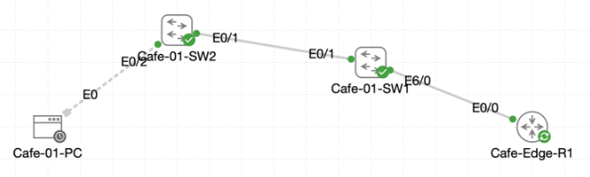

# Lab 058 - Configuring DAI

<p class="back-link">
  <a href="../../Lab-index.html">← Back to Lab Index</a>
</p>

<table>
<tr>
<td colspan="2" valign="top">

<h1>Objective</h1>

<h4>Prepare the switching path for Dynamic ARP Inspection by confirming DHCP snooping trust and trunking.</h4>

<h4>Verify that Cafe-01-PC receives a DHCP lease before ARP inspection is enabled.</h4>

<h4>Enable Dynamic ARP Inspection on VLANs 10 and 20.</h4>

<h4>Trust only the backbone uplinks while leaving access ports untrusted and rate-limited.</h4>

<h4>Apply MAC, destination MAC and IP validation checks to detect forged ARP traffic.</h4>

<h4>Use a static ARP ACL workaround so the lab client can be validated despite the CML DHCP snooping binding limitation.</h4>

</td>
</tr>

<tr>
<td valign="top">

</td>
</tr>
</table>

---

## Scenario

This lab extends the earlier DHCP snooping work by enabling Dynamic ARP Inspection across the Castle Rysen cafe switching path.

DHCP snooping helps the switch identify trusted DHCP paths and, on production hardware, builds a binding table that maps client MAC addresses to leased IP addresses. Dynamic ARP Inspection uses that trust information to decide whether ARP messages arriving on untrusted access ports are legitimate.

In this CML environment, the client successfully received a DHCP lease, but the DHCP snooping binding table remained empty. The lab therefore used a static ARP access list on `Cafe-01-SW2` as a controlled workaround so DAI could validate the PC's ARP traffic.

---

## Devices Used

* Cafe-Edge-R1
* Cafe-01-SW1
* Cafe-01-SW2
* Cafe-01-PC

---

## Addressing and VLAN Plan

| Device | Interface | Address / VLAN | Purpose |
| --- | --- | --- | --- |
| Cafe-Edge-R1 | Ethernet0/0.10 | 10.1.10.1 | VLAN 10 gateway |
| Cafe-Edge-R1 | Ethernet0/0.20 | 10.1.20.1 | VLAN 20 gateway and DHCP server path |
| Cafe-01-PC | eth0 | 10.1.20.11/24 | DHCP client in VLAN 20 |
| Cafe-01-SW1 | Ethernet6/0 | Trunk VLANs 10,20 | Uplink toward Cafe-Edge-R1 |
| Cafe-01-SW1 | Ethernet0/1 | Trunk VLANs 10,20 | Link toward Cafe-01-SW2 |
| Cafe-01-SW2 | Ethernet0/1 | Trunk VLANs 10,20 | Uplink toward Cafe-01-SW1 |
| Cafe-01-SW2 | Ethernet0/2 | VLAN 20 access | Cafe-01-PC access port |

---

## Security Feature Plan

| Feature | VLANs | Trusted Interfaces | Untrusted Interfaces |
| --- | --- | --- | --- |
| DHCP Snooping | 10, 20 | SW1 Et6/0, SW1 Et0/1, SW2 Et0/1 | Client/access ports |
| Dynamic ARP Inspection | 10, 20 | SW1 Et6/0, SW1 Et0/1, SW2 Et0/1 | Client/access ports |
| DAI Validation | 10, 20 | Source MAC, destination MAC and IP validation | Enforced on untrusted ports |
| Static ARP ACL | VLAN 20 | `DAI-PERMIT-PC` on SW2 | Permits Cafe-01-PC due to empty snooping binding table |

---

## Task 0 - Establish Trunk Trust and Verify the Snooping Baseline

### Step 1 - Confirm the Router Trunk

`Cafe-Edge-R1` initially showed the router-on-a-stick interface as administratively down.

```bash
show ip interface brief | include Ethernet0/0
```

### Initial Result

```bash
Ethernet0/0            unassigned      YES unset  administratively down down
Ethernet0/0.10         10.1.10.1       YES TFTP   administratively down down
Ethernet0/0.20         10.1.20.1       YES TFTP   administratively down down
```

The parent interface was enabled:

```bash
configure terminal
interface Ethernet0/0
no shutdown
end
```

### Result

```bash
Ethernet0/0            unassigned      YES unset  up                    up
Ethernet0/0.10         10.1.10.1       YES TFTP   up                    up
```

### Explanation

The VLAN subinterfaces depend on the physical parent interface. Bringing `Ethernet0/0` up restored the routed trunk required for DHCP and inter-VLAN traffic.

---

### Step 2 - Configure Trunks and DHCP Snooping Trust on Cafe-01-SW1

`Cafe-01-SW1` needed trusted trunk paths toward the router and access switch.

```bash
configure terminal
interface Ethernet6/0
switchport trunk encapsulation dot1q
switchport mode trunk
ip dhcp snooping trust
exit
interface Ethernet0/1
switchport trunk encapsulation dot1q
switchport mode trunk
ip dhcp snooping trust
end
```

### Trunk Verification

```bash
show interfaces trunk
```

### Result

```bash
Port           Mode             Encapsulation  Status        Native vlan
Et0/1          on               802.1q         trunking      1
Et6/0          on               802.1q         trunking      1

Port           Vlans allowed on trunk
Et0/1          10,20
Et6/0          10,20

Port           Vlans allowed and active in management domain
Et0/1          10,20
Et6/0          10,20
```

### DHCP Snooping Trust Verification

```bash
show ip dhcp snooping
```

### Result

```bash
DHCP snooping is configured on following VLANs:
10,20
DHCP snooping is operational on following VLANs:
10,20

Interface                  Trusted    Allow option    Rate limit (pps)
-----------------------    -------    ------------    ----------------
Ethernet0/1                      yes        yes             unlimited
Ethernet6/0                      yes        yes             unlimited
```

### Explanation

The router uplink and switch-to-switch link were both trusted for DHCP snooping. This is required so legitimate DHCP Offer and ACK traffic can travel back toward clients.

---

### Step 3 - Configure Trunk and DHCP Snooping Trust on Cafe-01-SW2

The uplink from `Cafe-01-SW2` to `Cafe-01-SW1` was configured as a trusted trunk.

```bash
configure terminal
interface Ethernet0/1
switchport trunk encapsulation dot1q
switchport mode trunk
ip dhcp snooping trust
end
```

### Verification

```bash
show interfaces trunk
show ip dhcp snooping
```

### Result

```bash
Port           Mode             Encapsulation  Status        Native vlan
Et0/1          on               802.1q         trunking      1

Port           Vlans allowed on trunk
Et0/1          10,20

Port           Vlans allowed and active in management domain
Et0/1          20
```

```bash
DHCP snooping is configured on following VLANs:
10,20
DHCP snooping is operational on following VLANs:
20

Interface                  Trusted    Allow option    Rate limit (pps)
-----------------------    -------    ------------    ----------------
Ethernet0/1                      yes        yes             unlimited
```

### Explanation

Only VLAN 20 was active on `Cafe-01-SW2` because the PC was connected in VLAN 20. The uplink was trusted, while the access-facing ports remained untrusted.

---

### Step 4 - Verify DHCP Lease on Cafe-01-PC

The client lease was refreshed from the Linux console.

```bash
sudo ifconfig eth0 0.0.0.0
sudo udhcpc -i eth0 -n -q
ifconfig eth0
route -n
```

### Result

```bash
udhcpc: lease of 10.1.20.11 obtained from 10.1.20.1, lease time 86400
```

```bash
eth0      Link encap:Ethernet  HWaddr 52:54:00:12:E0:8D
          inet addr:10.1.20.11  Bcast:10.1.20.255  Mask:255.255.255.0
```

```bash
Destination     Gateway         Genmask         Flags Metric Ref    Use Iface
0.0.0.0         10.1.20.1       0.0.0.0         UG    0      0        0 eth0
10.1.20.0       0.0.0.0         255.255.255.0   U     0      0        0 eth0
```

### Router DHCP Binding

```bash
show ip dhcp binding
```

### Result

```bash
10.1.20.11      0152.5400.12e0.8d       Aug 19 2026 03:56 PM    Automatic  Active     Ethernet0/0.20
```

### Explanation

The PC successfully received a VLAN 20 DHCP lease from `Cafe-Edge-R1`. The client MAC address was recorded as `52:54:00:12:E0:8D`, which converts to IOS dotted format as `5254.0012.E08D`.

---

### Step 5 - Note the DHCP Snooping Binding Limitation

On `Cafe-01-SW2`, the DHCP snooping binding table showed no entries:

```bash
show ip dhcp snooping binding
```

### Result

```bash
MacAddress          IpAddress        Lease(sec)  Type           VLAN  Interface
------------------  ---------------  ----------  -------------  ----  --------------------
Total number of bindings: 0
```

### Explanation

The DHCP exchange was successful, and the router recorded the lease, but the switch did not populate the snooping binding table. In this CML environment, that means DAI needs a static ARP ACL so it has a trusted IP-to-MAC mapping for the client.

---

## Task 1 - Trust the Right Pathways for ARP Inspection

### Step 6 - Trust ARP Inspection Uplinks on Cafe-01-SW1

```bash
configure terminal
interface ethernet6/0
ip arp inspection trust
exit
interface ethernet0/1
ip arp inspection trust
end
```

### Verification

```bash
show ip arp inspection interfaces
```

### Result

```bash
Interface        Trust State     Rate (pps)    Burst Interval
---------------  -----------     ----------    --------------
Et0/1            Trusted               None               N/A
Et6/0            Trusted               None               N/A
```

Access-facing ports remained untrusted:

```bash
Et0/0            Untrusted               15                 1
Et0/2            Untrusted               15                 1
Et0/3            Untrusted               15                 1
```

### Explanation

DAI should trust backbone/uplink paths, not endpoint-facing ports. Untrusted ports remain protected by the default 15 packets-per-second rate limit.

---

### Step 7 - Trust ARP Inspection Uplink on Cafe-01-SW2

```bash
configure terminal
interface ethernet0/1
ip arp inspection trust
end
```

### Verification

```bash
show ip arp inspection interfaces
```

### Result

```bash
Interface        Trust State     Rate (pps)    Burst Interval
---------------  -----------     ----------    --------------
Et0/0            Untrusted               15                 1
Et0/1            Trusted               None               N/A
Et0/2            Untrusted               15                 1
Et0/3            Untrusted               15                 1
```

### Explanation

Only the uplink was trusted. The client access port, `Ethernet0/2`, remained untrusted and subject to inspection.

---

## Task 2 - Activate Inspection on the Coffee VLANs

### Step 8 - Enable DAI on Cafe-01-SW1

```bash
configure terminal
ip arp inspection vlan 10,20
ip arp inspection validate src-mac dst-mac ip
end
```

### Verification for VLAN 10

```bash
show ip arp inspection vlan 10
```

### Result

```bash
Source Mac Validation      : Enabled
Destination Mac Validation : Enabled
IP Address Validation      : Enabled

Vlan     Configuration    Operation
----     -------------    ---------
  10     Enabled          Active
```

### Verification for VLAN 20

```bash
show ip arp inspection vlan 20
```

### Result

```bash
Source Mac Validation      : Enabled
Destination Mac Validation : Enabled
IP Address Validation      : Enabled

Vlan     Configuration    Operation
----     -------------    ---------
  20     Enabled          Active
```

### Explanation

DAI was now active on VLANs 10 and 20 on the distribution switch, with source MAC, destination MAC and IP validation enabled.

---

### Step 9 - Enable DAI on Cafe-01-SW2

```bash
configure terminal
ip arp inspection vlan 10,20
ip arp inspection validate src-mac dst-mac ip
end
```

### Verification for VLAN 20

```bash
show ip arp inspection vlan 20
```

### Result

```bash
Source Mac Validation      : Enabled
Destination Mac Validation : Enabled
IP Address Validation      : Enabled

Vlan     Configuration    Operation   ACL Match          Static ACL
----     -------------    ---------   ---------          ----------
  20     Enabled          Active
```

### Note on VLAN 10

On `Cafe-01-SW2`, VLAN 10 showed as enabled but inactive:

```bash
10     Enabled          Inactive
```

This is expected from the supplied evidence because only VLAN 20 was active and forwarding on that access switch during this test.

---

## Task 3 - Apply the Static ARP Permit and Validate Inspection

### Step 10 - Create the Static ARP ACL

Because the DHCP snooping binding table remained empty, a static ARP access list was created for `Cafe-01-PC`.

Recorded client values:

| Item | Value |
| --- | --- |
| Cafe-01-PC IP address | 10.1.20.11 |
| Linux MAC format | 52:54:00:12:E0:8D |
| IOS dotted MAC format | 5254.0012.E08D |

Configuration on `Cafe-01-SW2`:

```bash
configure terminal
arp access-list DAI-PERMIT-PC
 permit ip host 10.1.20.11 mac host 5254.0012.E08D
exit
ip arp inspection filter DAI-PERMIT-PC vlan 20
end
```

### Verification

```bash
show arp access-list
show ip arp inspection vlan 20
```

### Result

```bash
ARP access list DAI-PERMIT-PC
    permit ip host 10.1.20.11 mac host 5254.0012.e08d
```

```bash
Vlan     Configuration    Operation   ACL Match          Static ACL
----     -------------    ---------   ---------          ----------
  20     Enabled          Active      DAI-PERMIT-PC      No
```

### Explanation

The ARP ACL provided DAI with an explicit permitted IP-to-MAC mapping for the PC.

---

### Step 11 - Generate Legitimate ARP and ICMP Traffic

From `Cafe-01-PC`, an ARP entry was cleared and traffic was generated to the default gateway.

```bash
sudo arp -d 10.1.20.1
ping -c 3 10.1.20.1
```

### Result

```bash
64 bytes from 10.1.20.1: seq=0 ttl=255 time=3.021 ms
64 bytes from 10.1.20.1: seq=1 ttl=255 time=1.352 ms
64 bytes from 10.1.20.1: seq=2 ttl=255 time=1.283 ms

3 packets transmitted, 3 packets received, 0% packet loss
```

### Explanation

The PC could still reach the default gateway after DAI was active. This proved the static ARP permit allowed legitimate ARP traffic.

---

### Step 12 - Confirm DAI Statistics on Cafe-01-SW2

```bash
show ip arp inspection statistics
```

### Result

```bash
Vlan      Forwarded        Dropped     DHCP Drops      ACL Drops
----      ---------        -------     ----------      ---------
  10              0              0              0              0
  20              2              0              0              0

Vlan   DHCP Permits    ACL Permits  Probe Permits   Source MAC Failures
----   ------------    -----------  -------------   -------------------
  20              0              1              0                     0
```

### Explanation

The DAI statistics showed VLAN 20 forwarding ARP traffic with no drops. The ACL permit counter confirmed the static ARP ACL was being used to permit the PC.

---

### Step 13 - Confirm DAI Statistics and Trust State on Cafe-01-SW1

```bash
show ip arp inspection interfaces
show ip arp inspection statistics
```

### Result

```bash
Et0/1            Trusted               None               N/A
Et6/0            Trusted               None               N/A
```

```bash
Vlan      Forwarded        Dropped     DHCP Drops      ACL Drops
----      ---------        -------     ----------      ---------
  10              0              0              0              0
  20              2              0              0              0
```

### Explanation

`Cafe-01-SW1` showed the trusted uplinks and forwarding statistics for VLAN 20. Access-facing ports remained untrusted with the default rate limit.

---

## Troubleshooting and Notes

### Note 1 - DHCP snooping binding table remained empty

The DHCP lease succeeded and the router recorded the lease, but the switch binding table showed:

```bash
Total number of bindings: 0
```

This meant DAI could not rely on dynamic DHCP snooping bindings in this lab. The static ARP ACL was used as a workaround.

---

### Note 2 - Static ARP ACL was required for DAI validation

Without a DHCP snooping binding entry, DAI would not have had a trusted mapping for `10.1.20.11` and `52:54:00:12:E0:8D`.

The static ARP ACL supplied that missing trust information:

```bash
arp access-list DAI-PERMIT-PC
 permit ip host 10.1.20.11 mac host 5254.0012.E08D
```

---

### Note 3 - VLAN 10 inactive on Cafe-01-SW2

`Cafe-01-SW2` showed VLAN 10 as DAI-enabled but inactive. This matched the trunk output, where only VLAN 20 was active on SW2. The active client test was in VLAN 20, so this did not prevent completion of the VLAN 20 DAI validation.

---

### Note 4 - DAI trust should be limited

Only backbone and uplink interfaces were trusted. Access ports remained untrusted and rate-limited.

This is important because trusting an endpoint-facing port would allow that device to send ARP replies without inspection.

---

## Key Learning Points

* DHCP snooping is the foundation DAI normally uses to validate ARP traffic.
* DAI protects against ARP spoofing by checking ARP messages on untrusted ports.
* Trunk/uplink ports should be trusted when they carry legitimate upstream ARP traffic.
* Access ports should usually remain untrusted.
* DAI can validate source MAC, destination MAC and IP address fields.
* Untrusted ports use a default rate limit of 15 packets per second.
* If DHCP snooping bindings are missing, a static ARP ACL can be used to permit known static hosts.
* `show ip arp inspection vlan` proves DAI is enabled and active per VLAN.
* `show ip arp inspection interfaces` proves which ports are trusted or untrusted.
* `show ip arp inspection statistics` shows whether DAI is forwarding or dropping ARP traffic.

---

## Completion Check

The lab was completed successfully.

* Cafe-Edge-R1 Ethernet0/0 was brought up.
* Cafe-Edge-R1 subinterfaces for VLANs 10 and 20 were operational.
* Cafe-01-SW1 Ethernet6/0 and Ethernet0/1 were configured as 802.1Q trunks.
* Cafe-01-SW1 Ethernet6/0 and Ethernet0/1 were trusted for DHCP snooping.
* Cafe-01-SW2 Ethernet0/1 was configured as an 802.1Q trunk.
* Cafe-01-SW2 Ethernet0/1 was trusted for DHCP snooping.
* Cafe-01-PC received DHCP address `10.1.20.11/24`.
* Cafe-Edge-R1 recorded the DHCP binding for `10.1.20.11`.
* Cafe-01-SW1 trusted only the intended ARP inspection uplinks.
* Cafe-01-SW2 trusted only the intended ARP inspection uplink.
* DAI was enabled for VLANs 10 and 20.
* Source MAC, destination MAC and IP validation were enabled.
* The static ARP ACL `DAI-PERMIT-PC` was created on Cafe-01-SW2.
* `DAI-PERMIT-PC` permitted `10.1.20.11` with MAC `5254.0012.E08D`.
* The ARP inspection filter was applied to VLAN 20.
* Cafe-01-PC successfully pinged `10.1.20.1` after DAI was active.
* Cafe-01-SW2 DAI statistics showed VLAN 20 traffic forwarded with no drops.
* Access-facing ports remained untrusted with the default rate limit.
