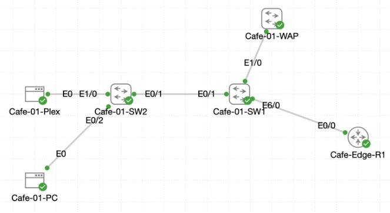

# Lab 059 - Castle Rysen Layer 2 Security Deployment

<p class="back-link">
  <a href="../../Lab-index.html">← Back to Lab Index</a>
</p>

<table>
<tr>
<td colspan="2" valign="top">

# Objective

#### Classify the infrastructure, admin and patron-facing switch interfaces before applying security controls.
#### Deploy one-device port security across patron access drops.
#### Use sticky MAC learning only where administrative endpoints need to be pinned to a known device.
#### Enable DHCP snooping for VLANs 1, 10 and 20 with trusted infrastructure uplinks and edge rate limiting.
#### Enable Dynamic ARP Inspection with MAC and IP validation to protect against ARP spoofing.
#### Record verification evidence, including the simulator limitation where DAI may drop patron ARP because DHCP snooping bindings remain empty.

</td>
</tr>

<tr>
<td valign="top">

</td>
</tr>
</table>

---

## Scenario

This lab represents a full Layer 2 access-security rollout for a new Castle Rysen cafe shelter deployment.

The network uses a router-on-a-stick edge router, `Cafe-Edge-R1`, with two access switches, `Cafe-01-SW1` and `Cafe-01-SW2`. The security goal was to harden the switch access layer before production clients were connected. The final policy combined port security, DHCP snooping and Dynamic ARP Inspection.

The deployment focused on three main risks:

- Unknown devices appearing on access ports.
- Rogue DHCP servers handing out malicious addressing information.
- ARP spoofing or ARP poisoning on client VLANs.

---

## Devices Used

- Cafe-Edge-R1
- Cafe-01-SW1
- Cafe-01-SW2
- Cafe-01-PC
- Cafe-01-Plex

---

## VLAN and Addressing Summary

| VLAN | Purpose | Gateway | Example Client |
| --- | --- | --- | --- |
| 1 | Default / infrastructure context | N/A | Infrastructure ports only |
| 10 | Admin / Plex services | 10.1.10.1 | Cafe-01-Plex: 10.1.10.11 |
| 20 | Patron client network | 10.1.20.1 | Cafe-01-PC: 10.1.20.11 |

---

## Interface Role Summary

### Cafe-01-SW1

| Interface | Observed Role | Security Treatment |
| --- | --- | --- |
| Ethernet0/1 | Trunk to Cafe-01-SW2 | DHCP snooping trust, DAI trust, no port security |
| Ethernet0/2 | Reserve trunk | Infrastructure link, no port security intended |
| Ethernet0/3 | Admin workstation drop | Port security with sticky MAC learning |
| Ethernet1/0 | Wireless uplink / infrastructure-style link | Higher DHCP rate limit; later DAI trusted in captured output |
| Ethernet1/1-Ethernet5/3 | Patron access drops | Port security, maximum 1, no sticky learning |
| Ethernet6/0 | Uplink to Cafe-Edge-R1 | DHCP snooping trust, DAI trust, no port security |

### Cafe-01-SW2

| Interface | Observed Role | Security Treatment |
| --- | --- | --- |
| Ethernet0/1 | Uplink to Cafe-01-SW1 | DHCP snooping trust and DAI trust |
| Ethernet0/2 | Cafe-01-PC patron endpoint | Port security, maximum 1, DHCP rate limit |
| Ethernet1/0 | Cafe-01-Plex admin endpoint | Port security enabled; DAI trusted in captured output |
| Ethernet1/1-Ethernet5/3 | Patron access drops | Port security and DHCP rate limiting |

---

## Task 0 - Map the Secure Edge

### Step 1 - Bring Up the Router Trunk

The router-on-a-stick parent interface initially appeared administratively down.

```bash
show ip interface brief | include Ethernet0/0
```

Initial output:

```bash
Ethernet0/0            unassigned      YES unset  administratively down down
Ethernet0/0.10         10.1.10.1       YES TFTP   administratively down down
Ethernet0/0.20         10.1.20.1       YES TFTP   administratively down down
```

The parent interface was enabled:

```bash
configure terminal
interface ethernet0/0
no shutdown
end
```

Verification:

```bash
Ethernet0/0            unassigned      YES unset  up                    up
Ethernet0/0.10         10.1.10.1       YES TFTP   up                    up
Ethernet0/0.20         10.1.20.1       YES TFTP   up                    up
```

### Why This Matters

The router subinterfaces depend on the physical parent interface. DHCP and inter-VLAN routing cannot work until the parent link is up/up.

---

### Step 2 - Map Cafe-01-SW1 Neighbours and Edge Ports

```bash
show cdp neighbors
show interface status | include Et0/1|Et0/2|Et0/3|Et1/0|Et6/0
show vlan brief | include Et0/3|Et1/1|Et5/3|Et6/0
```

Key evidence:

```bash
Device ID        Local Intrfce     Holdtme    Capability  Platform  Port ID
Cafe-01-SW2      Eth 0/1           123             R S I  Linux Uni Eth 0/1
Cafe-Edge-R1     Eth 6/0           159               R    Linux Uni Eth 0/0
```

```bash
Et0/1        Trunk to Cafe-01-S connected    1
Et0/2        Reserve Trunk to C connected    1
Et0/3        Admin Workstation  connected    10
Et1/0        Uplink to Cafe-01- connected    1
Et6/0        Uplink to Cafe-Edg connected    1
```

This identified the infrastructure links that should not be treated like single-host access ports.

---

### Step 3 - Map Cafe-01-SW2 Neighbours and Edge Ports

```bash
show cdp neighbors
show interface status | include Et0/1|Et0/2|Et1/0|Et1/1|Et5/3
show vlan brief | include Et0/2|Et1/0|Et1/1|Et5/3
```

Key evidence:

```bash
Device ID        Local Intrfce     Holdtme    Capability  Platform  Port ID
Cafe-01-SW1      Eth 0/1           123             R S I  Linux Uni Eth 0/1
```

```bash
Et0/1        Uplink to Cafe-01- connected    1
Et0/2        Cafe-01-PC (Patron connected    20
Et1/0        Cafe-01-Plex Admin connected    10
Et1/1        Patron Access Drop connected    20
Et5/3        Patron Access Drop connected    20
```

This confirmed `Cafe-01-PC` belonged to VLAN 20 and `Cafe-01-Plex` belonged to VLAN 10.

---

## Task 1 - Lock Port Security on Cafe-01-SW1

### Step 4 - Secure Patron Access Drops

The patron-facing access range on `Cafe-01-SW1` was configured for one device per port.

```bash
interface range Ethernet1/1 - 3 , Ethernet2/0 - 3 , Ethernet3/0 - 3 , Ethernet4/0 - 3 , Ethernet5/0 - 3
 switchport mode access
 switchport port-security
 switchport port-security maximum 1
 no switchport port-security mac-address sticky
```

### Step 5 - Secure the Admin Workstation Drop

```bash
interface ethernet0/3
 switchport mode access
 switchport port-security
 switchport port-security maximum 1
 switchport port-security mac-address sticky
```

Verification:

```bash
show port-security interface Ethernet0/3
show port-security
show running-config interface Ethernet0/3
```

Key output:

```bash
Port Security              : Enabled
Port Status                : Secure-up
Violation Mode             : Shutdown
Maximum MAC Addresses      : 1
Security Violation Count   : 0
```

```bash
interface Ethernet0/3
 description Admin Workstation Drop
 switchport access vlan 10
 switchport mode access
 switchport port-security mac-address sticky
 switchport port-security
 spanning-tree portfast
```

### Explanation

The admin workstation port was configured as an access port, allowed one MAC address, and used sticky learning so the approved endpoint could be retained in the running configuration after traffic was learned.

---

## Task 2 - Mirror Edge Controls on Cafe-01-SW2

### Step 6 - Secure Cafe-01-PC and Patron Access Drops

`Cafe-01-SW2` was configured to secure the patron-facing ports with one-device limits.

```bash
interface Ethernet0/2
 switchport mode access
 switchport port-security
 switchport port-security maximum 1
 no switchport port-security mac-address sticky
```

The wider patron ranges were also secured with the same one-device policy.

### Step 7 - Secure the Plex Admin Port

`Ethernet1/0`, the Cafe-01-Plex admin endpoint, was also secured:

```bash
interface Ethernet1/0
 switchport mode access
 switchport port-security
 switchport port-security maximum 1
```

Verification:

```bash
show port-security interface Ethernet1/0
show port-security interface Ethernet0/2
show port-security
```

Key output:

```bash
Port Security              : Enabled
Port Status                : Secure-up
Maximum MAC Addresses      : 1
Last Source Address:Vlan   : 5254.0079.6aa1:10
Security Violation Count   : 0
```

```bash
Port Security              : Enabled
Port Status                : Secure-up
Maximum MAC Addresses      : 1
Last Source Address:Vlan   : 5254.0008.3643:20
Security Violation Count   : 0
```

### Important Evidence Note

The lab objective called for sticky MAC learning on administrative endpoints. The supplied capture confirms sticky was enabled on `Cafe-01-SW1 Ethernet0/3`, but the `Cafe-01-SW2 Ethernet1/0` configuration shown in the evidence used `no switchport port-security mac-address sticky`. That means the Plex admin port was secured with a one-device limit, but sticky learning was not demonstrated for that port in the supplied output.

---

## Task 3 - Enforce DHCP Snooping Safeguards

### Step 8 - Configure DHCP Snooping on Cafe-01-SW1

```bash
configure terminal
ip dhcp snooping
ip dhcp snooping vlan 1,10,20
no ip dhcp snooping information option
interface ethernet6/0
 switchport trunk encapsulation dot1q
 switchport mode trunk
 ip dhcp snooping trust
exit
interface ethernet0/1
 switchport trunk encapsulation dot1q
 switchport mode trunk
 ip dhcp snooping trust
exit
interface range Ethernet1/1 - 3 , Ethernet2/0 - 3 , Ethernet3/0 - 3 , Ethernet4/0 - 3 , Ethernet5/0 - 3
 ip dhcp snooping limit rate 5
exit
interface Ethernet1/0
 ip dhcp snooping limit rate 20
end
```

Verification:

```bash
show ip dhcp snooping
show interfaces trunk
```

Key output:

```bash
Switch DHCP snooping is enabled
DHCP snooping is configured on following VLANs:
1,10,20
DHCP snooping is operational on following VLANs:
1,10,20
Insertion of option 82 is disabled
```

```bash
Ethernet0/1                      yes        yes             unlimited
Ethernet1/0                      no         no              20
Ethernet1/1                      no         no              5
Ethernet1/2                      no         no              5
Ethernet1/3                      no         no              5
```

```bash
Port           Mode             Encapsulation  Status        Native vlan
Et0/1          on               802.1q         trunking      1
Et6/0          on               802.1q         trunking      1
```

### Explanation

`Ethernet0/1` and `Ethernet6/0` were trusted because they are infrastructure paths. Patron-facing access ports stayed untrusted and were rate-limited.

---

### Step 9 - Configure DHCP Snooping on Cafe-01-SW2

```bash
configure terminal
ip dhcp snooping
ip dhcp snooping vlan 1,10,20
no ip dhcp snooping information option
interface ethernet0/1
 switchport trunk encapsulation dot1q
 switchport mode trunk
 ip dhcp snooping trust
exit
interface ethernet0/2
 ip dhcp snooping limit rate 5
exit
interface range Ethernet1/1 - 3 , Ethernet2/0 - 3 , Ethernet3/0 - 3 , Ethernet4/0 - 3 , Ethernet5/0 - 3
 ip dhcp snooping limit rate 20
end
```

Verification:

```bash
show ip dhcp snooping
show ip dhcp snooping binding
```

Key output:

```bash
Switch DHCP snooping is enabled
DHCP snooping is configured on following VLANs:
1,10,20
DHCP snooping is operational on following VLANs:
1,10,20
```

```bash
Ethernet0/1                      yes        yes             unlimited
Ethernet0/2                      no         no              5
Ethernet1/1                      no         no              20
Ethernet1/2                      no         no              20
```

The snooping binding table remained empty:

```bash
Total number of bindings: 0
```

### Explanation

This matched the known behaviour from the current lab environment: clients can receive DHCP leases from the router, but the switch image may not populate DHCP snooping bindings.

---

### Step 10 - Verify Client DHCP Leases

The client devices renewed their DHCP leases.

From `Cafe-01-PC`:

```bash
sudo ifconfig eth0 0.0.0.0
sudo udhcpc -i eth0 -n -q
ifconfig eth0
route -n
```

Result:

```bash
udhcpc: lease of 10.1.20.11 obtained from 10.1.20.1, lease time 86400
```

```bash
inet addr:10.1.20.11  Bcast:10.1.20.255  Mask:255.255.255.0
```

From `Cafe-01-Plex`:

```bash
udhcpc: lease of 10.1.10.11 obtained from 10.1.10.1, lease time 86400
```

Router verification:

```bash
show ip dhcp binding
```

Result:

```bash
10.1.10.11      0152.5400.796a.a1       Aug 19 2026 04:50 PM    Automatic  Active     Ethernet0/0.10
10.1.20.11      0152.5400.0836.43       Aug 19 2026 04:50 PM    Automatic  Active     Ethernet0/0.20
```

### Explanation

The router confirmed active DHCP leases for both the VLAN 10 Plex/admin client and the VLAN 20 patron client.

---

## Task 4 - Stand Up Dynamic ARP Inspection

### Step 11 - Configure DAI on Cafe-01-SW1

```bash
configure terminal
ip arp inspection vlan 1,10,20
ip arp inspection validate src-mac dst-mac ip
interface ethernet6/0
 ip arp inspection trust
exit
interface ethernet0/1
 ip arp inspection trust
exit
interface ethernet1/0
 ip arp inspection trust
exit
end
```

Verification:

```bash
show ip arp inspection vlan 10
show ip arp inspection interfaces
```

Key output:

```bash
Source Mac Validation      : Enabled
Destination Mac Validation : Enabled
IP Address Validation      : Enabled
```

```bash
Vlan     Configuration    Operation   ACL Match          Static ACL
----     -------------    ---------   ---------          ----------
  10     Enabled          Active
```

```bash
Et0/1            Trusted               None               N/A
Et1/0            Trusted               None               N/A
Et6/0            Trusted               None               N/A
```

All other listed access-facing interfaces remained untrusted with the default `15 pps` rate limit.

---

### Step 12 - Configure DAI on Cafe-01-SW2

```bash
configure terminal
ip arp inspection vlan 1,10,20
ip arp inspection validate src-mac dst-mac ip
interface ethernet0/1
 ip arp inspection trust
exit
interface ethernet1/0
 ip arp inspection trust
exit
end
```

Verification:

```bash
show ip arp inspection vlan 10
show ip arp inspection interfaces
```

Key output:

```bash
Source Mac Validation      : Enabled
Destination Mac Validation : Enabled
IP Address Validation      : Enabled
```

```bash
Vlan     Configuration    Operation   ACL Match          Static ACL
----     -------------    ---------   ---------          ----------
  10     Enabled          Active
```

```bash
Et0/1            Trusted               None               N/A
Et1/0            Trusted               None               N/A
Et0/2            Untrusted               15                 1
Et1/1            Untrusted               15                 1
Et5/3            Untrusted               15                 1
```

### Explanation

DAI was enabled with source MAC, destination MAC and IP validation. Infrastructure/admin paths were trusted, while patron-facing ports remained inspected.

---

## DAI Verification and Simulator Limitation

After DAI was enabled, `Cafe-01-PC` failed to ping its default gateway.

```bash
ping -c 3 10.1.20.1
```

Result:

```bash
3 packets transmitted, 0 packets received, 100% packet loss
```

The supplied lab text notes the likely cause:

```text
Cafe-01-PC may fail to ping 10.1.20.1 with 100% packet loss after DAI is enabled because the live switch snooping binding table remains empty.
```

### Explanation

DAI relies on the DHCP snooping binding table to validate whether a client IP/MAC/VLAN/interface mapping is legitimate. In this lab image, DHCP leases were successfully issued by the router, but the switch snooping binding table remained empty. Because of that, DAI had no dynamic binding to validate patron ARP packets from the untrusted access port.

This should be treated as a simulator limitation rather than a failed configuration step.

---

## Troubleshooting and Notes

### Issue 1 - Router parent interface was initially down

The router-on-a-stick parent link had to be enabled before subinterfaces could operate.

```bash
interface ethernet0/0
no shutdown
```

---

### Issue 2 - Case-sensitive `include` filter

This command returned no matching output because of interface-name case:

```bash
show ip interface brief | include ethernet0/0
```

The corrected version was:

```bash
show ip interface brief | include Ethernet0/0
```

---

### Issue 3 - Minor command typo

This command failed because `show` was mistyped:

```bash
Cafe-01-SW1#how interfaces trunk
             ^
% Invalid input detected at '^' marker.
```

It was corrected with:

```bash
show interfaces trunk
```

---

### Issue 4 - DHCP snooping binding table remained empty

Both DHCP clients received valid leases, and the router displayed both active bindings. However, the switch snooping binding table returned:

```bash
Total number of bindings: 0
```

This affected DAI because the switch did not have a binding table entry to validate ARP traffic on untrusted access ports.

---

### Issue 5 - Sticky MAC evidence on Cafe-01-SW2

The lab objective expected sticky MAC learning on administrative endpoints. The supplied output confirms port security on `Cafe-01-SW2 Ethernet1/0`, but it shows sticky learning was not enabled there. This should be revisited if strict completion evidence is required.

Recommended correction:

```bash
configure terminal
interface ethernet1/0
 switchport port-security mac-address sticky
end
```

Then generate traffic and verify:

```bash
show port-security interface ethernet1/0
show running-config interface ethernet1/0
```

---

## Key Learning Points

- Port security protects access ports from unknown or excessive MAC addresses.
- A maximum of one secure MAC address is appropriate for normal end-user access ports.
- Sticky MAC learning is useful for administrative endpoints where the expected device should be retained in the running configuration.
- Infrastructure links should not be protected with one-device port security because they may carry traffic from many MAC addresses.
- DHCP snooping separates trusted DHCP paths from untrusted client-facing ports.
- DHCP rate limiting helps reduce DHCP exhaustion or flood behaviour from access ports.
- Dynamic ARP Inspection depends on DHCP snooping bindings unless static ARP ACLs are used.
- DAI trust should be limited to infrastructure paths where legitimate ARP replies are expected.
- `show ip dhcp snooping`, `show port-security`, and `show ip arp inspection interfaces` are key verification commands.
- Empty snooping binding tables in the simulator can create DAI failures even when the logical configuration is correct.

---

## Completion Check

The lab was partially completed, with one simulator limitation and one sticky-learning evidence gap noted.

Completed successfully:

- `Cafe-Edge-R1 Ethernet0/0` was brought up.
- Router subinterfaces `Ethernet0/0.10` and `Ethernet0/0.20` came up/up.
- Switch infrastructure and access-facing interfaces were identified.
- Port security was enabled on patron-facing access ports.
- `Cafe-01-SW1 Ethernet0/3` was configured with sticky MAC learning.
- `Cafe-01-SW2 Ethernet0/2` and `Ethernet1/0` were secured with one-device limits.
- DHCP snooping was enabled on VLANs 1, 10 and 20.
- DHCP snooping Option 82 insertion was disabled.
- DHCP trusted uplinks were configured.
- DHCP rate limits were applied to access-facing ports.
- `Cafe-01-PC` received `10.1.20.11/24` from DHCP.
- `Cafe-01-Plex` received `10.1.10.11/24` from DHCP.
- `Cafe-Edge-R1` showed active DHCP bindings for both clients.
- DAI was enabled on VLANs 1, 10 and 20.
- DAI source MAC, destination MAC and IP validation were enabled.
- DAI trust was limited to infrastructure/admin-facing links.
- Access ports remained untrusted under DAI.

Needs follow-up or qualification:

- `Cafe-01-SW2 Ethernet1/0` was secured but sticky MAC learning was not demonstrated in the supplied evidence.
- `Cafe-01-PC` failed to ping the gateway after DAI because the simulator did not populate the DHCP snooping binding table.
- A static ARP ACL workaround, similar to the previous DAI lab, would be needed if full post-DAI patron reachability evidence is required in this CML image.
