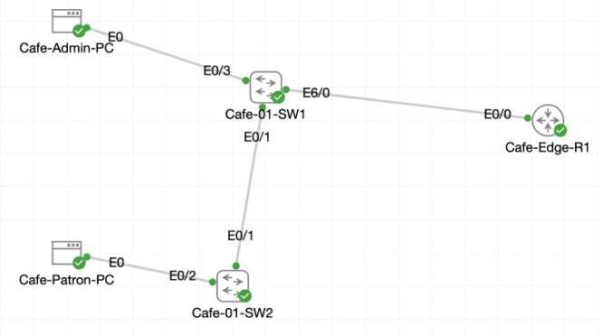

# Lab 060 - Skill 20 - Fortifying Shelter Layer 2 Defenses

<p class="back-link">
  <a href="../../Lab-index.html">← Back to Lab Index</a>
</p>

<table>
<tr>
<td colspan="2" valign="top">

# Objective

#### Classify every access-facing interface across the district shelter's cafe access layer before applying security controls.
#### Deploy one-device port security across patron access drops, with sticky MAC learning reserved for administrative endpoints.
#### Enable DHCP snooping on VLANs 10 and 20 with trusted infrastructure uplinks and custom per-port rate limits.
#### Enable Dynamic ARP Inspection on VLANs 10 and 20 to protect against ARP spoofing, using a static ARP ACL workaround where the simulator's DHCP snooping binding table would otherwise block legitimate traffic.
#### Simulate and recover from a port security violation, demonstrating that restrict mode contains unauthorized devices without taking the port down.

</td>
</tr>

<tr>
<td valign="top">

</td>
</tr>
</table>

---

## Scenario

This lab represents a Layer 2 access-security hardening exercise for the District 20 fallout shelter's newly activated coffee wing. The access layer shipped with only baseline configuration and needed to be locked down before patrons and admin staff connected to the network.

The topology consists of a router-on-a-stick edge router, `Cafe-Edge-R1`, and two access switches, `Cafe-01-SW1` and `Cafe-01-SW2`. `Cafe-01-SW1` anchors the admin gear and the uplink to the router; `Cafe-01-SW2` extends the floor to the patron seating area via a trunk back to SW1.

The deployment focused on three main risks:

- Unknown or excess devices appearing on access ports.
- Rogue DHCP activity on either VLAN.
- ARP spoofing or ARP poisoning between the admin and patron VLANs.

---

## Devices Used

- Cafe-Edge-R1
- Cafe-01-SW1
- Cafe-01-SW2
- Cafe-Admin-PC
- Cafe-Patron-PC

---

## VLAN and Addressing Summary

| VLAN | Purpose | Gateway | Example Client |
| --- | --- | --- | --- |
| 10 | Admin network | 10.1.10.1 | Cafe-Admin-PC: 10.1.10.11 |
| 20 | Patron client network | 10.1.20.1 | Cafe-Patron-PC: 10.1.20.11 |

DHCP pools `Admin` and `Patron` each served their respective /24, with the first 10 addresses (`.1`-`.10`) excluded in both scopes. DNS was set to `1.1.1.1` in both pools.

---

## Interface Role Summary

### Cafe-01-SW1

| Interface | Observed Role | Security Treatment |
| --- | --- | --- |
| Ethernet0/1 | Trunk to Cafe-01-SW2 | DHCP snooping trust, DAI trust, no port security |
| Ethernet0/3 | Admin workstation drop | Port security, maximum 1, sticky MAC learning |
| Ethernet1/0 | Reserved for future access point | DHCP rate limit 20 pps, no port security applied |
| Ethernet1/1-Ethernet1/3, Ethernet2/0 | Patron access drops | Port security, maximum 1, no sticky learning, 5 pps DHCP rate limit |
| Ethernet6/0 | Uplink to Cafe-Edge-R1 | DHCP snooping trust, DAI trust, no port security |

### Cafe-01-SW2

| Interface | Observed Role | Security Treatment |
| --- | --- | --- |
| Ethernet0/1 | Uplink to Cafe-01-SW1 | DHCP snooping trust, DAI trust |
| Ethernet0/2 | Cafe-Patron-PC drop | Port security, maximum 1, no sticky learning, 5 pps DHCP rate limit |
| Ethernet1/0 | Operations kiosk (admin) | Port security, maximum 1, sticky MAC learning |
| Ethernet1/1-Ethernet1/2 | Patron access drops | Port security, maximum 1, no sticky learning, 5 pps DHCP rate limit |

---

## Task 0 - Audit the Edge Footprint

### Step 1 - Bring Up the Router Trunk

`Cafe-Edge-R1`'s parent interface and both subinterfaces were found administratively down.

```bash
show ip interface brief
```

```bash
Ethernet0/0            unassigned      YES unset  administratively down down
Ethernet0/0.10         10.1.10.1       YES TFTP   administratively down down
Ethernet0/0.20         10.1.20.1       YES TFTP   administratively down down
```

Brought up with:

```bash
configure terminal
interface Ethernet0/0
 no shutdown
interface Ethernet0/0.10
 no shutdown
interface Ethernet0/0.20
 no shutdown
end
```

All three interfaces came up:

```bash
Ethernet0/0            unassigned      YES unset  up                    up
Ethernet0/0.10         10.1.10.1       YES TFTP   up                    up
Ethernet0/0.20         10.1.20.1       YES TFTP   up                    up
```

### Why This Matters

Subinterface state depends on the physical parent link. DHCP and inter-VLAN routing could not function until the parent interface was enabled.

### Step 2 - Map Cafe-01-SW1 and Cafe-01-SW2

`show interfaces status`, `show cdp neighbors detail`, and `show vlan brief` confirmed the physical topology (`Cafe-01-SW1 Et0/1` <-> `Cafe-01-SW2 Et0/1`, `Cafe-01-SW1 Et6/0` <-> `Cafe-Edge-R1 Et0/0`) and existing VLAN assignments on both switches, matching the interface role tables above.

### Step 3 - Discover the Missing Trunk Configuration

Neither `Et0/1` (SW1-SW2) nor `Et6/0` (SW1-R1) were actually configured for trunking - both sat untagged in VLAN 1 despite being physically connected. This meant VLANs 10 and 20 could not cross either link. Trunking was applied to close this gap:

```bash
! Cafe-01-SW1
interface Ethernet0/1
 switchport trunk encapsulation dot1q
 switchport mode trunk
 switchport trunk allowed vlan 10,20
interface Ethernet6/0
 switchport trunk encapsulation dot1q
 switchport mode trunk
 switchport trunk allowed vlan 10,20
```

```bash
! Cafe-01-SW2
interface Ethernet0/1
 switchport trunk encapsulation dot1q
 switchport mode trunk
 switchport trunk allowed vlan 10,20
```

Verification confirmed both trunks active, VLANs 10 and 20 forwarding:

```bash
Port           Mode             Encapsulation  Status        Native vlan
Et0/1          on               802.1q         trunking      1
Et6/0          on               802.1q         trunking      1
```

Full end-to-end reachability was then confirmed with pings from both workstations to both gateways.

---

## Task 1 - Enforce Port Security Standards

### Step 4 - Secure the Admin Workstation Drop (Cafe-01-SW1 Et0/3)

```bash
interface Ethernet0/3
 switchport mode access
 switchport access vlan 10
 switchport port-security
 switchport port-security maximum 1
 switchport port-security violation restrict
 switchport port-security mac-address sticky
```

After a ping from Cafe-Admin-PC, the port learned and pinned the workstation's MAC as a sticky entry:

```bash
Total MAC Addresses        : 1
Sticky MAC Addresses       : 1
Last Source Address:Vlan   : 5254.0010.a52a:10
```

### Step 5 - Secure Patron Access Drops (Cafe-01-SW1)

```bash
interface range Ethernet1/1, Ethernet1/2, Ethernet1/3, Ethernet2/0
 switchport mode access
 switchport access vlan 20
 switchport port-security
 switchport port-security maximum 1
 switchport port-security violation restrict
```

### Step 6 - Mirror the Policy on Cafe-01-SW2

```bash
interface Ethernet0/2
 switchport mode access
 switchport access vlan 20
 switchport port-security
 switchport port-security maximum 1
 switchport port-security violation restrict

interface Ethernet1/0
 switchport mode access
 switchport access vlan 10
 switchport port-security
 switchport port-security maximum 1
 switchport port-security violation restrict
 switchport port-security mac-address sticky

interface range Ethernet1/1, Ethernet1/2
 switchport mode access
 switchport access vlan 20
 switchport port-security
 switchport port-security maximum 1
 switchport port-security violation restrict
```

Verification (`show port-security` on both switches) confirmed every protected port reporting `Secure-up` with `Restrict` as the violation action and max 1 MAC.

---

## Task 2 - Deploy DHCP Snooping Safeguards

```bash
! Both switches
ip dhcp snooping
ip dhcp snooping vlan 10,20
```

```bash
! Cafe-01-SW1 trusted uplinks
interface Ethernet0/1
 ip dhcp snooping trust
interface Ethernet6/0
 ip dhcp snooping trust
```

```bash
! Cafe-01-SW2 trusted uplink
interface Ethernet0/1
 ip dhcp snooping trust
```

```bash
! Cafe-01-SW1 rate limits
interface range Ethernet1/1, Ethernet1/2, Ethernet1/3, Ethernet2/0
 ip dhcp snooping limit rate 5
interface Ethernet1/0
 ip dhcp snooping limit rate 20
```

```bash
! Cafe-01-SW2 rate limits
interface range Ethernet0/2, Ethernet1/1, Ethernet1/2
 ip dhcp snooping limit rate 5
```

`show ip dhcp snooping` confirmed VLANs 10 and 20 both configured and operational on both switches, with trusted uplinks reporting `unlimited` and access ports reporting the correct custom rate (5 pps patron, 20 pps SW1 Et1/0).

### Client DHCP Renewal

```bash
sudo udhcpc -i eth0
```

```bash
udhcpc: lease of 10.1.20.11 obtained from 10.1.20.1, lease time 86400
```

The client successfully obtained/renewed a lease on repeated attempts, confirming the DHCP relay path was fully functional end to end.

### Known Limitation - Empty Binding Table

Despite repeated successful client leases, `show ip dhcp snooping binding` returned `Total number of bindings: 0` on both switches throughout testing, even during a live `debug ip dhcp snooping event/packet` capture spanning a full DORA exchange. `show ip dhcp snooping statistics` also remained at all zeros, and `show ip dhcp snooping database` showed no configured agent and zero attempted writes.

This was assessed as a platform limitation of the IOL (IOS-on-Linux) switch image rather than a configuration fault - all control-plane indicators (snooping config, trust state, rate limits) were correct and verifiable; only the in-memory binding table failed to populate.

---

## Task 3 - Activate Dynamic ARP Inspection

```bash
! Cafe-01-SW1
ip arp inspection vlan 10,20
interface Ethernet0/1
 ip arp inspection trust
interface Ethernet6/0
 ip arp inspection trust
```

```bash
! Cafe-01-SW2
ip arp inspection vlan 10,20
interface Ethernet0/1
 ip arp inspection trust
```

`show ip arp inspection vlan 10,20` confirmed both VLANs `Enabled`/`Active` on both switches; `show ip arp inspection interfaces` confirmed trust limited strictly to the backbone links (`Et0/1` both switches, `Et6/0` on SW1), with all access ports untrusted at the default 15 pps / 1s burst.

### DAI Verification and Simulator Limitation

Once DAI was live, the patron workstation's gateway ping failed outright:

```bash
ping -c 4 10.1.20.1
--- 10.1.20.1 ping statistics ---
4 packets transmitted, 0 packets received, 100% packet loss
```

`show ip arp inspection statistics vlan 10,20` showed the drops landing squarely in the `DHCP Drops` column, confirming DAI was validating against the (empty) DHCP snooping binding table from Task 2 and had no record to match legitimate patron ARP traffic against - the direct downstream consequence of the binding-table gap noted above.

### Compensating Control - Static ARP ACLs

Since the dynamic binding table could not be relied on in this environment, static ARP ACLs were used to bind each known host's IP to its current MAC, applied on both switches:

```bash
arp access-list ADMIN-ARP
 permit ip host 10.1.10.11 mac host <admin-pc-mac>
arp access-list PATRON-ARP
 permit ip host 10.1.20.11 mac host <patron-pc-mac>
ip arp inspection filter ADMIN-ARP vlan 10
ip arp inspection filter PATRON-ARP vlan 20
```

Post-remediation testing confirmed both `ACL Permits` incrementing and full ping recovery (0% loss) on both VLANs, while DAI's protective function was preserved - a rogue device presenting a mismatched IP/MAC pair would still fail to match the ACL and be dropped.

---

## Task 4 - Verify Violation Handling and Recovery

### Step 7 - Simulate a Rogue Device on Cafe-01-SW1 Et0/3

The learned sticky MAC was displaced with a fake static entry:

```bash
interface Ethernet0/3
 no switchport port-security
 switchport port-security
 switchport port-security maximum 1
 switchport port-security violation restrict
 switchport port-security mac-address 0000.dead.beef
```

*(Note: attempting to remove only the specific sticky entry with `no switchport port-security mac-address sticky <mac>` left a stale duplicate row in `show port-security address`; a full `no switchport port-security` / re-enable cycle was required to cleanly reset the port to a single enforced MAC.)*

Traffic from the real Cafe-Admin-PC was then generated:

```bash
ping -c 4 10.1.10.1
--- 10.1.10.1 ping statistics ---
4 packets transmitted, 0 packets received, 100% packet loss
```

```bash
show port-security interface Ethernet0/3
Port Status                : Secure-up
Violation Mode             : Restrict
Security Violation Count   : 7
```

The violation was correctly detected and logged (`Security Violation Count` incremented from 0 to 7), while the port remained `Secure-up` throughout - proof that restrict mode contains an unauthorized device without disabling the port, unlike shutdown mode.

### Step 8 - Restore the Legitimate Device

```bash
interface Ethernet0/3
 no switchport port-security mac-address 0000.dead.beef
 switchport port-security mac-address sticky
```

A single ping from Cafe-Admin-PC caused the port to automatically relearn the real MAC as a fresh sticky entry, with no manual MAC re-entry required:

```bash
ping -c 4 10.1.10.1
--- 10.1.10.1 ping statistics ---
4 packets transmitted, 4 packets received, 0% packet loss
```

```bash
Configured MAC Addresses   : 0
Sticky MAC Addresses       : 1
Last Source Address:Vlan   : 5254.0046.464f:10
```

### Note on Violation Counter

`clear port-security interface Ethernet0/3` (and variants: `clear port-security all`, `clear port-security sticky`) returned `% Unrecognized command` on this platform - the `clear port-security` command family is not supported on this IOL image. The violation count therefore remained at its historical value of 7 despite the port having fully recovered and passing only legitimate traffic. This is documented as a platform/command limitation, not an active restriction, since the counter is a historical log rather than a live blocking condition.

---

## Troubleshooting and Notes

### Issue 1 - Trunking Was Never Configured by Default

Both inter-switch and router-facing links showed `connected` at Layer 1 but sat untagged in VLAN 1. This silently blocked all VLAN 10/20 traffic until trunking was explicitly applied on `Cafe-01-SW1 Et0/1`, `Cafe-01-SW1 Et6/0`, and `Cafe-01-SW2 Et0/1` - a step not explicitly called out in the original brief but required for every subsequent task to function.

### Issue 2 - Lab Environment Timeout Mid-Lab

The virtual lab environment timed out partway through Task 2, losing all applied configuration. All commands were re-applied from a consolidated command reference to restore the prior state, and previously learned port-security MAC addresses were re-triggered via fresh pings from both workstations.

### Issue 3 - Workstation MAC Addresses Changed After Restart

Following the timeout/restart, both Cafe-Admin-PC and Cafe-Patron-PC received new randomly-assigned MAC addresses. This was caught when a stale sticky-MAC value (carried over from before the restart) was mistakenly used to build a static ARP ACL. Current MACs were re-confirmed via `show port-security address` before the ACLs were finalized.

### Issue 4 - DHCP Snooping Binding Table Remained Empty

See Task 2. Confirmed via repeated successful client leases, zeroed `show ip dhcp snooping statistics`, an active debug capture spanning a full DORA exchange with no console output, and an unconfigured/zero-activity `show ip dhcp snooping database`. Assessed as an IOL platform limitation.

### Issue 5 - DAI Dropped Legitimate Patron Traffic

Direct consequence of Issue 4. Resolved with static per-host ARP ACLs (see Task 3) rather than relying on the dynamic DHCP snooping database.

### Issue 6 - Removing a Specific Sticky MAC Left a Stale Table Entry

`no switchport port-security mac-address sticky <mac>` did not fully clear the entry from `show port-security address`, even though the interface summary counters updated correctly. A full `no switchport port-security` / re-enable cycle was needed to get a clean single-entry state before the violation simulation would behave correctly.

### Issue 7 - `clear port-security` Command Family Unsupported

`clear port-security interface <if>`, `clear port-security all`, and `clear port-security sticky` were all rejected with `% Unrecognized command` on this IOL image. The violation counter from the Task 4 simulation could not be manually reset as a result.

---

## Key Learning Points

- Physical connectivity (`show interfaces status` showing `connected`) does not guarantee VLANs are actually being carried across a link - trunk configuration must be independently verified.
- Port security's `restrict` violation mode drops unauthorized traffic and logs a violation while keeping the port operational, distinct from `shutdown` mode which would err-disable the port entirely.
- Sticky MAC learning persists across a device restart as long as the port security configuration itself survives; a new MAC on the client side will simply be relearned on the next successful frame.
- Fully removing a single sticky/static secure MAC from a port can require disabling and re-enabling port security on that interface, rather than trusting a targeted `no` command alone.
- Dynamic ARP Inspection depends entirely on the DHCP snooping binding table for validation unless static ARP ACLs are configured; an empty binding table will cause DAI to drop legitimate traffic on affected VLANs.
- Static ARP ACLs are a valid compensating control for DAI when the dynamic binding table cannot be relied upon, without weakening protection against a genuine spoofing attempt.
- Not every documented IOS command family is implemented on every simulator/emulator image; verifying platform support before relying on a command (e.g. `clear port-security`) avoids wasted troubleshooting time.
- `show port-security`, `show ip dhcp snooping`, and `show ip arp inspection interfaces` remain the core verification commands for evidencing a completed Layer 2 security deployment.

---

## Completion Check

Completed successfully:

- `Cafe-Edge-R1` Ethernet0/0 and both subinterfaces brought up.
- Trunking configured and verified on all three infrastructure links (undocumented gap identified and closed).
- Every access-facing interface on both switches classified and documented.
- Port security enabled on all patron drops (maximum 1, restrict, no sticky) and both administrative drops (maximum 1, restrict, sticky).
- Sticky entry on `Cafe-01-SW1 Et0/3` confirmed to persist across renewed client traffic and a full device restart.
- DHCP snooping enabled on VLANs 10 and 20 on both switches, with trust limited to backbone links and custom rate limits applied (5 pps patron, 20 pps SW1 Et1/0).
- Client DHCP leases confirmed successful and repeatable from both workstations.
- Dynamic ARP Inspection enabled and active on VLANs 10 and 20 on both switches, trust limited to backbone links.
- Legitimate ARP traffic restored via static ARP ACL workaround following the DHCP-snooping-binding-table limitation.
- Port security violation successfully simulated on `Cafe-01-SW1 Et0/3`: violation detected, counter incremented, port remained `Secure-up`.
- Legitimate device fully restored with automatic sticky relearning, no manual MAC re-entry required.

Needs follow-up or qualification:

- DHCP snooping binding table did not populate in this simulator image despite correct configuration and successful client leases - documented as a platform limitation.
- DAI required a static ARP ACL workaround for patron and admin VLANs due to the above; this should be re-tested if a future simulator image populates the binding table correctly.
- Port security violation counter on `Cafe-01-SW1 Et0/3` could not be manually cleared (`clear port-security` unsupported on this platform) and remains at its historical value of 7 despite full recovery.
