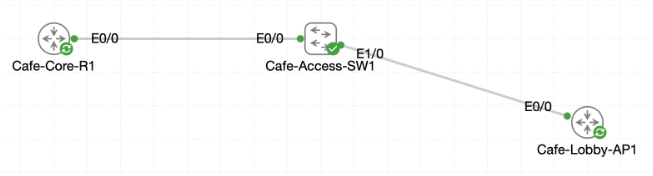

# Lab 061 - Using Cisco Discovery Protocol

<p class="back-link">
  <a href="../../Lab-index.html">← Back to Lab Index</a>
</p>

<table>
<tr>
<td colspan="2" valign="top">

# Objective

#### Verify that Cisco Discovery Protocol is enabled on the core router.

#### Use CDP neighbour information to identify directly connected devices, interfaces, hold timers, management addresses and software details.

#### Map the access-layer neighbours from Cafe-Access-SW1.

#### Disable CDP on the guest-facing access port to reduce unnecessary infrastructure exposure.

</td>
</tr>

<tr>
<td valign="top">

</td>
</tr>
</table>

---

## Scenario

This lab used Cisco Discovery Protocol to rebuild a basic network map from live device output.

The starting point was `Cafe-Core-R1`, which connected to `Cafe-Access-SW1`. CDP was used to confirm that the discovery protocol was active, identify the connected switch, gather management information, and then pivot to the access switch to map downstream neighbours.

The final task was to reduce information leakage by disabling CDP on the guest-facing access interface connected toward `Cafe-Lobby-AP1`.

---

## Devices Used

* Cafe-Core-R1
* Cafe-Access-SW1
* Cafe-Lobby-AP1

---

## Key Addressing and Discovery Information

| Device | Management Address | Discovery Source | Notes |
| --- | --- | --- | --- |
| Cafe-Core-R1 | 192.168.21.1 | Seen from Cafe-Access-SW1 | Core router neighbour |
| Cafe-Access-SW1 | 192.168.21.2 | Seen from Cafe-Core-R1 | Access switch management address |
| Cafe-Lobby-AP1 | 192.168.50.2 | Seen from Cafe-Access-SW1 | Guest services / lobby device |

---

## Interface Mapping

| Local Device | Local Interface | Remote Device | Remote Interface | Purpose |
| --- | --- | --- | --- | --- |
| Cafe-Core-R1 | Ethernet0/0 | Cafe-Access-SW1 | Ethernet0/0 | Core-to-access link |
| Cafe-Access-SW1 | Ethernet0/0 | Cafe-Core-R1 | Ethernet0/0 | Uplink to core router |
| Cafe-Access-SW1 | Ethernet1/0 | Cafe-Lobby-AP1 | Ethernet0/0 | Guest services drop |

---

## Task 0 - Check the CDP Heartbeat on Cafe-Core-R1

### Step 1 - Verify CDP Status

The first step was to confirm that CDP was globally enabled on the core router.

```bash
show cdp
```

### Result

```bash
Global CDP information:
        Sending CDP packets every 60 seconds
        Sending a holdtime value of 180 seconds
        Sending CDPv2 advertisements is enabled
```

### Explanation

This confirmed that `Cafe-Core-R1` was actively sending CDP advertisements every 60 seconds, using a 180-second hold timer.

The hold timer is the amount of time a neighbour keeps the CDP entry before removing it if no further advertisements are received.

---

### Step 2 - Review CDP Neighbours from the Core Router

```bash
show cdp neighbors
```

### Result

```bash
Device ID        Local Intrfce     Holdtme    Capability  Platform  Port ID
Cafe-Access-SW1  Eth 0/0           151             R S I  Linux Uni Eth 0/0

Total cdp entries displayed : 1
```

### Explanation

`Cafe-Core-R1` discovered one directly connected neighbour:

* The neighbour was `Cafe-Access-SW1`.
* The local interface was `Ethernet0/0`.
* The remote interface was `Ethernet0/0`.
* The advertised hold timer was 151 seconds at the time of capture.

This established the first core-to-access layer link in the topology.

---

## Task 1 - Pull Management Intel for Cafe-Access-SW1

### Step 3 - Review Detailed CDP Neighbour Information

```bash
show cdp neighbors detail
```

### Result

```bash
Device ID: Cafe-Access-SW1
Entry address(es):
  IP address: 192.168.21.2
Platform: Linux Unix,  Capabilities: Router Switch IGMP
Interface: Ethernet0/0,  Port ID (outgoing port): Ethernet0/0
Holdtime : 171 sec
```

The detailed output also showed the software version:

```bash
Cisco IOS Software [IOSXE], Linux Software (X86_64BI_LINUX_L2-ADVENTERPRISEK9-M), Version 17.16.1a, RELEASE SOFTWARE (fc1)
```

### Explanation

The detailed CDP output provided the information needed to document and access the neighbour:

* Management IP address: `192.168.21.2`
* Platform: `Linux Unix`
* Capabilities: Router, Switch and IGMP
* Local interface: `Cafe-Core-R1 Ethernet0/0`
* Remote port: `Cafe-Access-SW1 Ethernet0/0`
* IOS XE version: `17.16.1a`

---

## Task 2 - Map the Access Layer from Cafe-Access-SW1

### Step 4 - Connect to Cafe-Access-SW1

The switch management address learned through CDP was used for a Telnet session.

```bash
Cafe-Core-R1#telnet 192.168.21.2
```

### Result

```bash
Trying 192.168.21.2 ... Open

User Access Verification
Password:
Cafe-Access-SW1>
```

### Explanation

CDP provided a usable management address for the neighbouring access switch. This allowed the operator to pivot from the core router to the access layer.

The `enable` command returned `% No password set`, so the CDP show commands were run from user EXEC mode where possible.

---

### Step 5 - Review CDP Neighbours from Cafe-Access-SW1

```bash
show cdp neighbors
```

### Result

```bash
Device ID        Local Intrfce     Holdtme    Capability  Platform  Port ID
Cafe-Lobby-AP1   Eth 1/0           128               R    Linux Uni Eth 0/0
Cafe-Core-R1     Eth 0/0           153               R    Linux Uni Eth 0/0

Total cdp entries displayed : 2
```

### Explanation

The access switch had two CDP neighbours:

* `Cafe-Core-R1` on local interface `Ethernet0/0`.
* `Cafe-Lobby-AP1` on local interface `Ethernet1/0`.

This completed the access-layer map and confirmed which interface served the guest-facing lobby device.

---

### Step 6 - Review Detailed Access-Layer Neighbour Output

```bash
show cdp neighbors detail
```

### Cafe-Lobby-AP1 Detail

```bash
Device ID: Cafe-Lobby-AP1
Entry address(es):
  IP address: 192.168.50.2
Platform: Linux Unix,  Capabilities: Router
Interface: Ethernet1/0,  Port ID (outgoing port): Ethernet0/0
Holdtime : 121 sec
```

### Cafe-Core-R1 Detail

```bash
Device ID: Cafe-Core-R1
Entry address(es):
  IP address: 192.168.21.1
Platform: Linux Unix,  Capabilities: Router
Interface: Ethernet0/0,  Port ID (outgoing port): Ethernet0/0
Holdtime : 146 sec
```

### Explanation

This verified both the local and remote interface identifiers:

* `Cafe-Lobby-AP1` connected to `Cafe-Access-SW1 Ethernet1/0`, with remote port `Ethernet0/0`.
* `Cafe-Core-R1` connected to `Cafe-Access-SW1 Ethernet0/0`, with remote port `Ethernet0/0`.

---

## Task 3 - Silence CDP on the Guest Drop

### Step 7 - Disable CDP on Ethernet1/0

The guest-facing interface was placed into interface configuration mode and CDP was disabled locally.

```bash
configure terminal
interface ethernet1/0
no cdp enable
end
```

### Explanation

Disabling CDP on untrusted or guest-facing ports reduces the amount of infrastructure information leaked to devices outside the trusted network boundary.

CDP can expose details such as device names, management addresses, platform information, capabilities and interface identifiers. This is useful for administrators, but not desirable on ports that face untrusted users.

---

### Step 8 - Verify Interface Configuration

```bash
show running-config interface Ethernet1/0
```

### Result

```bash
interface Ethernet1/0
 description Guest services drop toward Cafe-Lobby-AP1 (lab step: Ethernet0/4)
 switchport access vlan 20
 switchport mode access
 no cdp enable
```

### Explanation

The running configuration confirmed that CDP was disabled directly under `Ethernet1/0`.

---

### Step 9 - Verify CDP Interface State

```bash
show cdp interface Ethernet1/0
```

### Result

```bash
CDP is not enabled on interface Ethernet1/0
```

### Explanation

This was the strongest immediate proof that CDP advertisements had been disabled on the guest-facing interface.

---

### Step 10 - Confirm CDP Neighbour Age-Out Behaviour

Immediately after disabling CDP, `Cafe-Lobby-AP1` still appeared in the neighbour table:

```bash
Device ID        Local Intrfce     Holdtme    Capability  Platform  Port ID
Cafe-Lobby-AP1   Eth 1/0           100               R    Linux Uni Eth 0/0
Cafe-Core-R1     Eth 0/0           133               R    Linux Uni Eth 0/0
```

After the previous hold timer aged out, only the core router remained:

```bash
Device ID        Local Intrfce     Holdtme    Capability  Platform  Port ID
Cafe-Core-R1     Eth 0/0           173               R    Linux Uni Eth 0/0

Total cdp entries displayed : 1
```

### Explanation

This behaviour was expected. CDP neighbour entries do not necessarily disappear immediately when CDP is disabled on an interface. They remain visible until the hold timer expires.

---

## Troubleshooting and Notes

### Note 1 - CDP neighbour entries can take time to appear

The lab instructions stated that CDP advertisements are sent every 60 seconds. If the neighbour table is empty at first, it is normal to wait for the next advertisement interval and check again.

---

### Note 2 - Telnet access did not provide privileged EXEC access

During the Telnet session to `Cafe-Access-SW1`, the `enable` command returned:

```bash
% No password set
```

The access-layer CDP show commands were still usable from user EXEC mode. The configuration step was then performed from a privileged prompt on `Cafe-Access-SW1`.

---

### Note 3 - CDP should be disabled selectively, not globally

The lab did not disable CDP globally. It disabled CDP only on the guest-facing interface. This preserved useful discovery information on trusted infrastructure links while suppressing it where exposure was unnecessary.

---

## Key Learning Points

* CDP is useful for mapping directly connected Cisco devices.
* `show cdp` confirms global CDP timer and holdtime values.
* `show cdp neighbors` gives a quick summary of connected devices and interfaces.
* `show cdp neighbors detail` reveals management addresses, platform information, capabilities, software version and remote port identifiers.
* CDP can be useful for troubleshooting undocumented networks.
* CDP should be suppressed on guest-facing or untrusted interfaces.
* `no cdp enable` disables CDP on a single interface.
* CDP neighbour entries may remain visible until the hold timer expires.
* Interface running configuration and `show cdp interface` are stronger immediate proof than the neighbour table directly after disabling CDP.

---

## Completion Check

The lab was completed successfully.

* `Cafe-Core-R1` confirmed CDP was globally enabled.
* CDP advertisements were shown as being sent every 60 seconds.
* CDP holdtime was shown as 180 seconds globally.
* `Cafe-Core-R1` discovered `Cafe-Access-SW1` on local `Ethernet0/0`.
* `Cafe-Access-SW1` reported management IP address `192.168.21.2`.
* Detailed CDP output confirmed the switch platform, capabilities and IOS XE version.
* Telnet to `192.168.21.2` opened successfully.
* `Cafe-Access-SW1` discovered `Cafe-Core-R1` on `Ethernet0/0`.
* `Cafe-Access-SW1` discovered `Cafe-Lobby-AP1` on `Ethernet1/0`.
* Detailed neighbour output confirmed the remote port IDs as `Ethernet0/0`.
* CDP was disabled on `Cafe-Access-SW1 Ethernet1/0`.
* `show running-config interface Ethernet1/0` confirmed `no cdp enable`.
* `show cdp interface Ethernet1/0` confirmed CDP was not enabled on that interface.
* After the hold timer aged out, the CDP neighbour table no longer listed `Cafe-Lobby-AP1`.
