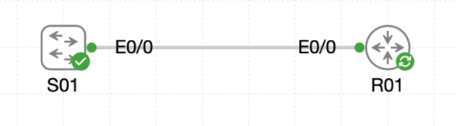

# Lab 062 - Using Link Layer Discovery Protocol

<p class="back-link">
  <a href="../../Lab-index.html">← Back to Lab Index</a>
</p>

<table>
<tr>
<td colspan="2" valign="top">

<h1>Objective</h1>

<h4>Enable LLDP globally on the bunker switch and field router.</h4>

<h4>Use LLDP neighbour output to confirm the physical connection between S01 and R01.</h4>

<h4>Capture detailed LLDP neighbour information, including capabilities, port IDs and management address.</h4>

<h4>Tune LLDP behaviour on S01 so Ethernet0/0 receives LLDP information without transmitting advertisements.</h4>

<h4>Verify that S01 continues to learn R01 while R01 stops learning S01 after S01 transmission is disabled.</h4>

</td>
</tr>

<tr>
<td valign="top">

</td>
</tr>
</table>

---

## Scenario

This lab demonstrates how Link Layer Discovery Protocol can be used to build a live map of connected network devices.

The topology contains a bunker switch, `S01`, connected to a field router, `R01`. LLDP was initially enabled on the switch, then enabled on the router so neighbour discovery could occur in both directions. After confirming discovery, LLDP transmission was disabled on `S01` interface `Ethernet0/0` while receive remained enabled.

This allowed the switch to continue learning about the router while reducing the information that the switch advertised out of that interface.

---

## Devices Used

* S01
* R01

---

## Discovery Plan

| Device | Interface | Connected To | LLDP Role |
| --- | --- | --- | --- |
| S01 | Ethernet0/0 | R01 Ethernet0/0 | Initially transmit and receive; later receive-only |
| R01 | Ethernet0/0 | S01 Ethernet0/0 | Transmit and receive |

---

## Task 0 - Spark LLDP on the Switch

### Step 1 - Enable LLDP on S01

LLDP was enabled globally on the switch.

```bash
S01>enable
S01#configure terminal
S01(config)#lldp run
S01(config)#end
```

### Verification

```bash
show lldp
```

### Result

```bash
Global LLDP Information:
    Status: ACTIVE
    LLDP advertisements are sent every 30 seconds
    LLDP hold time advertised is 120 seconds
    LLDP interface reinitialisation delay is 2 seconds
```

### Explanation

`lldp run` enables LLDP globally. Once enabled, the switch can send and receive LLDP frames on interfaces where LLDP is allowed.

The switch confirmed:

* LLDP was active.
* Advertisements were sent every 30 seconds.
* The advertised hold time was 120 seconds.

---

### Step 2 - Check Initial LLDP Neighbours on S01

```bash
show lldp neighbors
```

### Result

```bash
Device ID           Local Intf     Hold-time  Capability      Port ID

Total entries displayed: 0
```

### Explanation

This was expected at this stage. LLDP had been enabled on `S01`, but `R01` was not yet running LLDP, so there was no router advertisement for the switch to learn.

---

## Task 1 - Light Up LLDP on the Router

### Step 3 - Enable LLDP on R01

```bash
R01>enable
R01#configure terminal
R01(config)#lldp run
R01(config)#end
```

### Step 4 - Check LLDP Neighbours on R01

An initial command used the British spelling `neighbours`, which IOS did not recognise.

```bash
show lldp neighbours
```

### Result

```bash
% Invalid input detected at '^' marker.
```

The command was then corrected to the IOS-supported spelling.

```bash
show lldp neighbors
```

### Result

```bash
Device ID           Local Intf     Hold-time  Capability      Port ID
S01                 Et0/0          120        B,R             Et0/0

Total entries displayed: 1
```

### Explanation

The router successfully learned `S01` through LLDP. The output confirmed:

* The neighbour was `S01`.
* The local router interface was `Et0/0`.
* The remote port ID was `Et0/0`.
* The neighbour advertised bridge and router capabilities.
* The hold time was 120 seconds.

---

### Step 5 - Capture Detailed LLDP Information

```bash
show lldp neighbors detail
```

### Key Output

```bash
Local Intf: Et0/0
Chassis id: aabb.cc00.0100
Port id: Et0/0
Port Description: Link to R01
System Name: S01
System Capabilities: B,R
Enabled Capabilities: B,R
Management Addresses:
    IP: 10.21.0.2
Vlan ID: 1
Peer Source MAC: aabb.cc00.0100
```

### Explanation

The detailed LLDP view provided a richer record of the neighbour. The most important evidence was the management address for `S01`, which was `10.21.0.2`.

This is the sort of information engineers can use when documentation is missing or out of date.

---

## Task 2 - Tighten LLDP Direction on the Switch

### Step 6 - Disable LLDP Transmit on S01 Ethernet0/0

The switch was reconfigured so that `Ethernet0/0` would no longer send LLDP advertisements.

```bash
S01#configure terminal
S01(config)#interface Ethernet0/0
S01(config-if)#no lldp transmit
S01(config-if)#end
```

### Running Configuration Evidence

```bash
show running-config interface Ethernet0/0
```

### Result

```bash
interface Ethernet0/0
 description Link to R01
 no lldp transmit
end
```

### Explanation

This changed the interface into a receive-only LLDP posture. The switch could still listen to R01, but it would stop advertising its own identity out of that port.

---

### Step 7 - Confirm Interface-Level LLDP Direction

```bash
show lldp interface Ethernet0/0
```

### Result

```bash
Ethernet0/0:
    Tx: disabled
    Rx: enabled
    Tx state: INIT
    Rx state: WAIT FOR FRAME
```

### Explanation

This confirmed the intended interface policy:

* LLDP transmit was disabled.
* LLDP receive remained enabled.

This is useful on ports where the device should still learn neighbouring information but should not expose its own discovery details.

---

### Step 8 - Confirm S01 Still Learns R01

```bash
show lldp neighbors
```

### Result on S01

```bash
Device ID           Local Intf     Hold-time  Capability      Port ID
R01                 Et0/0          120        R               Et0/0

Total entries displayed: 1
```

### Explanation

Because LLDP receive was still enabled on `S01`, the switch continued to learn `R01` on `Ethernet0/0`.

---

### Step 9 - Confirm R01 Stops Learning S01

```bash
show lldp neighbors
```

### Result on R01

```bash
Device ID           Local Intf     Hold-time  Capability      Port ID

Total entries displayed: 0
```

### Explanation

After `no lldp transmit` was applied on `S01`, `R01` no longer had an active LLDP neighbour entry for the switch. This showed that the switch was no longer advertising itself out of the link toward the router.

---

## Troubleshooting and Notes

### Issue 1 - LLDP initially showed no neighbours on S01

#### Observation

```bash
Total entries displayed: 0
```

#### Explanation

This was expected because LLDP had not yet been enabled on `R01`.

---

### Issue 2 - IOS command spelling

#### Failed command

```bash
show lldp neighbours
```

#### Result

```bash
% Invalid input detected at '^' marker.
```

#### Correct command

```bash
show lldp neighbors
```

#### Explanation

Cisco IOS uses the American spelling `neighbors` in this command.

---

### Issue 3 - LLDP neighbour ageing

After disabling LLDP transmit, the old neighbour entry may remain visible until the shutdown frame is processed or the previous hold timer expires.

In this capture, `R01` eventually showed zero LLDP neighbours, proving that S01 was no longer transmitting LLDP advertisements.

---

## Key Learning Points

* LLDP is a vendor-neutral Layer 2 discovery protocol.
* `lldp run` enables LLDP globally.
* `show lldp` confirms global LLDP status, advertisement interval and hold time.
* `show lldp neighbors` provides a quick neighbour summary.
* `show lldp neighbors detail` reveals management address, platform, capabilities and port information.
* LLDP can be tuned per interface.
* `no lldp transmit` stops local advertisements while still allowing LLDP receive to remain active.
* LLDP should be disabled or limited on untrusted-facing interfaces to reduce information exposure.
* Cisco IOS uses `neighbors`, not `neighbours`, in LLDP show commands.

---

## Completion Check

The lab was completed successfully.

* LLDP was enabled globally on `S01`.
* `S01` reported LLDP as active, with 30-second advertisements and a 120-second hold time.
* LLDP was enabled globally on `R01`.
* `R01` learned `S01` on local interface `Et0/0`.
* Detailed LLDP output on `R01` showed `S01` management address `10.21.0.2`.
* `S01` interface `Ethernet0/0` was configured with `no lldp transmit`.
* `show lldp interface Ethernet0/0` showed `Tx: disabled` and `Rx: enabled`.
* `S01` continued to learn `R01` on `Et0/0`.
* `R01` no longer listed `S01` as an active LLDP neighbour after S01 stopped transmitting.
