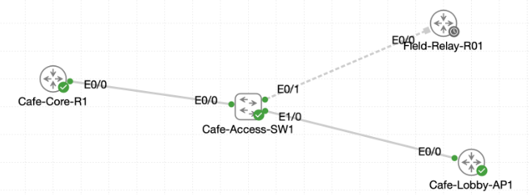

# Lab 063 - Field Discovery Safeguards

<p class="back-link">
  <a href="../../Lab-index.html">← Back to Lab Index</a>
</p>

<table>
<tr>
<td colspan="2" valign="top">

<h1>Objective</h1>

<h4>Restore and verify Cisco Discovery Protocol visibility between the shelter core router and access switch.</h4>

<h4>Use discovery output to record neighbour timers, management addresses, platforms and interface mappings.</h4>

<h4>Reduce information exposure by disabling discovery advertisements on the guest-facing access interface.</h4>

<h4>Enable LLDP between the access switch and field relay, then tune the switch interface so it listens without transmitting extra information.</h4>

</td>
</tr>

<tr>
<td valign="top">

</td>
</tr>
</table>

---

## Scenario

This lab combines CDP and LLDP discovery work into a single discovery-hardening exercise.

Castle Rysen needed visibility across a shelter core router, an access switch, a guest-facing device and a field relay. The task was to bring discovery protocols back online where they were operationally useful, use them to document the live topology, and then reduce exposure on untrusted or sensitive interfaces.

The lab covered two discovery protocols:

* **CDP** between `Cafe-Core-R1`, `Cafe-Access-SW1` and `Cafe-Lobby-AP1`.
* **LLDP** between `Cafe-Access-SW1` and `Field-Relay-R01`.

---

## Devices Used

* Cafe-Core-R1
* Cafe-Access-SW1
* Cafe-Lobby-AP1
* Field-Relay-R01

---

## Discovery Protocol Plan

| Protocol | Device / Interface | Action | Purpose |
| --- | --- | --- | --- |
| CDP | Cafe-Core-R1 | Enable globally | Restore Cisco neighbour visibility |
| CDP | Cafe-Access-SW1 | Enable globally | Allow the switch to discover upstream and downstream devices |
| CDP | Cafe-Access-SW1 Ethernet1/0 | Disable on interface | Prevent guest-facing CDP advertisement leakage |
| LLDP | Field-Relay-R01 | Enable globally | Allow standards-based discovery on the relay link |
| LLDP | Cafe-Access-SW1 | Enable globally | Discover the relay from the switch side |
| LLDP | Cafe-Access-SW1 Ethernet0/1 | Disable transmit only | Keep receiving relay information while reducing switch disclosure |

---

## Task 1 - Reignite the Core Beacon

### Step 1 - Enable CDP on Cafe-Core-R1

CDP was re-enabled globally on the core router.

```bash
configure terminal
cdp run
end
```

### Step 2 - Verify Global CDP Status

```bash
show cdp
```

### Result

```bash
Global CDP information:
        Sending CDP packets every 60 seconds
        Sending a holdtime value of 180 seconds
        Sending CDPv2 advertisements is enabled
```

### Explanation

This confirmed that CDP was active globally on `Cafe-Core-R1`. CDP advertisements were being sent every 60 seconds, with a 180-second hold timer.

---

### Step 3 - Confirm Initial Neighbour State

```bash
show cdp neighbors
show cdp neighbors detail
```

### Initial Result

```bash
Total cdp entries displayed : 0
```

### Explanation

The router initially had no CDP neighbours. This was expected because the access switch also needed CDP enabled before the two devices could discover each other.

---

### Step 4 - Enable CDP on Cafe-Access-SW1

On the access switch, CDP was enabled globally.

```bash
configure terminal
cdp run
end
```

---

### Step 5 - Verify Cafe-Core-R1 Learns Cafe-Access-SW1

Back on the core router:

```bash
show cdp neighbors
```

### Result

```bash
Device ID        Local Intrfce     Holdtme    Capability  Platform  Port ID
Cafe-Access-SW1  Eth 0/0           176             R S I  Linux Uni Eth 0/0
```

### Explanation

`Cafe-Core-R1` successfully discovered `Cafe-Access-SW1` on local interface `Ethernet0/0`. The switch also reported its remote port as `Ethernet0/0`.

---

### Step 6 - Capture Detailed CDP Management Information

```bash
show cdp neighbors detail
```

### Result

```bash
Device ID: Cafe-Access-SW1
Entry address(es):
  IP address: 192.168.21.2
Platform: Linux Unix,  Capabilities: Router Switch IGMP
Interface: Ethernet0/0,  Port ID (outgoing port): Ethernet0/0
Holdtime : 171 sec
```

```bash
Version :
Cisco IOS Software [IOSXE], Linux Software (X86_64BI_LINUX_L2-ADVENTERPRISEK9-M), Version 17.16.1a, RELEASE SOFTWARE (fc1)
```

### Explanation

CDP provided the access switch management address, platform, capabilities, remote interface ID and IOS XE version. This information is useful when building or validating network documentation from the live topology.

---

## Task 2 - Map the Access Layer

### Step 7 - Connect to Cafe-Access-SW1

The management address learned through CDP was used to Telnet to the access switch.

```bash
telnet 192.168.21.2
```

### Result

```bash
Trying 192.168.21.2 ... Open

User Access Verification
Password:
Cafe-Access-SW1>en
% No password set
```

### Explanation

Telnet connectivity to the switch worked, but privileged EXEC access was unavailable from that session because no enable password was configured. The lab output then continued from the switch console for privileged commands.

---

### Step 8 - Verify CDP on Cafe-Access-SW1

```bash
show cdp
```

### Result

```bash
Global CDP information:
        Sending CDP packets every 60 seconds
        Sending a holdtime value of 180 seconds
        Sending CDPv2 advertisements is enabled
```

---

### Step 9 - Discover Access Switch Neighbours

```bash
show cdp neighbors
```

### Result

```bash
Device ID        Local Intrfce     Holdtme    Capability  Platform  Port ID
Cafe-Lobby-AP1   Eth 1/0           157               R    Linux Uni Eth 0/0
Cafe-Core-R1     Eth 0/0           179               R    Linux Uni Eth 0/0
```

### Explanation

The access switch saw two neighbours:

* `Cafe-Core-R1` upstream on local interface `Ethernet0/0`.
* `Cafe-Lobby-AP1` downstream on local interface `Ethernet1/0`.

Both neighbours reported remote port `Ethernet0/0`.

---

### Step 10 - Capture Detailed Access-Layer Neighbour Information

```bash
show cdp neighbors detail
```

### Cafe-Lobby-AP1 Evidence

```bash
Device ID: Cafe-Lobby-AP1
Entry address(es):
  IP address: 192.168.50.2
Platform: Linux Unix,  Capabilities: Router
Interface: Ethernet1/0,  Port ID (outgoing port): Ethernet0/0
Holdtime : 145 sec
```

### Cafe-Core-R1 Evidence

```bash
Device ID: Cafe-Core-R1
Entry address(es):
  IP address: 192.168.21.1
Platform: Linux Unix,  Capabilities: Router
Interface: Ethernet0/0,  Port ID (outgoing port): Ethernet0/0
Holdtime : 167 sec
```

### Explanation

This documented both local and remote interface mappings, along with the management addresses for the downstream and upstream devices.

---

## Task 3 - Muffle the Guest Drop

### Step 11 - Attempt to Disable CDP Transmit Only

The first attempted command was:

```bash
no cdp transmit
```

### Result

```bash
% Invalid input detected at '^' marker.
```

### Explanation

Unlike LLDP, this IOS command set did not support a separate `no cdp transmit` command at the interface level. CDP on the interface had to be disabled entirely.

---

### Step 12 - Disable CDP on the Guest-Facing Interface

```bash
configure terminal
interface Ethernet1/0
no cdp enable
end
```

### Verification

```bash
show running-config interface Ethernet1/0
```

### Result

```bash
interface Ethernet1/0
 description Guest services drop toward Cafe-Lobby-AP1
 switchport access vlan 20
 switchport mode access
 no cdp enable
end
```

### Additional Verification

```bash
show cdp interface Ethernet1/0
```

### Result

```bash
CDP is not enabled on interface Ethernet1/0
```

### Explanation

The guest-facing interface remained operational, but CDP was disabled so the switch no longer advertised infrastructure information out toward the guest-side device.

---

### Step 13 - Observe CDP Hold Timer Age-Out

Immediately after disabling CDP on `Ethernet1/0`, the previous `Cafe-Lobby-AP1` neighbour entry was still visible:

```bash
Cafe-Lobby-AP1   Eth 1/0           58                R    Linux Uni Eth 0/0
Cafe-Core-R1     Eth 0/0           144               R    Linux Uni Eth 0/0
```

### Explanation

This is expected. CDP neighbour entries do not disappear instantly if they were already learned. They remain until the hold timer expires unless a shutdown update or other event removes them sooner.

---

## Task 4 - Harden the Relay Link with LLDP

### Step 14 - Enable LLDP on Field-Relay-R01

The first attempted command was entered in the wrong order:

```bash
run lldp
```

### Result

```bash
% Invalid input detected at '^' marker.
```

### Correct Command

```bash
configure terminal
lldp run
end
```

### Verification

```bash
show lldp
```

### Result

```bash
Global LLDP Information:
    Status: ACTIVE
    LLDP advertisements are sent every 30 seconds
    LLDP hold time advertised is 120 seconds
    LLDP interface reinitialisation delay is 2 seconds
```

### Initial Neighbour Result

```bash
Total entries displayed: 0
```

### Explanation

LLDP was active on the relay, but it had not yet learned a neighbour because LLDP still needed to be enabled on the switch side.

---

### Step 15 - Enable LLDP on Cafe-Access-SW1

```bash
configure terminal
lldp run
end
```

### Verification

```bash
show lldp
```

### Result

```bash
Global LLDP Information:
    Status: ACTIVE
    LLDP advertisements are sent every 30 seconds
    LLDP hold time advertised is 120 seconds
    LLDP interface reinitialisation delay is 2 seconds
```

### Neighbour Result

```bash
Device ID           Local Intf     Hold-time  Capability      Port ID
Field-Relay-R01     Et0/1          120        R               Et0/0
```

### Explanation

The switch successfully discovered `Field-Relay-R01` using LLDP on local interface `Ethernet0/1`.

---

### Step 16 - Disable LLDP Transmit on Cafe-Access-SW1 Ethernet0/1

```bash
configure terminal
interface Ethernet0/1
no lldp transmit
end
```

### Verification

```bash
show running-config interface Ethernet0/1
```

### Result

```bash
interface Ethernet0/1
 description Link to Field-Relay-R01 Ethernet0/0
 switchport mode access
 no lldp transmit
end
```

### Interface LLDP Status

```bash
show lldp interface Ethernet0/1
```

### Result

```bash
Ethernet0/1:
    Tx: disabled
    Rx: enabled
    Tx state: INIT
    Rx state: WAIT FOR FRAME
```

### Explanation

This created a receive-only LLDP policy on the switch interface. `Cafe-Access-SW1` could continue listening for LLDP frames from the relay, but it no longer transmitted LLDP advertisements back out of that port.

---

### Step 17 - Confirm Cafe-Access-SW1 Still Learns the Relay

```bash
show lldp neighbors
```

### Result

```bash
Device ID           Local Intf     Hold-time  Capability      Port ID
Field-Relay-R01     Et0/1          120        R               Et0/0
```

### Explanation

The switch still learned `Field-Relay-R01`, proving LLDP receive remained active even though transmit had been disabled.

---

## Troubleshooting and Notes

### Issue 1 - No CDP neighbours initially on Cafe-Core-R1

The core router initially showed no CDP entries even after `cdp run` was enabled.

```bash
Total cdp entries displayed : 0
```

This was resolved by enabling CDP globally on `Cafe-Access-SW1` as well.

---

### Issue 2 - Telnet access worked, but enable failed

```bash
Cafe-Access-SW1>en
% No password set
```

The switch was reachable through its management address, but privileged EXEC was not available from the Telnet session because the enable password was not configured. The console session was used for privileged configuration work.

---

### Issue 3 - `no cdp transmit` was not valid

```bash
Cafe-Access-SW1(config-if)#no cdp transmit
                                   ^
% Invalid input detected at '^' marker.
```

The valid interface-level suppression command on this device was:

```bash
no cdp enable
```

---

### Issue 4 - `run lldp` was not valid

```bash
Field-Relay-R01(config)#run lldp
                         ^
% Invalid input detected at '^' marker.
```

The correct global LLDP command was:

```bash
lldp run
```

---

### Evidence Note - Final Relay-Side LLDP Check

The supplied output confirms that `Cafe-Access-SW1` continued to learn `Field-Relay-R01` after `no lldp transmit` was applied on `Ethernet0/1`.

The supplied output does not include a final `show lldp neighbors` check from `Field-Relay-R01` after the old hold timer expired. Because the switch interface was set to receive-only, the expected result would be that the relay eventually stops listing `Cafe-Access-SW1` as an LLDP neighbour.

---

## Key Learning Points

* CDP is Cisco-focused and can expose useful topology information such as local interfaces, remote ports, management addresses, platform details and software versions.
* CDP must be active on neighbouring devices before entries appear in the neighbour table.
* CDP neighbour entries may remain visible until their hold timer expires.
* Disabling CDP on guest-facing interfaces reduces unnecessary information exposure.
* LLDP is standards-based and useful where multi-vendor or non-Cisco discovery is required.
* LLDP can be controlled directionally on an interface using transmit and receive settings.
* `no lldp transmit` allows a device to keep learning neighbours without advertising its own details out of that interface.
* Discovery protocols are useful operational tools, but they should be limited on untrusted links.

---

## Completion Check

The lab was completed successfully.

* CDP was re-enabled globally on `Cafe-Core-R1`.
* `Cafe-Core-R1` discovered `Cafe-Access-SW1` on `Ethernet0/0`.
* CDP detailed output showed the access switch management address as `192.168.21.2`.
* CDP detailed output identified the switch platform as `Linux Unix` with IOS XE version information.
* `Cafe-Access-SW1` discovered both `Cafe-Core-R1` and `Cafe-Lobby-AP1`.
* Local and remote interface mappings were documented for the core and lobby devices.
* CDP was disabled on guest-facing `Ethernet1/0` using `no cdp enable`.
* `show cdp interface Ethernet1/0` confirmed CDP was disabled on the guest-facing port.
* LLDP was enabled on `Field-Relay-R01`.
* LLDP was enabled on `Cafe-Access-SW1`.
* `Cafe-Access-SW1` discovered `Field-Relay-R01` on local interface `Ethernet0/1`.
* LLDP transmit was disabled on `Cafe-Access-SW1 Ethernet0/1`.
* `show lldp interface Ethernet0/1` confirmed `Tx: disabled` and `Rx: enabled`.
* The switch continued learning the field relay after transmit was disabled, proving the interface remained receive-capable.
