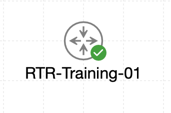

# Lab 064 - Manually Setting Cisco Clocks

<p class="back-link">
  <a href="../../Lab-index.html">← Back to Lab Index</a>
</p>

<table>
<tr>
<td colspan="2" valign="top">

# Objective

#### Inspect the default system clock on a Cisco router and identify whether it is still using the hardware calendar.

#### Manually configure the router clock from privileged EXEC mode.

#### Configure a custom time zone label and UTC offset for Castle Rysen Standard Time.

#### Verify that the clock displays the correct local time and that the active time source is user configuration.

</td>
</tr>

<tr>
<td valign="top">

</td>
</tr>
</table>

---

## Scenario

This lab focused on manual time configuration on `RTR-Training-01`.

The router initially reported time from its hardware calendar and displayed a leading asterisk beside the clock output. That matters because router logs, certificate checks, security messages and troubleshooting evidence all depend on accurate timestamps.

The task was to inspect the default clock state, manually set the correct time and date, configure the Castle Rysen Standard Time zone, and verify that the router reported the manually configured time source.

---

## Devices Used

| Device | Role |
| --- | --- |
| `RTR-Training-01` | Cisco training router used for manual clock and time-zone configuration |

---

## Time Configuration Plan

| Item | Value |
| --- | --- |
| Target local time | `11:22:30` |
| Target date | `12 September 2024` |
| Initial time zone | `UTC` |
| Final time zone label | `CRST` |
| CRST offset | `UTC -7` |
| Final time source | `user configuration` |

---

## Task 0 - Audit the Bunker Clock

### Step 1 - Check the Current Clock

The first step was to check the router clock from privileged EXEC mode.

```bash
show clock
```

### Evidence

```bash
RTR-Training-01#show clock
*11:18:49.947 UTC Thu Aug 20 2026
```

### Explanation

The leading `*` indicated that the router clock was not authoritative or synchronised. The router was still relying on its default clock state rather than a trusted configured time source.

---

### Step 2 - Check the Detailed Clock Source

The detailed clock output was then checked.

```bash
show clock detail
```

### Evidence

```bash
RTR-Training-01#show clock detail
*11:19:26.333 UTC Thu Aug 20 2026
Time source is hardware calendar
```

### Explanation

This confirmed that the router was using the hardware calendar as its time source.

The console also displayed PKI warnings stating that the clock was not authoritative:

```bash
%PKI-2-NON_AUTHORITATIVE_CLOCK: PKI functions can not be initialized until an authoritative time source, like NTP, can be obtained.
```

This reinforced why accurate time configuration is important for security functions and logging.

---

## Task 1 - Set Castle Rysen Time

### Step 3 - Manually Set the Router Clock

The system clock was manually set from privileged EXEC mode.

```bash
clock set 11:22:30 12 September 2024
```

### Verification

```bash
show clock
show clock detail
```

### Evidence

```bash
RTR-Training-01#show clock
11:22:35.210 UTC Thu Sep 12 2024
```

```bash
RTR-Training-01#show clock detail
11:22:42.625 UTC Thu Sep 12 2024
Time source is user configuration
```

### Explanation

After setting the clock manually, the leading `*` disappeared and the detailed output changed to:

```bash
Time source is user configuration
```

This confirmed that the router was now using the manually configured clock value rather than the hardware calendar.

---

## Task 2 - Anchor the Time Zone

### Step 4 - Configure Castle Rysen Standard Time

Castle Rysen Standard Time was configured with a seven-hour offset behind UTC.

```bash
configure terminal
clock timezone CRST -7
end
```

### Verification

```bash
show running-config | include clock timezone
```

### Evidence

```bash
clock timezone CRST -7 0
```

### Explanation

The router was configured to display local time using the `CRST` label with a `UTC -7` offset.

---

### Step 5 - Reapply the Intended Local Clock Time

After applying the time-zone setting, the clock was set again so that the displayed local time matched the lab requirement.

```bash
clock set 11:22:30 12 September 2024
```

### Final Verification

```bash
show clock
show clock detail
```

### Evidence

```bash
RTR-Training-01#show clock
11:22:35.912 CRST Thu Sep 12 2024
```

```bash
RTR-Training-01#show clock detail
11:22:48.838 CRST Thu Sep 12 2024
Time source is user configuration
```

### Explanation

The router now displayed the intended Castle Rysen Standard Time label and still reported the time source as user configuration.

---

## Troubleshooting and Notes

### Issue 1 - `no logging console` entered from the wrong mode

#### Symptom

```bash
RTR-Training-01#no logging console
                   ^
% Invalid input detected at '^' marker.
```

#### Cause

The command was entered from privileged EXEC mode. `no logging console` is a global configuration command.

#### Fix

The router was moved into global configuration mode before applying the command.

```bash
configure terminal
no logging console
end
```

---

### Issue 2 - Router clock initially not authoritative

#### Symptom

```bash
*11:19:26.333 UTC Thu Aug 20 2026
Time source is hardware calendar
```

#### Cause

The router had not yet been manually configured or synchronised with a trusted time source.

#### Fix

The clock was manually configured with:

```bash
clock set 11:22:30 12 September 2024
```

The result was:

```bash
Time source is user configuration
```

---

## Key Learning Points

* `show clock` gives a quick view of the current router time.
* `show clock detail` shows the current time source.
* A leading `*` in the clock output indicates the time is not authoritative.
* `clock set` is entered from privileged EXEC mode, not global configuration mode.
* `clock timezone` is entered from global configuration mode.
* Time-zone changes affect how time is displayed locally.
* After changing the time zone, the local displayed time may need to be set again to match the intended operational schedule.
* Accurate router time is important for logs, certificates, authentication and security troubleshooting.

---

## Completion Check

The lab was completed successfully.

* The initial clock showed a leading `*`, indicating an unsynchronised or non-authoritative clock.
* `show clock detail` confirmed the original time source was the hardware calendar.
* The router clock was manually set to `11:22:30` on `12 September 2024`.
* The detailed clock output changed to `Time source is user configuration`.
* The time zone was configured as `CRST`, seven hours behind UTC.
* The running configuration confirmed `clock timezone CRST -7 0`.
* The clock was realigned after applying the time-zone configuration.
* Final verification showed `11:22` with the `CRST` time-zone label.
* Final detailed verification confirmed `Time source is user configuration`.
