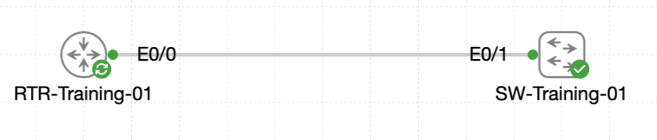

# Lab 065 - Setting the Clock with NTP

<p class="back-link">
  <a href="../../Lab-index.html">← Back to Lab Index</a>
</p>

<table>
<tr>
<td colspan="2" valign="top">

# Objective

#### Calibrate a Cisco router with Castle Rysen Standard Time.

#### Configure the router as the local NTP master for the training network.

#### Publish NTP from a stable loopback interface.

#### Configure an access switch to use the router as its NTP server.

#### Verify reachability and interpret the live simulator NTP association state honestly.

</td>
</tr>

<tr>
<td valign="top">

</td>
</tr>
</table>

---

## Scenario

This lab focused on configuring local time services using NTP.

`RTR-Training-01` was configured as the bunker’s authoritative clock source. The router was assigned the Castle Rysen Standard Time zone, manually set to the required local time, promoted as an NTP master, and given a loopback interface so devices could reach a stable NTP source address.

`SW-Training-01` was then configured with a management SVI, default path to the router, matching time-zone settings, and an NTP server entry pointing to the router loopback.

The key learning point in this lab was not only the configuration itself, but also how to interpret NTP evidence in the simulator. The switch could successfully ping the router and the router loopback, but the live NTP association remained in `.INIT.` with reach `0`. That was documented as a simulator behaviour rather than misrepresenting the lab as fully synchronised.

---

## Devices Used

| Device | Role |
| --- | --- |
| `RTR-Training-01` | Router configured as the local NTP master |
| `SW-Training-01` | Access switch configured as an NTP client |

---

## Addressing and Time Plan

| Item | Value |
| --- | --- |
| Router loopback | `Loopback100` |
| Router NTP source address | `10.22.100.1/32` |
| Switch management SVI | `Vlan10` |
| Switch management IP | `10.0.18.11/24` |
| Switch default gateway | `10.0.18.1` |
| Switch static default route | `0.0.0.0/0 via 10.0.18.1` |
| NTP server configured on switch | `10.22.100.1` |
| Time zone label | `CRST` |
| Time zone offset | `UTC -7` |
| Required local time | `11:32:30` |
| Required date | `12 September 2024` |

---

## Task 0 - Establish the Castle Time Source

### Step 1 - Disable Console Logging Noise

Console logging was disabled to make the lab output easier to read.

```bash
configure terminal
no logging console
end
```

### Step 2 - Configure the Router Time Zone and NTP Master

The router was configured with the Castle Rysen Standard Time zone and promoted as an NTP master.

```bash
configure terminal
clock timezone CRST -7
ntp master
end
```

### Step 3 - Set the Router Clock

The router clock was manually set to the required Castle Rysen local time.

```bash
clock set 11:32:30 12 September 2024
```

### Verification

```bash
show clock
show clock detail
show ntp status
```

### Evidence

```bash
RTR-Training-01#show clock
11:32:34.410 CRST Thu Sep 12 2024
```

```bash
RTR-Training-01#show clock detail
11:32:40.525 CRST Thu Sep 12 2024
Time source is NTP
```

```bash
RTR-Training-01#show ntp status
Clock is unsynchronized, stratum 8, reference is 127.127.1.1
```

### Explanation

The router was acting as an NTP master using the local oscillator reference `127.127.1.1` and reporting stratum `8`.

The output still stated `Clock is unsynchronized`. In this lab, that status was expected and recorded honestly. The router was still suitable as the configured local NTP master for the training scenario, but the live status line did not claim an upstream NTP synchronisation source.

---

## Task 1 - Publish a Stable NTP Interface

### Step 4 - Create Loopback100

A loopback interface was added to give the NTP service a stable source address.

```bash
configure terminal
interface Loopback100
 ip address 10.22.100.1 255.255.255.255
exit
ntp source Loopback100
end
```

### Verification

```bash
show ip interface brief | include Loopback100
show running-config | include ntp
show ntp status
```

### Evidence

```bash
RTR-Training-01#show ip interface brief | include Loopback100
Loopback100            10.22.100.1     YES manual up                    up
```

```bash
RTR-Training-01#show running-config | include ntp
ntp source Loopback100
ntp master
```

```bash
RTR-Training-01#show ntp status
Clock is unsynchronized, stratum 8, reference is 127.127.1.1
```

### Explanation

The loopback interface was operational and was configured as the NTP source. This is better than sourcing NTP from a physical interface because the loopback can remain reachable even if the physical forwarding path changes, provided routing still exists.

---

## Task 2 - Point the Access Switch at Castle Time

### Step 5 - Configure Switch Management Reachability

`SW-Training-01` needed a management IP and a path to the router loopback before it could reach the NTP server.

```bash
configure terminal
interface vlan 10
 ip address 10.0.18.11 255.255.255.0
 no shutdown
exit
ip default-gateway 10.0.18.1
ip route 0.0.0.0 0.0.0.0 10.0.18.1
clock timezone CRST -7
ntp server 10.22.100.1
end
```

### Explanation

The switch was configured with:

* A management SVI on VLAN 10.
* A default gateway for Layer 2 management behaviour.
* A static default route so it could reach the router loopback.
* The same `CRST` time-zone setting as the router.
* The router loopback as its NTP server.

---

### Step 6 - Verify Reachability to the Router and Loopback

```bash
ping 10.0.18.1
ping 10.22.100.1
```

### Evidence

```bash
SW-Training-01#ping 10.0.18.1
!!!!!
Success rate is 100 percent (5/5), round-trip min/avg/max = 1/1/1 ms
```

```bash
SW-Training-01#ping 10.22.100.1
!!!!!
Success rate is 100 percent (5/5), round-trip min/avg/max = 1/1/1 ms
```

### Explanation

The switch could reach both the directly connected router gateway and the router’s loopback-based NTP source.

This proved the NTP issue seen later was not caused by basic IP reachability.

---

### Step 7 - Inspect Switch NTP Status

```bash
show ntp status
show ntp associations
show clock detail
```

### Evidence

```bash
SW-Training-01#show ntp status
Clock is unsynchronized, stratum 16, no reference clock
```

```bash
SW-Training-01#show ntp associations

  address         ref clock       st   when   poll reach  delay  offset   disp
 ~10.22.100.1     .INIT.          16     19     64     0  0.000   0.000 15937.
 * sys.peer, # selected, + candidate, - outlyer, x falseticker, ~ configured
```

```bash
SW-Training-01#show clock detail
*04:44:23.097 CRST Thu Aug 20 2026
Time source is NTP
```

### Explanation

The switch listed `10.22.100.1` as a configured NTP peer, shown by the `~` marker.

However, the association remained in `.INIT.`, the reach value stayed at `0`, and the switch stayed at stratum `16`. That means the switch had the NTP server configured but had not successfully synchronised with it in this simulator build.

The lab notes specifically stated that this live simulator behaviour should be recorded rather than waiting indefinitely for the switch to advance to stratum `9`.

---

## Troubleshooting and Notes

### Issue 1 - Router reported unsynchronised despite `ntp master`

#### Evidence

```bash
Clock is unsynchronized, stratum 8, reference is 127.127.1.1
```

#### Explanation

The router was configured as the local NTP master and used the local oscillator reference. It did not have an upstream external NTP source, so the status line still reported unsynchronised.

For this lab, the important router-side evidence was:

```bash
ntp source Loopback100
ntp master
```

and the stratum `8` local oscillator reference.

---

### Issue 2 - Switch could reach the NTP server but remained in `.INIT.`

#### Evidence

```bash
SW-Training-01#ping 10.22.100.1
!!!!!
Success rate is 100 percent (5/5)
```

```bash
~10.22.100.1     .INIT.          16     35     64     0
```

#### Explanation

The switch had IP reachability to the NTP server but did not form a working NTP association. The lab source described this as simulator behaviour. The correct approach was to record the actual evidence instead of claiming full NTP synchronisation.

---

## Key Learning Points

* NTP allows devices to use a shared time source for consistent logs and troubleshooting.
* `ntp master` can make a router act as a local time authority.
* A loopback interface is a stable source for services such as NTP.
* `ntp source Loopback100` tells the router to source NTP from the loopback address.
* Client devices still need IP reachability to the NTP source address.
* `show ntp status` shows synchronisation state and stratum.
* `show ntp associations` shows configured peers and whether an NTP relationship is forming.
* `.INIT.` with reach `0` means the configured peer has not successfully exchanged NTP updates.
* Simulator limitations should be documented honestly rather than hidden.

---

## Completion Check

The lab was completed successfully within the behaviour of the live simulator.

* `RTR-Training-01` was configured with `clock timezone CRST -7`.
* The router clock was set to the required Castle Rysen local time.
* `RTR-Training-01` was configured with `ntp master`.
* `Loopback100` was created with `10.22.100.1/32`.
* `ntp source Loopback100` was configured.
* The router reported stratum `8` with reference `127.127.1.1`.
* `SW-Training-01` was configured with VLAN 10 management IP `10.0.18.11/24`.
* The switch was given a default path via `10.0.18.1`.
* The switch successfully pinged both `10.0.18.1` and `10.22.100.1`.
* The switch was configured with `ntp server 10.22.100.1`.
* `show ntp associations` listed `10.22.100.1` as the configured peer.
* The live simulator kept the association in `.INIT.` with reach `0`, which was documented as the final observed state.
