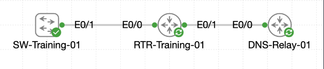

# Lab 066 - Using DNS on Cisco Devices

<p class="back-link">
  <a href="../../Lab-index.html">← Back to Lab Index</a>
</p>

<table>
<tr>
<td colspan="2" valign="top">

# Objective

#### Configure a Cisco router to use an upstream DNS resolver for external hostname lookups.

#### Enable the router's local DNS service and create internal Castle Rysen host records.

#### Configure an access switch to use the router as its DNS server.

#### Verify hostname resolution from both the router and switch using successful ping tests and host-table evidence.

</td>
</tr>

<tr>
<td valign="top">

</td>
</tr>
</table>

---

## Scenario

This lab focused on DNS configuration across a small Cisco training topology.

`RTR-Training-01` acted as the central router for the Castle Rysen training network. It had an internal connection toward `SW-Training-01` and a separate upstream DNS-facing interface. The goal was to prove that the router could use an external resolver, then convert the router into the internal DNS authority for Castle Rysen hostnames.

Once the router was serving DNS locally, `SW-Training-01` was configured to use the router as its resolver so that internal hostnames such as `orders`, `archive`, and `roaster` could be resolved without relying directly on the upstream resolver.

---

## Devices Used

| Device | Role |
| --- | --- |
| `RTR-Training-01` | Router, upstream DNS client, and local DNS server |
| `SW-Training-01` | Access switch using the router for DNS resolution |

---

## Addressing and DNS Plan

| Device | Interface / Setting | Value | Purpose |
| --- | --- | --- | --- |
| `RTR-Training-01` | `Ethernet0/0` | `10.22.30.1` | Internal link toward access switch |
| `RTR-Training-01` | `Ethernet0/1` | `203.0.113.54/30` | Upstream DNS-facing interface |
| Upstream resolver | DNS server | `203.0.113.53` | External DNS relay |
| `SW-Training-01` | `Vlan10` | `10.22.30.11/24` | Switch management SVI |
| `SW-Training-01` | Default gateway / route | `10.22.30.1` | Path to router and service loopbacks |
| Castle domain | Domain name | `castlerysen.local` | Internal DNS suffix |

---

## Local DNS Records

| Hostname | Address |
| --- | --- |
| `roaster.castlerysen.local` | `10.22.88.15` |
| `orders.castlerysen.local` | `10.22.88.25` |
| `archive.castlerysen.local` | `10.22.88.45` |

---

## Task 0 - Point the Router at the Upstream Resolver

### Step 1 - Confirm the Router Interfaces

The router was checked to confirm the internal interface was already up and to identify the upstream interface state.

```bash
show ip interface brief | include Ethernet0/0|Ethernet0/1
```

### Evidence

```bash
RTR-Training-01#show ip interface brief | include Ethernet0/0|Ethernet0/1
Ethernet0/0            10.22.30.1      YES TFTP   up                    up      
Ethernet0/1            unassigned      YES unset  administratively down down
```

### Explanation

`Ethernet0/0` was already operational on the internal side of the topology, but `Ethernet0/1` was administratively down. Because this interface was needed to reach the upstream resolver, it had to be addressed and enabled.

---

### Step 2 - Bring Up the Upstream DNS Link

`Ethernet0/1` was configured with the upstream-facing address and brought online.

```bash
configure terminal
interface Ethernet0/1
 ip address 203.0.113.54 255.255.255.252
 no shutdown
exit
ip name-server 203.0.113.53
end
```

### Step 3 - Verify Resolver Reachability

The router successfully reached the upstream DNS resolver.

```bash
RTR-Training-01#ping 203.0.113.53
Type escape sequence to abort.
Sending 5, 100-byte ICMP Echos to 203.0.113.53, timeout is 2 seconds:
!!!!!
Success rate is 100 percent (5/5), round-trip min/avg/max = 1/1/1 ms
```

---

### Step 4 - Verify Public DNS Resolution

The router then resolved and pinged `cisco.com`.

```bash
RTR-Training-01#ping cisco.com   
Type escape sequence to abort.
Sending 5, 100-byte ICMP Echos to 198.51.100.10, timeout is 2 seconds:
!!!!!
Success rate is 100 percent (5/5), round-trip min/avg/max = 1/1/1 ms
```

### Explanation

This proved that `RTR-Training-01` could use the upstream resolver at `203.0.113.53` to resolve names outside the local Castle Rysen domain.

---

## Task 1 - Build Castle Rysen's Local DNS Records

### Step 5 - Configure the Router as a Local DNS Server

The local DNS domain and host records were configured on `RTR-Training-01`.

```bash
configure terminal
ip domain name castlerysen.local
ip dns server
ip host roaster.castlerysen.local 10.22.88.15
ip host orders.castlerysen.local 10.22.88.25
ip host archive.castlerysen.local 10.22.88.45
end
```

### Explanation

`ip dns server` allowed the router to answer DNS queries. The `ip host` entries created local name-to-address mappings for Castle Rysen services.

---

### Step 6 - Test Local Hostname Resolution from the Router

The router successfully resolved and reached all three local Castle Rysen records.

```bash
RTR-Training-01#ping roaster
Sending 5, 100-byte ICMP Echos to 10.22.88.15, timeout is 2 seconds:
!!!!!
Success rate is 100 percent (5/5), round-trip min/avg/max = 1/1/1 ms
```

```bash
RTR-Training-01#ping archive.castlerysen.local
Sending 5, 100-byte ICMP Echos to 10.22.88.45, timeout is 2 seconds:
!!!!!
Success rate is 100 percent (5/5), round-trip min/avg/max = 1/1/1 ms
```

```bash
RTR-Training-01#ping orders
Sending 5, 100-byte ICMP Echos to 10.22.88.25, timeout is 2 seconds:
!!!!!
Success rate is 100 percent (5/5), round-trip min/avg/max = 1/1/1 ms
```

---

### Step 7 - Verify the Router Host Table

```bash
RTR-Training-01#show hosts
Default domain is castlerysen.local
Name servers are 203.0.113.53
NAME  TTL  CLASS   TYPE      DATA/ADDRESS
-----------------------------------------
 15.88.22.10.in-addr.arpa       10      IN      PTR     roaster.castlerysen.local
 25.88.22.10.in-addr.arpa       10      IN      PTR     orders.castlerysen.local
 45.88.22.10.in-addr.arpa       10      IN      PTR     archive.castlerysen.local
 archive.castlerysen.local      10      IN      A       10.22.88.45
 orders.castlerysen.local       10      IN      A       10.22.88.25
 roaster.castlerysen.local      10      IN      A       10.22.88.15
```

### Explanation

The router retained the upstream resolver for non-local names, while also storing local `castlerysen.local` records for internal devices.

---

## Task 2 - Aim the Access Switch at Castle DNS

### Step 8 - Confirm the Switch Management Path

The switch uplink and management SVI were checked.

```bash
SW-Training-01#show interfaces status | include Et0/1
Et0/1        Uplink to RTR-Trai connected    10           full   auto 10/100/1000BaseTX
```

```bash
SW-Training-01#show ip interface brief | include Vlan10 
Vlan10                 10.22.30.11     YES TFTP   up                    up
```

### Explanation

The switch had an operational VLAN 10 management SVI at `10.22.30.11`, and its uplink toward the router was connected in VLAN 10.

---

### Step 9 - Configure DNS Settings on the Switch

The switch was configured to use the router as its DNS resolver and to use the Castle Rysen local domain.

```bash
configure terminal
interface vlan 10
 ip address 10.22.30.11 255.255.255.0
 no shutdown
exit
ip default-gateway 10.22.30.1
ip route 0.0.0.0 0.0.0.0 10.22.30.1
ip domain name castlerysen.local
ip name-server 10.22.30.1
end
```

### Explanation

The switch used `10.22.30.1` as both its gateway and DNS server. A static default route was also added so the switch could reach the off-subnet Castle service addresses in `10.22.88.0`.

---

### Step 10 - Verify Hostname Resolution from the Switch

The switch successfully resolved and reached the Castle Rysen hostnames.

```bash
SW-Training-01#ping orders
Sending 5, 100-byte ICMP Echos to 10.22.88.25, timeout is 2 seconds:
!!!!!
Success rate is 100 percent (5/5), round-trip min/avg/max = 1/1/1 ms
```

```bash
SW-Training-01#ping archive
Sending 5, 100-byte ICMP Echos to 10.22.88.45, timeout is 2 seconds:
!!!!!
Success rate is 100 percent (5/5), round-trip min/avg/max = 1/1/1 ms
```

```bash
SW-Training-01#ping roaster 
Sending 5, 100-byte ICMP Echos to 10.22.88.15, timeout is 2 seconds:
!!!!!
Success rate is 100 percent (5/5), round-trip min/avg/max = 1/1/1 ms
```

### Explanation

The successful pings prove that the switch could ask the router to resolve short hostnames, append the `castlerysen.local` domain, and then route traffic to the resolved service addresses.

---

## Verification Summary

| Verification | Result |
| --- | --- |
| Router internal interface `Ethernet0/0` up/up | Passed |
| Router upstream interface `Ethernet0/1` configured and reachable | Passed |
| Router can reach upstream resolver `203.0.113.53` | Passed |
| Router resolves `cisco.com` to `198.51.100.10` | Passed |
| Router local DNS server enabled | Passed |
| Router host records created for `roaster`, `orders`, and `archive` | Passed |
| Switch VLAN 10 SVI up/up with `10.22.30.11` | Passed |
| Switch DNS server set to `10.22.30.1` | Passed |
| Switch resolves and pings `orders`, `archive`, and `roaster` | Passed |

---

## Troubleshooting and Notes

### Issue 1 - Mistyped terminal command

#### Symptom

```bash
RTR-Training-01#termnal length 0
                    ^
% Invalid input detected at '^' marker.
```

#### Cause

The command was mistyped as `termnal` instead of `terminal`.

#### Fix

```bash
terminal length 0
```

---

### Issue 2 - Upstream interface initially down

#### Symptom

```bash
Ethernet0/1            unassigned      YES unset  administratively down down
```

#### Cause

The upstream DNS-facing interface had no IP address and was administratively shut down.

#### Fix

```bash
interface Ethernet0/1
 ip address 203.0.113.54 255.255.255.252
 no shutdown
```

---

### Issue 3 - Switch `show hosts` did not retain every resolved entry

#### Observation

The switch resolved and successfully pinged `orders`, `archive`, and `roaster`, but `show hosts` did not keep every resolved entry visible at the same time.

```bash
SW-Training-01#show hosts
Default domain is castlerysen.local
Name servers are 10.22.30.1
```

The final note in the lab confirms that on this switch image, `show hosts` confirms the configured domain and name server, but the successful ping destination address and success rate should be used as the stronger verification evidence.

---

## Key Learning Points

* Cisco devices can use `ip name-server` to forward hostname lookups to a DNS resolver.
* `ip domain name` allows short names such as `orders` to resolve using a default domain suffix.
* `ip dns server` allows a Cisco router to answer DNS requests from other devices.
* `ip host` creates static local hostname records.
* Successful `ping <hostname>` confirms both name resolution and IP reachability.
* `show hosts` can confirm the default domain, configured name servers and cached or static DNS entries.
* A switch may need both a default gateway and a static default route, depending on platform behaviour and management reachability requirements.
* Verification should be based on the actual device output rather than assuming every simulator command behaves exactly like production hardware.

---

## Completion Check

The lab was completed successfully.

* `RTR-Training-01` restored `Ethernet0/1` with `203.0.113.54/30`.
* The router successfully reached the upstream resolver at `203.0.113.53`.
* The router resolved `cisco.com` to `198.51.100.10`.
* The router was configured with `ip name-server 203.0.113.53`.
* The router was enabled as a local DNS server with `ip dns server`.
* Static Castle Rysen records were created for `roaster`, `orders`, and `archive`.
* The router resolved and successfully pinged all three Castle hostnames.
* `SW-Training-01` used `10.22.30.1` as its DNS server.
* The switch successfully resolved and pinged `orders`, `archive`, and `roaster`.
* The switch image did not retain every resolved entry in `show hosts`, so successful DNS-based ping output was used as the main evidence.
