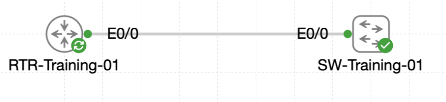

# Lab 067 - Configuring DHCP Services on Cisco Devices

<p class="back-link">
  <a href="../../Lab-index.html">← Back to Lab Index</a>
</p>

<table>
<tr>
<td colspan="2" valign="top">

# Objective

#### Configure a Cisco router to act as a DHCP server for multiple VLANs.

#### Exclude reserved infrastructure address ranges before creating DHCP pools.

#### Build DHCP pools for the Admin and Patron VLANs with the correct gateway, domain name and DNS options.

#### Use a switch management SVI as a DHCP client and verify the assigned lease, gateway and DNS settings.

</td>
</tr>

<tr>
<td valign="top">

</td>
</tr>
</table>

---

## Scenario

This lab simulated Castle Rysen's Fallout Shelter Gamma access stack, where `RTR-Training-01` provides DHCP services to downstream VLANs through router-on-a-stick subinterfaces.

The router needed to reserve infrastructure addresses, create DHCP scopes for both the Admin and Patron networks, and issue a valid DHCP lease to `SW-Training-01` on VLAN 10.

The goal was to prove that the DHCP server could hand out correct addressing information while protecting statically assigned infrastructure addresses from accidental lease allocation.

---

## Devices Used

| Device | Role |
| --- | --- |
| `RTR-Training-01` | Router and DHCP server |
| `SW-Training-01` | Access switch and DHCP client on VLAN 10 |

---

## Addressing and DHCP Plan

| VLAN / Pool | Network | Gateway | Excluded Range | DNS Server | Domain |
| --- | --- | --- | --- | --- | --- |
| VLAN 10 / `ADMIN-NET` | `10.22.10.0/24` | `10.22.10.1` | `10.22.10.1 - 10.22.10.20` | `10.22.30.53` | `castlerysen.local` |
| VLAN 20 / `PATRON-NET` | `10.22.20.0/24` | `10.22.20.1` | `10.22.20.1 - 10.22.20.20` | `10.22.30.53` | `castlerysen.local` |

---

## Task 0 - Lock Down the Reserved Addresses

### Step 1 - Confirm Router Subinterfaces Are Up

The parent router interface was enabled and the VLAN subinterfaces were checked.

```bash
interface Ethernet0/0
 no shutdown
```

### Evidence

```bash
RTR-Training-01#show ip interface brief | include Ethernet0/0
Ethernet0/0            unassigned      YES unset  up                    up      
Ethernet0/0.10         10.22.10.1      YES TFTP   up                    up      
Ethernet0/0.20         10.22.20.1      YES TFTP   up                    up
```

### Explanation

`Ethernet0/0` had to be operational because the router's subinterfaces depend on the parent interface. Once the parent interface was up, the Admin and Patron gateway subinterfaces were also up/up.

---

### Step 2 - Exclude Reserved Infrastructure Addresses

The reserved address blocks were excluded before creating DHCP pools.

```bash
ip dhcp excluded-address 10.22.10.1 10.22.10.20
ip dhcp excluded-address 10.22.20.1 10.22.20.20
```

### Evidence

```bash
RTR-Training-01#show running-config | section dhcp
ip dhcp excluded-address 10.22.10.1 10.22.10.20
ip dhcp excluded-address 10.22.20.1 10.22.20.20
```

### Explanation

These exclusions stop DHCP from handing out addresses reserved for routers, switches, monitoring tools or other static infrastructure devices.

---

## Task 1 - Build the Admin and Patron DHCP Pools

### Step 3 - Create the Admin Pool

The Admin VLAN pool was configured for the `10.22.10.0/24` network.

```bash
ip dhcp pool ADMIN-NET
 network 10.22.10.0 255.255.255.0
 default-router 10.22.10.1
 domain-name castlerysen.local
 dns-server 10.22.30.53
```

### Step 4 - Create the Patron Pool

The Patron VLAN pool was configured for the `10.22.20.0/24` network.

```bash
ip dhcp pool PATRON-NET
 network 10.22.20.0 255.255.255.0
 default-router 10.22.20.1
 domain-name castlerysen.local
 dns-server 10.22.30.53
```

### Verification

```bash
show ip dhcp pool
```

### Evidence

```bash
Pool ADMIN-NET :
 Total addresses                : 254
 Leased addresses               : 0
 Excluded addresses             : 20
 Current index        IP address range                    Leased/Excluded/Total
 10.22.10.1           10.22.10.1       - 10.22.10.254      0     / 20    / 254
```

```bash
Pool PATRON-NET :
 Total addresses                : 254
 Leased addresses               : 0
 Excluded addresses             : 20
 Current index        IP address range                    Leased/Excluded/Total
 10.22.20.1           10.22.20.1       - 10.22.20.254      0     / 20    / 254
```

### Explanation

Each pool covered a full `/24` network with 254 usable host addresses, but the first 20 addresses were excluded from dynamic allocation.

---

## Task 2 - Watch the DORA Dance from the Switch

### Step 5 - Enable DHCP Debugging on the Router

DHCP server packet debugging was enabled before the switch requested a lease.

```bash
debug ip dhcp server packet
```

### Evidence

```bash
RTR-Training-01#debug ip dhcp server packet
DHCP server packet debugging is on.
```

### Note

No live DHCP debug messages appeared in the captured output. This was likely because console logging had previously been disabled with:

```bash
no logging console
```

The DHCP lease evidence still confirms that the request and reply completed successfully.

---

### Step 6 - Configure the Switch SVI as a DHCP Client

On `SW-Training-01`, VLAN 10 was configured to request its address by DHCP.

```bash
interface vlan 10
 ip address dhcp
 no shutdown
```

### Verification

```bash
show ip interface brief | include Vlan10
show dhcp lease
show hosts
```

### Evidence

```bash
SW-Training-01#show ip interface brief | include Vlan10
Vlan10                 10.22.10.21     YES DHCP   up                    up
```

```bash
SW-Training-01#show dhcp lease
Temp IP addr: 10.22.10.21  for peer on Interface: Vlan10
Temp  sub net mask: 255.255.255.0
   DHCP Lease server: 10.22.10.1, state: 5 Bound
Temp default-gateway addr: 10.22.10.1
```

```bash
SW-Training-01#show hosts
Default domain is castlerysen.local
Name servers are 10.22.30.53
```

### Explanation

The switch successfully joined the Admin VLAN using DHCP. The assigned address was `10.22.10.21`, which is the first available address after the excluded `10.22.10.1 - 10.22.10.20` range.

The DHCP lease also confirmed that the switch learned the correct default gateway and DNS options from the `ADMIN-NET` pool.

---

### Step 7 - Confirm the Router DHCP Binding

The DHCP binding table on the router confirmed the active lease.

```bash
show ip dhcp binding
```

### Evidence

```bash
RTR-Training-01#show ip dhcp binding
Bindings from all pools not associated with VRF:
IP address      Client-ID/              Lease expiration        Type       State      Interface
10.22.10.21     0063.6973.636f.2d61.    Aug 21 2026 01:17 PM    Automatic  Active     Ethernet0/0.10
```

### Explanation

The router recorded the switch lease as an automatic active binding on `Ethernet0/0.10`, proving the VLAN 10 DHCP pool issued the address correctly.

---

### Step 8 - Disable Debugging

The DHCP debug output was disabled after the test.

```bash
undebug all
```

### Evidence

```bash
RTR-Training-01#undebug all
All possible debugging has been turned off
```

---

## Troubleshooting and Notes

### Issue 1 - Mistyped DHCP Command

#### Symptom

```bash
RTR-Training-01(config)#ip dhsp excluded-address 10.22.10.1 10.22.10.20
                             ^
% Invalid input detected at '^' marker.
```

#### Cause

`dhcp` was mistyped as `dhsp`.

#### Fix

The command was re-entered correctly:

```bash
ip dhcp excluded-address 10.22.10.1 10.22.10.20
```

---

### Issue 2 - DHCP Debug Messages Were Not Captured

#### Observation

DHCP debugging was enabled before the switch requested a lease, but no debug packet messages appeared in the captured CLI output.

#### Likely Cause

Console logging had been disabled earlier with:

```bash
no logging console
```

#### Evidence Still Supporting Success

The DHCP process still completed correctly because:

* `SW-Training-01` received `10.22.10.21` through DHCP.
* `show dhcp lease` showed state `Bound`.
* The router showed an active DHCP binding for `10.22.10.21`.
* The switch learned the correct default gateway, domain and DNS server settings.

---

## Key Learning Points

* DHCP excluded addresses protect static infrastructure devices from accidental dynamic assignment.
* DHCP pools define the network, default gateway, domain name and DNS server options for clients.
* Router-on-a-stick DHCP depends on the parent interface and subinterfaces being up/up.
* `show ip dhcp pool` verifies pool size, exclusions and lease usage.
* `show dhcp lease` on a Cisco switch confirms the lease state and learned gateway.
* `show ip dhcp binding` on the router confirms active DHCP leases.
* Debugging is only useful if output is visible; disabling console logging can hide expected debug messages.
* The first lease in this lab was `10.22.10.21`, proving the excluded range was respected.

---

## Completion Check

The lab was completed successfully.

* `RTR-Training-01` had `Ethernet0/0`, `Ethernet0/0.10` and `Ethernet0/0.20` up/up.
* Reserved infrastructure ranges were excluded for both VLANs.
* The `ADMIN-NET` and `PATRON-NET` DHCP pools were configured.
* Each pool showed 254 total addresses and 20 excluded addresses.
* `SW-Training-01` obtained `10.22.10.21` through DHCP on `Vlan10`.
* The switch lease showed the DHCP server as `10.22.10.1` and state `Bound`.
* The switch learned the default gateway `10.22.10.1`.
* The switch learned the DNS server `10.22.30.53` and domain `castlerysen.local`.
* The router DHCP binding table showed `10.22.10.21` as an active automatic lease on `Ethernet0/0.10`.
* Debugging was disabled cleanly with `undebug all`.
