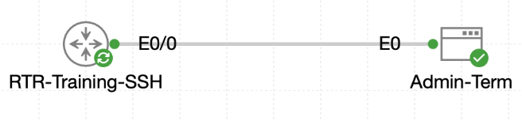

# Lab 068 - Configuring SSH on Cisco Devices

<p class="back-link">
  <a href="../../Lab-index.html">← Back to Lab Index</a>
</p>

<table>
<tr>
<td colspan="2" valign="top">

# Objective

#### Prepare a Cisco router with the hostname, domain name and management interface state needed for SSH.

#### Create a local privileged user account and generate RSA keys for encrypted remote access.

#### Lock the VTY lines so the router accepts SSH only and rejects clear-text Telnet sessions.

#### Verify that SSH version 2 is active and that a live remote session is recorded on the router.

</td>
</tr>

<tr>
<td valign="top">

</td>
</tr>
</table>

---

## Scenario

This lab focused on replacing insecure remote access with SSH on `RTR-Training-SSH`.

The router was connected to an administrative Linux terminal named `Admin-Term` over `Ethernet0/0`. The goal was to make sure the router had the correct identity information, create a local privileged account, generate RSA keys, restrict the VTY lines to SSH only, and then prove that Telnet was refused while SSH succeeded.

This is an important management-plane hardening task. Telnet sends traffic in clear text, while SSH provides encrypted remote access and allows a router to authenticate named local users.

---

## Devices Used

| Device | Role |
| --- | --- |
| `RTR-Training-SSH` | Cisco router being hardened for SSH access |
| `Admin-Term` | TinyCore Linux admin terminal used to test Telnet and SSH access |

---

## Addressing and Access Plan

| Device | Interface / Role | Address / Detail |
| --- | --- | --- |
| `RTR-Training-SSH` | `Ethernet0/0` | `10.22.45.1` |
| `Admin-Term` | Source host | `10.22.45.10` shown in the successful SSH session |
| Router hostname | Required identity | `RTR-Training-SSH` |
| Domain name | Required for RSA key generation | `castlerysen.local` |
| Local SSH user | Privileged account | `fieldtech` privilege `15` |
| SSH key modulus | RSA key size | `2048` bits |
| VTY access policy | Allowed protocol | SSH only |

---

## Task 0 - Solidify the Router Identity

### Step 1 - Confirm the Management Interface

The router initially started with the default `Router` hostname. The first check confirmed that `Ethernet0/0` was already operational and had the expected management-side address.

```bash
show ip interface brief | include Ethernet0/0
```

### Evidence

```bash
Router#show ip interface brief | include Ethernet0/0
Ethernet0/0            10.22.45.1      YES TFTP   up                    up
```

### Explanation

SSH testing requires basic IP reachability between the admin terminal and the router. The `up/up` state confirmed that the local management interface was ready before the SSH configuration began.

---

### Step 2 - Configure the Hostname and Domain Name

RSA keys are generated using the router hostname and domain name. The router was renamed and given the Castle Rysen domain.

```bash
configure terminal
hostname RTR-Training-SSH
ip domain name castlerysen.local
end
write memory
```

### Verification

```bash
show running-config | include hostname|ip domain name
```

### Evidence

```bash
hostname RTR-Training-SSH
ip domain name castlerysen.local
```

### Explanation

The hostname and domain name created the fully qualified identity used during RSA key generation:

```bash
RTR-Training-SSH.castlerysen.local
```

---

## Task 1 - Issue Credentials and Encryption Keys

### Step 3 - Create the Local Privileged User

A local user account was created for SSH authentication.

```bash
username fieldtech privilege 15 secret BunkerSSH!
```

### Verification

```bash
show running-config | include username
```

### Evidence

```bash
username fieldtech privilege 15 secret 9 $9$8LKaOniOwlOU7.$MbzGH5tklYd8.eOZ4QFleZIVCyoMNr2Z4sS18pKPVVI
```

### Explanation

The user `fieldtech` was assigned privilege level 15, meaning successful SSH login places the user directly into privileged EXEC capability.

The secret is stored in encrypted form in the running configuration, which is why the output shows a type 9 hash rather than the plain-text password.

---

### Step 4 - Generate RSA Keys

RSA keys were generated using a 2048-bit modulus.

```bash
crypto key generate rsa
```

When prompted, the modulus was set to:

```bash
2048
```

### Evidence

```bash
The name for the keys will be: RTR-Training-SSH.castlerysen.local
How many bits in the modulus [2048]: 2048
% Generating crypto RSA keys in background ...
```

### Explanation

SSH requires cryptographic keys. The router used its hostname and domain name to generate the key label, which confirmed that the identity prerequisites were in place.

---

### Step 5 - Verify SSH Status

```bash
show ip ssh
```

### Evidence

```bash
SSH Enabled - version 2.0
Minimum expected Diffie Hellman key size : 2048 bits
IOS Keys in SECSH format(ssh-rsa, base64 encoded): RTR-Training-SSH.castlerysen.local
Modulus Size : 2048 bits
```

### Explanation

This confirmed that SSH was active, running version 2, and using the required 2048-bit RSA key size.

---

## Task 2 - Enforce Secure Remote Access

### Step 6 - Configure the VTY Lines for SSH Only

The router VTY lines were configured to use the local user database and accept SSH only.

```bash
configure terminal
line vty 0 4
login local
transport input ssh
exit
ip ssh version 2
end
```

### Verification

```bash
show running-config | section line vty
```

### Evidence

```bash
line vty 0 4
 password cisco
 login local
 transport input ssh
```

### Explanation

The key lines are:

```bash
login local
transport input ssh
```

`login local` tells the router to authenticate users against the local username database. `transport input ssh` blocks Telnet and allows only SSH on the VTY lines.

The old VTY password remained in the configuration, but because `login local` was active, the router used the local `fieldtech` account for authentication.

---

## Task 3 - Validate Remote Login Behaviour

### Step 7 - Confirm Telnet Is Rejected

From `Admin-Term`, a Telnet session was attempted to the router.

```bash
telnet 10.22.45.1
```

### Evidence

```bash
cisco@Admin-Term:~$ telnet 10.22.45.1
telnet: can't connect to remote host (10.22.45.1): Connection refused
```

### Explanation

This was the expected result. Telnet was refused because the VTY lines were configured for SSH only.

---

### Step 8 - Confirm SSH Access Works

From the same admin terminal, SSH was attempted with the local user account.

```bash
ssh -o StrictHostKeyChecking=no -l fieldtech 10.22.45.1
```

### Evidence

```bash
cisco@Admin-Term:~$ ssh -o StrictHostKeyChecking=no -l fieldtech 10.22.45.1
Warning: Permanently added '10.22.45.1' (RSA) to the list of known hosts.
(fieldtech@10.22.45.1) Password:
```

### Explanation

The SSH client accepted the router RSA host key and prompted for the `fieldtech` password. This confirmed that the router was offering SSH service to the admin terminal.

---

### Step 9 - Verify the Active SSH Session on the Router

Back on the router, the active user sessions were checked.

```bash
show users
```

### Evidence

```bash
RTR-Training-SSH#show users
    Line       User       Host(s)              Idle       Location
   0 con 0                idle                 00:02:45   
*  2 vty 0     fieldtech  idle                 00:00:00 10.22.45.10
```

### Explanation

The router showed `fieldtech` connected on `vty 0` from `10.22.45.10`, confirming the remote SSH login was active.

---

### Step 10 - Confirm SSH Logs

```bash
show logging | include SSH
```

### Evidence

```bash
%SSH-5-ENABLED: SSH 2.0 has been enabled
%SSH-5-SSH2_SESSION: SSH2 Session request from 10.22.45.10 (tty = 0) using crypto cipher 'chacha20-poly1305@openssh.com', hmac 'hmac-sha2-256-etm@openssh.com' Succeeded
%SSH-5-SSH2_USERAUTH: User 'fieldtech' authentication for SSH2 Session from 10.22.45.10 (tty = 0) using crypto cipher 'chacha20-poly1305@openssh.com', hmac 'hmac-sha2-256-etm@openssh.com' Succeeded
```

### Explanation

The logs confirmed that SSH version 2 was enabled and that the `fieldtech` user successfully authenticated from the admin terminal.

---

## Troubleshooting and Notes

### Issue 1 - Typo in `no logging console`

#### Symptom

```bash
Router(config)#no logginf
```

#### Cause

The word `logging` was mistyped.

#### Fix

The correct command was entered:

```bash
no logging console
```

---

### Issue 2 - Typo in `show running-config`

#### Symptom

```bash
RTR-Training-SSH#show runnning-config | include username
                          ^
% Invalid input detected at '^' marker.
```

#### Cause

`running` was typed with an extra `n`.

#### Fix

The command was re-entered correctly:

```bash
show running-config | include username
```

---

### Issue 3 - VTY password remained visible

The VTY section still showed:

```bash
password cisco
```

This did not prevent the lab from completing because `login local` was also configured, meaning the router authenticated using the local username database instead of the old line password.

---

## Key Learning Points

* SSH requires a hostname and domain name before RSA keys can be generated cleanly.
* `crypto key generate rsa` creates the key material used by SSH.
* A 2048-bit RSA modulus satisfies the lab encryption requirement.
* `username <name> privilege 15 secret <secret>` creates a local privileged account.
* `login local` makes VTY lines use the local username database.
* `transport input ssh` blocks Telnet and permits only SSH.
* `show ip ssh` verifies the SSH version, key size and supported algorithms.
* `show users` confirms active VTY sessions and their source IP addresses.
* Telnet rejection is expected when SSH-only access is enforced.

---

## Completion Check

The lab was completed successfully.

* `Ethernet0/0` on `RTR-Training-SSH` was confirmed as `up/up` with address `10.22.45.1`.
* The router hostname was set to `RTR-Training-SSH`.
* The domain name was set to `castlerysen.local`.
* The local `fieldtech` user was created with privilege level 15.
* A 2048-bit RSA key pair was generated.
* SSH version 2 was active.
* VTY lines were configured with `login local` and `transport input ssh`.
* Telnet from `Admin-Term` was refused.
* SSH from `Admin-Term` using `fieldtech` succeeded.
* `show users` showed `fieldtech` connected over `vty 0` from `10.22.45.10`.
* Router logs confirmed successful SSH version 2 session and user authentication.
