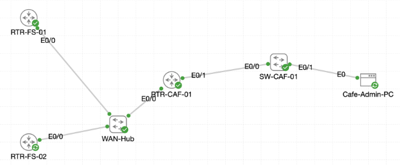

# Lab 069 - Deploying IP Services at Castle Rysen

<p class="back-link">
  <a href="../../Lab-index.html">← Back to Lab Index</a>
</p>

<table>
<tr>
<td colspan="2" valign="top">

# Objective

#### Deploy multiple Cisco IP services across a small routed Castle Rysen environment.

#### Configure DNS authority and forwarding between the fallout shelter routers and the district cafe router.

#### Establish an NTP hierarchy using resilient loopback addresses and document the simulator's live NTP behaviour.

#### Update DHCP pools to distribute DNS, domain and NTP information to clients.

#### Configure PAT/NAT overload for inside client networks and secure router management with SSH.

</td>
</tr>

<tr>
<td valign="top">

</td>
</tr>
</table>

---

## Scenario

This lab simulated a Castle Rysen IP services deployment across three routers:

* `RTR-FS-01` acted as the Fallout Shelter Alpha router.
* `RTR-FS-02` acted as the Fallout Shelter Bravo router.
* `RTR-CAF-01` acted as the district cafe router.

The aim was to build a complete services layer using DNS, NTP, DHCP, NAT and SSH. The shelter routers were configured as resilient DNS and NTP authorities using loopback addresses, while the cafe router provided local DNS, DHCP options, NAT overload and secure SSH-only management access.

The lab also required honest interpretation of simulator behaviour. In this IOS environment, the NTP servers showed the expected stratum and local-clock associations, but still reported `Clock is unsynchronized`. This was recorded as observed evidence rather than treated as a configuration failure.

---

## Devices Used

| Device | Role |
| --- | --- |
| `RTR-FS-01` | Fallout Shelter Alpha router, DNS/NTP authority and SSH endpoint |
| `RTR-FS-02` | Fallout Shelter Bravo router, secondary DNS/NTP authority and SSH endpoint |
| `RTR-CAF-01` | District cafe router, DNS forwarder/local authority, DHCP server, NAT edge and SSH endpoint |
| `Cafe-Admin-PC` | DHCP client used to verify address assignment and DHCP options |

---

## Addressing and Services Plan

### Router and Loopback Addressing

| Device | Interface | Address | Purpose |
| --- | --- | --- | --- |
| `RTR-FS-01` | `Ethernet0/0` | `172.22.0.1` | Shelter Alpha link toward cafe |
| `RTR-FS-01` | `Loopback1` | `1.1.1.1/32` | Stable DNS/NTP source |
| `RTR-FS-02` | `Ethernet0/0` | `172.22.0.5` | Shelter Bravo link toward cafe |
| `RTR-FS-02` | `Loopback1` | `2.2.2.2/32` | Stable DNS/NTP source |
| `RTR-CAF-01` | `Ethernet0/0` | `172.22.0.2` | Cafe uplink toward shelters / NAT outside |
| `RTR-CAF-01` | `Ethernet0/1.10` | `10.22.10.1` | Admin VLAN gateway / NAT inside |
| `RTR-CAF-01` | `Ethernet0/1.20` | `10.22.20.1` | Patron VLAN gateway / NAT inside |
| `RTR-CAF-01` | `Loopback0` | `10.22.255.1/32` | Cafe NTP source for clients |

### DNS Records

| Device | DNS Record | Address | Notes |
| --- | --- | --- | --- |
| `RTR-FS-01` | `cafe.castlerysen.local` | `172.22.0.2` | Local DNS record created on FS-01 |
| `RTR-FS-02` | `cafe1.castlerysen.local` | `172.22.0.2` | Mirrored cafe record on FS-02 |
| `RTR-CAF-01` | `plex.castlerysen.local` | `10.22.10.50` | Local cafe service record |

### DHCP Pools

| Pool | Network | Default Gateway | DNS Server | Domain | NTP Option |
| --- | --- | --- | --- | --- | --- |
| `ADMIN-NET` | `10.22.10.0/24` | `10.22.10.1` | `10.22.10.1` | `castlerysen.local` | Option 42: `10.22.255.1` |
| `PATRON-NET` | `10.22.20.0/24` | `10.22.20.1` | `10.22.10.1` | `castlerysen.local` | Option 42: `10.22.255.1` |

### NAT Plan

| Direction | Interface | NAT Role |
| --- | --- | --- |
| Admin VLAN | `Ethernet0/1.10` | Inside |
| Patron VLAN | `Ethernet0/1.20` | Inside |
| Shelter-facing uplink | `Ethernet0/0` | Outside |

NAT ACL 10 matched:

```bash
access-list 10 permit 10.22.10.0 0.0.0.255
access-list 10 permit 10.22.20.0 0.0.0.255
```

---

## Task 0 - Crown Fallout Shelter Alpha as DNS Authority

### What Was Done

On `RTR-FS-01`, the uplink toward the cafe router was checked first.

```bash
show ip interface brief | include Ethernet0/0
```

The router showed `Ethernet0/0` up/up with `172.22.0.1`.

DNS was then enabled locally, the Castle domain was configured, and a local host record was added.

```bash
ip domain name castlerysen.local
ip dns server
ip host cafe.castlerysen.local 172.22.0.2
ip name-server 1.1.1.1
ip name-server 8.8.8.8
interface Loopback1
 ip address 1.1.1.1 255.255.255.255
```

### Verification

```bash
RTR-FS-01#ping cafe.castlerysen.local
Sending 5, 100-byte ICMP Echos to 172.22.0.2, timeout is 2 seconds:
!!!!!
Success rate is 100 percent (5/5)
```

```bash
RTR-FS-01#show hosts
Default domain is castlerysen.local
Name servers are 1.1.1.1, 8.8.8.8
...
cafe.castlerysen.local 10      IN      A       172.22.0.2
```

### Explanation

`RTR-FS-01` was successfully configured as a local DNS authority and could resolve the cafe hostname to the WAN address of `RTR-CAF-01`.

---

## Task 1 - Mirror DNS Resilience on Shelter Bravo

### What Was Done

On `RTR-FS-02`, the uplink was verified as operational and the DNS configuration was mirrored.

```bash
ip domain name castlerysen.local
ip dns server
ip host cafe1.castlerysen.local 172.22.0.2
ip name-server 1.1.1.1
ip name-server 8.8.8.8
interface Loopback1
 ip address 2.2.2.2 255.255.255.255
```

### Verification

```bash
RTR-FS-02#ping cafe1.castlerysen.local
Sending 5, 100-byte ICMP Echos to 172.22.0.2, timeout is 2 seconds:
!!!!!
Success rate is 100 percent (5/5)
```

```bash
RTR-FS-02#show hosts
Default domain is castlerysen.local
Name servers are 1.1.1.1, 8.8.8.8
...
cafe1.castlerysen.local        10      IN      A       172.22.0.2
```

### Evidence Note

The lab brief asked for identical `cafe1.castlerysen.local` records on the shelter pair. The captured evidence shows `RTR-FS-01` used `cafe.castlerysen.local`, while `RTR-FS-02` used `cafe1.castlerysen.local`. Both records resolved successfully to `172.22.0.2`, but the names were not identical in the submitted CLI evidence.

---

## Task 2 - Publish Local Services from the District Shop

### What Was Done

On `RTR-CAF-01`, the cafe-facing parent interface was initially down. The parent interface was brought up so the VLAN subinterfaces could operate.

```bash
interface Ethernet0/1
 no shutdown
```

### Verification

```bash
RTR-CAF-01#show ip interface brief | include Ethernet0/1
Ethernet0/1            unassigned      YES unset  up                    up
Ethernet0/1.10         10.22.10.1      YES TFTP   up                    up
Ethernet0/1.20         10.22.20.1      YES TFTP   up                    up
```

The uplink toward the shelter network was also verified.

```bash
RTR-CAF-01#show ip interface brief | include Ethernet0/0
Ethernet0/0            172.22.0.2      YES TFTP   up                    up
```

The cafe router was then configured for local DNS and upstream shelter resolvers.

```bash
ip domain name castlerysen.local
ip dns server
ip host plex.castlerysen.local 10.22.10.50
ip name-server 1.1.1.1
ip name-server 2.2.2.2
```

### Verification

```bash
RTR-CAF-01#ping plex.castlerysen.local
Sending 5, 100-byte ICMP Echos to 10.22.10.50, timeout is 2 seconds:
.....
Success rate is 0 percent (0/5)
```

```bash
RTR-CAF-01#show hosts
Default domain is castlerysen.local
Name servers are 1.1.1.1, 2.2.2.2
...
plex.castlerysen.local 10      IN      A       10.22.10.50
```

### Explanation

The ping output proves that DNS resolution worked because the router translated `plex.castlerysen.local` into `10.22.10.50`. The ICMP test failed because the lab topology did not include a live Plex host at that address.

---

## Task 3 - Anchor Timekeeping at the Fallout Shelters

### What Was Done

Both shelter routers were configured with the Castle time zone, promoted as stratum-1 NTP masters, and bound to `Loopback1` as their NTP source.

```bash
clock timezone MST -7
ntp master 1
ntp source Loopback1
```

### RTR-FS-01 Verification

```bash
RTR-FS-01#show ntp status
Clock is unsynchronized, stratum 1, reference is .LOCL.
```

```bash
RTR-FS-01#show ntp associations
*~127.127.1.1     .LOCL.           0     14     16     3  0.000   0.000 3938.2
```

### RTR-FS-02 Verification

```bash
RTR-FS-02#show ntp status
Clock is unsynchronized, stratum 1, reference is .LOCL.
```

```bash
RTR-FS-02#show ntp associations
*~127.127.1.1     .LOCL.           0     12     16     3  0.000   0.000 3938.2
```

### Explanation

Both shelter routers presented themselves as stratum-1 NTP sources using the local clock association. The simulator continued to show `Clock is unsynchronized`, so the evidence was judged using the stratum and `.LOCL.` association rather than chasing a synchronised state that the live image did not provide.

---

## Task 4 - Sync the District Shop to the Shelter Time Grid

### What Was Done

`RTR-CAF-01` was configured to use both shelter loopbacks as NTP servers. A local loopback was added for the cafe router's own NTP source, and the router was configured as a stratum-2 fallback source.

```bash
ntp server 1.1.1.1
ntp server 2.2.2.2
interface Loopback0
 ip address 10.22.255.1 255.255.255.255
ntp source Loopback0
ntp master 2
```

### Verification

```bash
RTR-CAF-01#show ntp associations
 ~1.1.1.1         .INIT.          16     50     64     0  0.000   0.000 15937.
*~127.127.1.1     .LOCL.           1      8     16     1  0.000   0.000 7937.9
 ~2.2.2.2         .INIT.          16     43     64     0  0.000   0.000 15937.
```

```bash
RTR-CAF-01#show ntp status
Clock is unsynchronized, stratum 2, reference is 127.127.1.1
```

### Explanation

The router recorded both shelter loopbacks as configured NTP servers, but they remained in `.INIT.` with reach `0`. The router selected its local clock association and presented a stratum-2 fallback, matching the expected live simulator behaviour described in the lab.

---

## Task 5 - Deliver DNS and Time Through DHCP

### What Was Done

The existing DHCP configuration was reviewed, then both DHCP pools were updated with DNS, domain and NTP options.

```bash
ip dhcp pool ADMIN-NET
 domain-name castlerysen.local
 dns-server 10.22.10.1
 option 42 ip 10.22.255.1
exit
ip dhcp pool PATRON-NET
 domain-name castlerysen.local
 dns-server 10.22.10.1
 option 42 ip 10.22.255.1
```

### Verification

```bash
RTR-CAF-01#show running-config | section ip dhcp
ip dhcp excluded-address 10.22.10.1 10.22.10.20
ip dhcp excluded-address 10.22.20.1 10.22.20.20
ip dhcp pool ADMIN-NET
 network 10.22.10.0 255.255.255.0
 default-router 10.22.10.1
 domain-name castlerysen.local
 dns-server 10.22.10.1
 option 42 ip 10.22.255.1
ip dhcp pool PATRON-NET
 network 10.22.20.0 255.255.255.0
 default-router 10.22.20.1
 domain-name castlerysen.local
 dns-server 10.22.10.1
 option 42 ip 10.22.255.1
```

The DHCP pool summary showed one active lease in `ADMIN-NET`.

```bash
Pool ADMIN-NET :
 Total addresses                : 254
 Leased addresses               : 1
 Excluded addresses             : 20
```

### Client Verification

On `Cafe-Admin-PC`, the client obtained an address from the Admin VLAN.

```bash
udhcpc: lease of 10.22.10.21 obtained from 10.22.10.1, lease time 86400
```

```bash
inet addr:10.22.10.21  Bcast:10.22.10.255  Mask:255.255.255.0
```

The default route and DNS settings were also correct.

```bash
0.0.0.0         10.22.10.1      0.0.0.0         UG    0      0        0 eth0
```

```bash
search castlerysen.local
nameserver 10.22.10.1
```

Router binding evidence confirmed the lease.

```bash
10.22.10.21     0152.5400.a7fd.78       Aug 21 2026 02:50 PM    Automatic  Active     Ethernet0/1.10
```

### Explanation

DHCP successfully delivered the Admin VLAN address, default gateway, DNS server and search domain. The TinyCore client did not display DHCP option 42 directly, so the router's running configuration was used as the authoritative evidence for NTP option delivery.

---

## Task 6 - Translate District Traffic with NAT

### What Was Done

The Admin and Patron VLAN subinterfaces were marked as NAT inside, and the shelter-facing uplink was marked as NAT outside.

```bash
interface Ethernet0/1.10
 ip nat inside
interface Ethernet0/1.20
 ip nat inside
interface Ethernet0/0
 ip nat outside
```

ACL 10 was created to match the internal address ranges.

```bash
access-list 10 permit 10.22.10.0 0.0.0.255
access-list 10 permit 10.22.20.0 0.0.0.255
```

### Verification

The router successfully generated translated traffic sourced from the Admin VLAN gateway.

```bash
RTR-CAF-01#ping 198.51.100.10 source 10.22.10.1
!!!!!
Success rate is 100 percent (5/5)
```

The translation table showed the inside local address translated to the cafe WAN address.

```bash
RTR-CAF-01#show ip nat translations
Pro Inside global      Inside local       Outside local      Outside global
icmp 172.22.0.2:1024   10.22.10.1:2       198.51.100.10:2    198.51.100.10:1024
```

### Evidence Note

The intended NAT overload command was partially obscured in the CLI evidence:

```bash
RTR-CAF-01(config)#$de source list 10 interface Ethernet0/0 overload
```

However, the successful translation table proves that NAT overload was active by the time verification was performed.

The intended command was:

```bash
ip nat inside source list 10 interface Ethernet0/0 overload
```

---

## Task 7 - Lock Down Remote Access with SSH

### What Was Done

A privileged local user was configured on all three routers, RSA keys were generated, SSH version 2 was enabled, and VTY lines were restricted to SSH-only access using local authentication.

```bash
username jeremy privilege 15 secret BeanR0ast!
crypto key generate rsa modulus 2048
ip ssh version 2
line vty 0 4
 transport input ssh
 login local
```

### Verification

An SSH session was opened from `RTR-CAF-01` to `RTR-FS-01`.

```bash
RTR-CAF-01#ssh -l jeremy 1.1.1.1
Password:
```

On `RTR-FS-01`, the remote session appeared under the VTY lines.

```bash
RTR-FS-01#show users
Line       User       Host(s)              Idle       Location
*  2 vty 0     jeremy     idle                 00:00:00 cafe.castlerysen.local
```

A Telnet attempt to the same router was refused.

```bash
RTR-CAF-01#telnet 1.1.1.1
Trying 1.1.1.1 ...
% Connection refused by remote host
```

### Explanation

This confirmed that SSH remote management was operational and Telnet was blocked by the VTY transport policy.

---

## Troubleshooting and Notes

### Loopback Typo on RTR-FS-02

A typo was entered while creating `Loopback1`.

```bash
RTR-FS-02(config)#interface Loopbace1
                                   ^
% Invalid input detected at '^' marker.
```

The command was corrected with:

```bash
interface Loopback1
ip address 2.2.2.2 255.255.255.255
```

---

### Invalid Interface Show Command on RTR-CAF-01

The following command was rejected:

```bash
show interface brief | include Ethernet0/0
```

The correct IOS command was:

```bash
show ip interface brief | include Ethernet0/0
```

---

### NTP Simulator Limitation

The routers presented the expected stratum values and `.LOCL.` associations, but still showed `Clock is unsynchronized`.

This was recorded as a simulator behaviour rather than a failure of the configuration.

---

### DNS Record Naming Difference

`RTR-FS-01` used `cafe.castlerysen.local`, while `RTR-FS-02` used `cafe1.castlerysen.local`.

Both records resolved to `172.22.0.2`, but this naming difference should be standardised in a production configuration.

---

## Key Learning Points

* Cisco routers can act as local DNS servers using `ip dns server`.
* Static DNS host records can be created with `ip host`.
* Loopbacks provide stable service addresses for DNS and NTP.
* `ntp master` can make a router serve time from its local clock.
* In this simulator, NTP status may remain unsynchronised even when the expected stratum and local-clock association are present.
* DHCP option 42 distributes NTP server information to clients.
* TinyCore clients may not visibly display every DHCP option, so router-side configuration evidence is important.
* NAT overload allows multiple internal clients to share one outside interface address.
* `show ip nat translations` is the key proof that NAT is actively translating traffic.
* SSH hardening requires local credentials, RSA keys, SSH version 2 and VTY transport restrictions.
* `transport input ssh` blocks Telnet and leaves SSH as the only accepted remote access protocol.

---

## Completion Check

The lab was completed successfully.

* `RTR-FS-01` and `RTR-FS-02` were configured as local DNS authorities.
* Shelter loopbacks `1.1.1.1/32` and `2.2.2.2/32` were created as resilient service addresses.
* `RTR-CAF-01` resolved `plex.castlerysen.local` to `10.22.10.50`.
* Shelter routers were configured as stratum-1 NTP masters using `Loopback1` as the NTP source.
* `RTR-CAF-01` recorded both shelter NTP servers and presented a local stratum-2 fallback.
* DHCP pools advertised the Castle domain, DNS server `10.22.10.1` and NTP option 42 pointing to `10.22.255.1`.
* `Cafe-Admin-PC` received a valid Admin VLAN lease from `RTR-CAF-01`.
* NAT translations appeared for Admin VLAN traffic using the cafe WAN interface address.
* All routers were configured for SSH-only VTY access with local authentication.
* SSH to `RTR-FS-01` succeeded and Telnet was refused.
