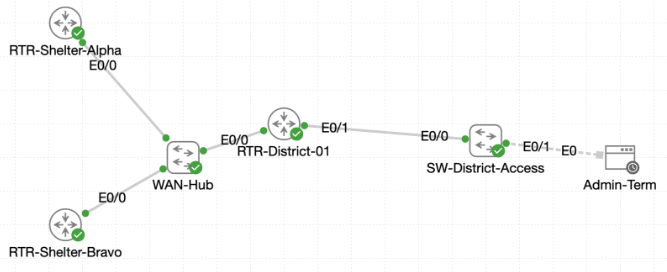

# Lab 070 - Securing Castle Rysen Services

<p class="back-link">
  <a href="../../Lab-index.html">← Back to Lab Index</a>
</p>

<table>
<tr>
<td colspan="2" valign="top">

# Objective

#### Align the Castle Rysen shelter routers and district router to Castle Rysen Standard Time.

#### Build a redundant NTP hierarchy using shelter loopbacks and distribute time services to the district network.

#### Configure local DNS and forwarding so Castle hostnames resolve across the shelter and district routers.

#### Deliver DHCP options for Admin and Patron VLANs, including gateway, DNS, domain name and NTP option 42.

#### Secure remote administration with SSH-only VTY access using local authentication.

#### Configure PAT so internal district subnets can reach external shelter-side services without exposing inside addressing.

</td>
</tr>

<tr>
<td valign="top">

</td>
</tr>
</table>

---

## Scenario

This skill lab brought together several Cisco IP services in one Castle Rysen deployment.

The environment used two shelter routers, one district aggregation router, one access switch and an admin terminal. The goal was to bring time, naming, addressing, remote access and outbound translation into a single hardened services build.

The lab was completed with a few simulator-specific adjustments. Static routing was needed on the shelter routers so they could reach the district NTP loopback, the district router access-facing parent interface had to be brought up, and a secondary address was added to the Admin subinterface so the simulated Plex record had a live reachable endpoint. The NTP section also showed emulator instability: the shelter routers eventually showed synchronized stratum-1 local-clock status, but the district router later reset its NTP association state and downstream NTP could not fully stabilize.

---

## Devices Used

| Device | Role |
| --- | --- |
| `RTR-Shelter-Alpha` | Primary shelter router, DNS/NTP authority, SSH-managed router |
| `RTR-Shelter-Bravo` | Secondary shelter router, DNS/NTP authority, SSH-managed router |
| `RTR-District-01` | District aggregation router, DNS/DHCP/NTP client, NAT edge, SSH-managed router |
| `SW-District-Access` | District access switch using DHCP, DNS and NTP services |
| `Admin-Term` | TinyCore Linux admin terminal used to validate SSH and Telnet behaviour |

---

## Addressing and Services Plan

| Device / Interface | Address / Service | Purpose |
| --- | --- | --- |
| `RTR-Shelter-Alpha Ethernet0/0` | `172.22.0.1` | Shelter Alpha link to district router |
| `RTR-Shelter-Alpha Loopback1` | `1.1.1.1/32` | Stable DNS/NTP address for Shelter Alpha |
| `RTR-Shelter-Bravo Ethernet0/0` | `172.22.0.5` | Shelter Bravo link to district router |
| `RTR-Shelter-Bravo Loopback1` | `2.2.2.2/32` | Stable DNS/NTP address for Shelter Bravo |
| `RTR-Shelter-Bravo Loopback10` | `198.51.100.10/32` | External test destination in the lab topology |
| `RTR-District-01 Ethernet0/0` | `172.22.0.2` | District uplink toward shelter routers / NAT outside |
| `RTR-District-01 Ethernet0/1.10` | `10.22.10.1/24` | Admin VLAN gateway / NAT inside |
| `RTR-District-01 Ethernet0/1.10 secondary` | `10.22.10.50/24` | Simulated Plex service endpoint for local DNS testing |
| `RTR-District-01 Ethernet0/1.20` | `10.22.20.1/24` | Patron VLAN gateway / NAT inside |
| `RTR-District-01 Loopback0` | `10.22.255.1/32` | District NTP source / stable services address |
| `SW-District-Access Vlan10` | `10.22.10.22` via DHCP | Switch management address |
| Castle DNS domain | `castlerysen.local` | Local DNS suffix |
| DNS record | `cafe1.castlerysen.local -> 172.22.0.2` | District router / cafe uplink record |
| DNS record | `plex.castlerysen.local -> 10.22.10.50` | Local Plex service record |
| SSH user | `jeremy` privilege 15 | Router and switch management account |
| SSH secret | `BeanR0ast!` | Local SSH authentication secret |

---

## Task 1 - Reclaim the Shelter Clocks

### Goal

Align both shelter routers to Castle Rysen Standard Time and confirm they no longer rely on the hardware calendar.

### Commands Used

```bash
clock timezone CRST -7
clock set 11:40:00 12 September 2024
show clock detail
```

### Evidence - Shelter Alpha

```bash
RTR-Shelter-Alpha#show clock detail
*13:23:44.789 UTC Mon Aug 24 2026
Time source is hardware calendar
```

After the manual clock configuration:

```bash
RTR-Shelter-Alpha#show clock detail
11:40:14.931 CRST Thu Sep 12 2024
Time source is user configuration
```

### Evidence - Shelter Bravo

```bash
RTR-Shelter-Bravo#show clock detail
*13:24:58.187 UTC Mon Aug 24 2026
Time source is hardware calendar
```

After the manual clock configuration:

```bash
RTR-Shelter-Bravo#show clock detail
11:40:53.308 CRST Thu Sep 12 2024
Time source is user configuration
```

### Result

Both shelter routers were moved from the default hardware calendar to manually configured Castle Rysen Standard Time using the `CRST` time-zone label.

---

## Task 2 - Build the Castle Time Grid

### Goal

Create resilient NTP sources on the shelter routers and configure the district router and switch to reference the time grid.

### Shelter Alpha Configuration

```bash
interface Loopback1
 ip address 1.1.1.1 255.255.255.255
exit
ntp source Loopback1
ntp master 1
```

### Shelter Alpha Verification

```bash
RTR-Shelter-Alpha#show ntp status
Clock is synchronized, stratum 1, reference is .LOCL.
```

```bash
RTR-Shelter-Alpha#show ip int brief
Loopback1              1.1.1.1         YES manual up                    up
```

### Shelter Bravo Configuration

```bash
interface Loopback1
 ip address 2.2.2.2 255.255.255.255
exit
ntp source Loopback1
ntp master 1
```

### Shelter Bravo Verification

```bash
RTR-Shelter-Bravo#show ntp status
Clock is synchronized, stratum 1, reference is .LOCL.
```

```bash
RTR-Shelter-Bravo#show ip int brief
Loopback1              2.2.2.2         YES manual up                    up
```

### District NTP Configuration

```bash
interface Loopback0
 ip address 10.22.255.1 255.255.255.255
exit
ntp server 1.1.1.1
ntp server 2.2.2.2
ntp source Loopback0
```

### District NTP Evidence

```bash
RTR-District-01#show ntp associations
  address         ref clock       st   when   poll reach  delay  offset   disp
*~1.1.1.1         .LOCL.           1     61     64    17  1.000 4721.50  3.017
x~2.2.2.2         .LOCL.           1     56     64     3  1.000 2157.50 64.463
```

Later in the lab, the district router's NTP process reset and returned to an unsynchronised state:

```bash
RTR-District-01#show ntp status
Clock is unsynchronized, stratum 16, no reference clock
```

### Switch NTP Evidence

```bash
SW-District-Access(config)#ntp server 10.22.10.1
```

```bash
SW-District-Access#show ntp associations
  address         ref clock       st   when   poll reach  delay  offset   disp
 ~10.22.10.1      .INIT.          16     25     64     0  0.000   0.000 15937.
```

### Result

The shelter routers successfully acted as local stratum-1 NTP masters sourced from Loopback1. The district router was configured with both shelter loopbacks and briefly showed upstream associations, but the simulator later reset the district NTP state. The switch could be configured to reference the district router, but it remained in `.INIT.` because the district NTP relationship did not remain stable in the emulator.

---

## Task 3 - Publish Castle DNS Authority

### Goal

Enable local DNS services on the shelter routers and district router so Castle hostnames can resolve internally.

### Shelter DNS Configuration

On both shelter routers:

```bash
ip domain name castlerysen.local
ip dns server
ip host cafe1.castlerysen.local 172.22.0.2
ip name-server 1.1.1.1
ip name-server 8.8.8.8
```

### Shelter DNS Verification

```bash
RTR-Shelter-Alpha#show hosts
Default domain is castlerysen.local
Name servers are 1.1.1.1, 8.8.8.8
NAME  TTL  CLASS   TYPE      DATA/ADDRESS
-----------------------------------------
 2.0.22.172.in-addr.arpa        10      IN      PTR     cafe1.castlerysen.local
 cafe1.castlerysen.local        10      IN      A       172.22.0.2
```

```bash
RTR-Shelter-Bravo#show hosts
Default domain is castlerysen.local
Name servers are 1.1.1.1, 8.8.8.8
NAME  TTL  CLASS   TYPE      DATA/ADDRESS
-----------------------------------------
 2.0.22.172.in-addr.arpa        10      IN      PTR     cafe1.castlerysen.local
 cafe1.castlerysen.local        10      IN      A       172.22.0.2
```

### District DNS Configuration

```bash
ip domain name castlerysen.local
ip dns server
ip name-server 1.1.1.1
ip name-server 2.2.2.2
ip host plex.castlerysen.local 10.22.10.50
```

### District DNS Verification

```bash
RTR-District-01#ping plex
Sending 5, 100-byte ICMP Echos to 10.22.10.50, timeout is 2 seconds:
!!!!!
Success rate is 100 percent (5/5)
```

```bash
RTR-District-01#ping cafe1
Sending 5, 100-byte ICMP Echos to 172.22.0.2, timeout is 2 seconds:
!!!!!
Success rate is 100 percent (5/5)
```

### Switch DNS Verification

```bash
SW-District-Access#show hosts
Default domain is castlerysen.local
Name servers are 10.22.255.1
```

```bash
SW-District-Access#ping plex.castlerysen.local
Sending 5, 100-byte ICMP Echos to 10.22.10.50, timeout is 2 seconds:
.!!!!
Success rate is 80 percent (4/5)
```

```bash
SW-District-Access#ping cafe1.castlerysen.local
Sending 5, 100-byte ICMP Echos to 172.22.0.2, timeout is 2 seconds:
!!!!!
Success rate is 100 percent (5/5)
```

### Result

DNS was enabled on the shelter routers and district router. The `cafe1.castlerysen.local` record resolved to the district uplink, and `plex.castlerysen.local` resolved to the simulated Plex endpoint. The switch successfully used the Castle domain suffix and district DNS server for name resolution.

---

## Task 4 - Deliver Addressing with Castle Options

### Goal

Update DHCP pools on the district router so Admin and Patron clients receive the correct default gateway, Castle DNS, domain suffix and NTP option.

### DHCP Configuration

```bash
ip dhcp excluded-address 10.22.10.1 10.22.10.20
ip dhcp excluded-address 10.22.20.1 10.22.20.20

ip dhcp pool ADMIN-NET
 network 10.22.10.0 255.255.255.0
 default-router 10.22.10.1
 domain-name castlerysen.local
 dns-server 10.22.10.1
 option 42 ip 10.22.255.1

ip dhcp pool PATRON-NET
 network 10.22.20.0 255.255.255.0
 default-router 10.22.20.1
 domain-name castlerysen.local
 dns-server 10.22.10.1
 option 42 ip 10.22.255.1
```

### Switch DHCP Lease Verification

```bash
SW-District-Access#show ip interface brief
Vlan10                 10.22.10.22     YES DHCP   up                    up
```

```bash
SW-District-Access#show dhcp lease
Temp IP addr: 10.22.10.22  for peer on Interface: Vlan10
Temp  sub net mask: 255.255.255.0
   DHCP Lease server: 10.22.10.1, state: 5 Bound
Temp default-gateway addr: 10.22.10.1
   Hostname: SW-District-Access
```

### Result

The DHCP pools were configured with the required Castle options. The access switch received an Admin VLAN address by DHCP and learned `10.22.10.1` as its default gateway. The raw switch lease output confirmed the address and gateway; the DHCP pool configuration confirmed the DNS, domain and option 42 settings.

---

## Task 5 - Harden Remote Access with SSH

### Goal

Enforce SSH-only management across the routers and switch using local authentication.

### Configuration Applied

The same management-plane hardening pattern was applied to the infrastructure devices:

```bash
username jeremy privilege 15 secret BeanR0ast!
crypto key generate rsa modulus 2048
ip ssh version 2
line vty 0 4
 transport input ssh
 login local
```

### Devices Hardened

| Device | SSH Key Evidence |
| --- | --- |
| `RTR-Shelter-Alpha` | RSA 2048-bit key generated and running config saved |
| `RTR-Shelter-Bravo` | RSA 2048-bit key generated and running config saved |
| `RTR-District-01` | RSA 2048-bit key generated and running config saved |
| `SW-District-Access` | RSA 2048-bit key generated and running config saved |

### SSH Validation

From `Admin-Term`, SSH was attempted to infrastructure devices using the `jeremy` account.

```bash
tc@admin-term:~$ ssh -l jeremy 172.22.0.1
```

The session reached `RTR-Shelter-Alpha`:

```bash
RTR-Shelter-Alpha#
```

Telnet to the district router was refused:

```bash
tc@admin-term:~$ telnet 172.22.0.2
telnet: can't connect to remote host (172.22.0.2): Connection refused
```

SSH to the district router was then attempted:

```bash
tc@admin-term:~$ ssh -l jeremy 172.22.0.2
```

The CLI returned to the `RTR-District-01#` prompt after authentication, demonstrating that SSH succeeded while Telnet was blocked.

### Result

VTY access was restricted to SSH with local login across the infrastructure devices. Telnet was rejected, and SSH sessions succeeded using the configured local user.

---

## Task 6 - Shield the District with NAT

### Goal

Use PAT on `RTR-District-01` so Admin and Patron networks can reach external services while sharing the district router's WAN address.

### NAT Configuration

```bash
interface Ethernet0/1.10
 ip nat inside
exit
interface Ethernet0/1.20
 ip nat inside
exit
interface Ethernet0/0
 ip nat outside
exit
access-list 1 permit 10.22.10.0 0.0.0.255
access-list 1 permit 10.22.20.0 0.0.0.255
ip nat inside source list 1 interface Ethernet0/0 overload
```

### Verification from Admin VLAN Source

```bash
RTR-District-01#ping 198.51.100.10 source 10.22.10.1
Packet sent with a source address of 10.22.10.1
!!!!!
Success rate is 100 percent (5/5)
```

### Verification from Patron VLAN Source

```bash
RTR-District-01#ping 198.51.100.10 source 10.22.20.1
Packet sent with a source address of 10.22.20.1
!!!!!
Success rate is 100 percent (5/5)
```

### NAT Translation Evidence

```bash
RTR-District-01#show ip nat translations
Pro Inside global      Inside local       Outside local      Outside global
icmp 172.22.0.2:1024   10.22.10.1:6       198.51.100.10:6    198.51.100.10:1024
icmp 172.22.0.2:1025   10.22.20.1:7       198.51.100.10:7    198.51.100.10:1025
```

### Result

PAT translated both Admin and Patron source traffic to the district WAN address `172.22.0.2`. The NAT table confirmed translations for both inside networks.

---

## Troubleshooting and Notes

### Static Routes Needed on Shelter Routers

Additional static routes were required on `RTR-Shelter-Alpha` and `RTR-Shelter-Bravo` so they could reach the district NTP loopback:

```bash
ip route 10.22.255.1 255.255.255.255 172.22.0.2
```

The routes were visible in each shelter routing table alongside the existing Admin and Patron routes.

---

### District Access Interface Was Initially Down

`RTR-District-01 Ethernet0/1` and its subinterfaces initially showed down/down:

```bash
Ethernet0/1            unassigned      YES unset  administratively down down
Ethernet0/1.10         10.22.10.1      YES TFTP   administratively down down
Ethernet0/1.20         10.22.20.1      YES TFTP   administratively down down
```

This was corrected with:

```bash
interface Ethernet0/1
 no shutdown
```

The subinterfaces then came up/up.

---

### Secondary Address Added for Plex Reachability

The lab topology did not provide a live Plex host at `10.22.10.50`, so a secondary IP address was added to `Ethernet0/1.10` to make the DNS record testable:

```bash
interface Ethernet0/1.10
 ip address 10.22.10.50 255.255.255.0 secondary
```

Earlier attempts to use a loopback or a `/32` secondary address failed because the address overlapped the existing Admin subnet or used an invalid mask for that subinterface context.

---

### NTP Emulator Behaviour

The shelter routers eventually showed synchronized stratum-1 status with `.LOCL.` selected. However, `RTR-District-01` repeatedly failed to maintain a stable NTP relationship with the shelter routers. Its associations later moved to `.STEP.` / reach 0 and the status returned to stratum 16.

This was recorded as an emulator limitation rather than a configuration-only failure, because the same router had previously shown association reachability and stratum-2 behaviour before the NTP process reset.

---

### NAT Command Capture Was Garbled, but Translation Worked

The raw CLI contains a pasted/mangled NAT command line:

```bash
RTR-District-01(config)#$de source list 1 interface Ethernet0/0 overload
```

The intended command was:

```bash
ip nat inside source list 1 interface Ethernet0/0 overload
```

The final NAT translation table confirmed that PAT was active and translating both Admin and Patron source traffic.

---

## Key Learning Points

* Accurate clock configuration matters before deploying NTP, logging, certificates and SSH.
* NTP does not distribute time-zone labels; each device still needs its local time zone configured.
* Loopbacks provide stable service endpoints for DNS and NTP.
* Cisco IOS can provide local DNS records with `ip dns server` and `ip host`.
* DHCP option 42 is used to distribute NTP server information.
* `show dhcp lease` may not expose every option even when the DHCP pool is configured correctly.
* SSH requires a hostname, domain name, local credentials, RSA keys and VTY transport policy.
* `transport input ssh` prevents Telnet from reaching the VTY lines.
* NAT overload allows multiple inside hosts or subnets to share one outside interface address.
* Simulator behaviour should be documented honestly when live state does not match expected protocol convergence.

---

## Completion Check

The lab was completed successfully with noted simulator limitations.

* `RTR-Shelter-Alpha` and `RTR-Shelter-Bravo` were aligned to Castle Rysen Standard Time.
* Both shelter routers had Loopback1 configured and up/up.
* Both shelter routers acted as local stratum-1 NTP masters sourced from Loopback1.
* `RTR-District-01` was configured with Loopback0 `10.22.255.1/32` and both shelter loopbacks as NTP servers.
* NTP instability on the district router and downstream switch was documented as an emulator limitation.
* DNS was enabled for the `castlerysen.local` domain.
* `cafe1.castlerysen.local` resolved to `172.22.0.2`.
* `plex.castlerysen.local` resolved to `10.22.10.50`.
* DHCP pools delivered Admin and Patron addressing information, including Castle domain, DNS server and option 42 in the pool configuration.
* `SW-District-Access` received `10.22.10.22` via DHCP on Vlan10.
* SSH-only remote management was configured and saved across the infrastructure devices.
* Telnet was rejected while SSH sessions succeeded.
* NAT inside/outside interfaces, ACL matching and PAT were configured on `RTR-District-01`.
* NAT translations were shown for both Admin and Patron source traffic toward `198.51.100.10`.
