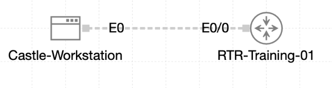

# Lab 071 - Configuring SNMPv2c and SNMPv3

<p class="back-link">
  <a href="../../Lab-index.html">← Back to Lab Index</a>
</p>

<table>
<tr>
<td colspan="2" valign="top">

# Objective

#### Audit the existing SNMP posture on `RTR-Training-01`.

#### Configure controlled SNMPv2c read-only and read-write communities using a management ACL.

#### Configure an SNMPv3 group and user using authentication and privacy.

#### Verify that the router advertises the expected SNMP communities, engine ID, SNMPv3 group, SNMPv3 user and packet counters.

</td>
</tr>

<tr>
<td valign="top">

</td>
</tr>
</table>

---

## Scenario

Castle Rysen required SNMP telemetry on `RTR-Training-01` so the management station could monitor router status securely.

The router initially had no active SNMP agent configuration. The lab introduced both SNMPv2c and SNMPv3:

* SNMPv2c was configured with read-only and read-write community strings.
* A standard ACL limited SNMPv2c access to the Castle management workstation.
* SNMPv3 was configured with a privacy-enabled group and a user using SHA authentication and AES-128 encryption.
* Verification commands confirmed the final communities, group, user and engine ID.

---

## Devices Used

| Device | Role |
| --- | --- |
| `RTR-Training-01` | Cisco router configured as the SNMP agent |
| Castle management workstation | SNMP management host at `10.23.0.50` |

---

## Addressing and Management Plan

| Item | Value |
| --- | --- |
| Router management interface | `Ethernet0/0` |
| Router management IP | `10.23.0.1/24` |
| SNMP management host | `10.23.0.50` |
| SNMP access ACL | `SNMP-MGMT` |
| SNMPv2c read-only community | `CSTL-RO` |
| SNMPv2c read-write community | `CSTL-RW` |
| SNMPv3 group | `CastleSecure` |
| SNMPv3 user | `JeremyOps` |
| Authentication protocol | `SHA` |
| Privacy protocol | `AES128` |

---

## Task 0 - Audit the SNMP Perimeter

### Step 1 - Verify the Management Interface

The first step was to confirm that `RTR-Training-01` was reachable on the management segment.

```bash
show ip interface brief | include Ethernet0/0
```

### Evidence

```bash
Ethernet0/0            10.23.0.1       YES TFTP   up                    up
```

### Explanation

`Ethernet0/0` was already configured with `10.23.0.1` and showed an `up/up` state.

---

### Step 2 - Test Reachability to the Management Host

The Castle management workstation was tested from the router.

```bash
ping 10.23.0.50
```

### Evidence

```bash
Sending 5, 100-byte ICMP Echos to 10.23.0.50, timeout is 2 seconds:
.!!!!
Success rate is 80 percent (4/5), round-trip min/avg/max = 1/1/1 ms
```

### Explanation

The first ICMP packet was lost while ARP resolved. The remaining packets succeeded, confirming management-segment reachability.

---

### Step 3 - Check the Existing SNMP State

The router was checked for any existing SNMP configuration.

```bash
show running-config | include snmp
show snmp
show snmp engineID
```

### Evidence

```bash
RTR-Training-01#show running-config | include snmp
RTR-Training-01#
RTR-Training-01#show snmp
%SNMP agent not enabled
RTR-Training-01#
RTR-Training-01#show snmp engineID
%SNMP agent not enabled
```

### Explanation

There was no existing SNMP configuration, and the SNMP agent was not enabled before the lab changes.

---

## Task 1 - Publish Controlled SNMPv2c Communities

### Step 4 - Create the SNMP Management ACL

A standard ACL was created to restrict SNMP access to only the Castle management workstation.

```bash
ip access-list standard SNMP-MGMT
 permit 10.23.0.50
```

### Evidence

```bash
ip access-list standard SNMP-MGMT
 10 permit 10.23.0.50
```

### Explanation

This ACL allows only `10.23.0.50` to use the configured SNMP community strings.

---

### Step 5 - Configure SNMPv2c Communities

The router was configured with one read-only and one read-write community string.

```bash
snmp-server community CSTL-RO ro SNMP-MGMT
snmp-server community CSTL-RW rw SNMP-MGMT
snmp-server contact bunker.noc@castlerysen.coffee
snmp-server location Castle Rysen Command Bunker
```

### Verification

```bash
show snmp community
show running-config | section snmp
```

### Evidence

```bash
Community name: CSTL-RO
Community Index: CSTL-RO
Community SecurityName: CSTL-RO
storage-type: nonvolatile        active access-list: SNMP-MGMT
```

```bash
Community name: CSTL-RW
Community Index: CSTL-RW
Community SecurityName: CSTL-RW
storage-type: nonvolatile        active access-list: SNMP-MGMT
```

```bash
snmp-server community CSTL-RO RO SNMP-MGMT
snmp-server community CSTL-RW RW SNMP-MGMT
snmp-server location Castle Rysen Command Bunker
snmp-server contact bunker.noc@castlerysen.coffee
```

### Explanation

Both SNMPv2c communities were active and bound to `SNMP-MGMT`.

`CSTL-RO` provides read-only access, while `CSTL-RW` provides read-write access. Both are restricted to the approved management host.

---

### Step 6 - Verify the SNMP Engine ID

After the SNMP configuration was applied, the router reported a local SNMP engine ID.

```bash
show snmp engineID
```

### Evidence

```bash
Local SNMP engineID: 800000090300AABBCC000100
```

### Explanation

The local SNMP engine ID is required for SNMPv3 operations and confirms that the SNMP agent is now active.

---

## Task 2 - Secure SNMPv3 Authentication and Privacy

### Step 7 - Configure the SNMPv3 Group

The SNMPv3 group was configured with privacy enabled.

```bash
snmp-server group CastleSecure v3 priv
```

### Verification

```bash
show snmp group | section CastleSecure
```

### Evidence

```bash
groupname: CastleSecure                     security model:v3 priv
```

### Explanation

The `CastleSecure` group uses SNMPv3 with privacy, meaning SNMPv3 users in this group must use both authentication and encryption.

---

### Step 8 - Configure the SNMPv3 User

The SNMPv3 user `JeremyOps` was configured under the `CastleSecure` group using SHA authentication and AES-128 privacy.

Expected configuration pattern:

```bash
snmp-server user JeremyOps CastleSecure v3 auth sha P@SSw0rd!23 priv aes 128 EncP@ss!23
```

### Verification

```bash
show snmp user JeremyOps
```

### Evidence

```bash
User name: JeremyOps
Engine ID: 800000090300AABBCC000100
storage-type: nonvolatile        active
Authentication Protocol: SHA
Privacy Protocol: AES128
Group-name: CastleSecure
```

### Explanation

The final verification confirmed that `JeremyOps` was active, assigned to `CastleSecure`, using SHA authentication and AES-128 privacy.

---

## Troubleshooting and Notes

### Group Name Case Sensitivity

An initial group was created as `castleSecure` with a lowercase `c`.

```bash
snmp-server group castleSecure v3 priv
```

The lab then removed that group and recreated it with the intended capitalization:

```bash
no snmp-server group castleSecure v3 priv
snmp-server group CastleSecure v3 priv
```

Final verification confirmed the intended group name:

```bash
groupname: CastleSecure                     security model:v3 priv
```

---

### SNMPv3 User Command Visibility

The raw CLI evidence shows the user command line partially/truncated during entry:

```bash
snmp-server user JeremyOps CastleSecure v3 auth sha P@$
```

However, the verification output confirms that the resulting SNMPv3 user was active, assigned to the correct group, and configured with the required SHA authentication and AES-128 privacy.

---

### SNMP Counters

The router displayed live SNMP counters after the SNMP agent was enabled.

```bash
0 SNMP packets input
    0 Bad SNMP version errors
    0 Unknown community name
    0 Illegal operation for community name supplied
    0 Encoding errors
0 SNMP packets output
    0 Bad values errors
SNMP global trap: disabled
SNMP logging: disabled
```

At the time of verification, the agent was enabled but no SNMP polling traffic had yet been received.

---

## Key Learning Points

* SNMP is not enabled by default until SNMP server configuration is added.
* SNMPv2c community strings should be restricted with ACLs.
* `RO` allows read-only monitoring; `RW` permits changes and must be protected carefully.
* `snmp-server contact` and `snmp-server location` improve operational documentation.
* SNMPv3 is more secure than SNMPv2c because it supports authentication and privacy.
* SNMPv3 group names are case-sensitive in practice and should be kept consistent.
* `show snmp user` is the key verification command for authentication and privacy settings.
* `show snmp engineID` confirms the local SNMP engine used for SNMPv3.

---

## Completion Check

The lab was completed successfully.

* `Ethernet0/0` remained `up/up` with IP address `10.23.0.1`.
* The router successfully reached the management host `10.23.0.50`.
* The initial SNMP audit confirmed the SNMP agent was not enabled.
* ACL `SNMP-MGMT` was created to permit only `10.23.0.50`.
* SNMPv2c communities `CSTL-RO` and `CSTL-RW` were configured and bound to `SNMP-MGMT`.
* Contact and location fields were added for Castle Rysen operations records.
* The SNMP engine ID was generated and visible.
* SNMPv3 group `CastleSecure` was configured with `v3 priv`.
* SNMPv3 user `JeremyOps` was verified with SHA authentication and AES-128 privacy.
* SNMP statistics were visible, confirming the SNMP agent was active.
