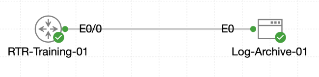

# Lab 072 - Understanding and Configuring Syslog

<p class="back-link">
  <a href="../../Lab-index.html">← Back to Lab Index</a>
</p>

<table>
<tr>
<td colspan="2" valign="top">

# Objective

#### Interpret live Cisco syslog messages by identifying timestamp format, facility mnemonic and severity level.

#### Enable buffered logging on `RTR-Training-01` with millisecond timestamps.

#### Forward informational-and-higher syslog messages to a remote archive host.

#### Verify that interface change events are visible both locally in the router buffer and remotely on `Log-Archive-01`.

</td>
</tr>

<tr>
<td valign="top">

</td>
</tr>
</table>

---

## Scenario

Castle Rysen needed reliable logging from `RTR-Training-01` so the bunker team could review recent router events locally and preserve important messages on a remote archive host.

The lab focused on three syslog skills:

* Reading live console syslog messages and identifying their structure.
* Enabling a larger local buffered log with date, time and millisecond timestamps.
* Exporting syslog messages to `Log-Archive-01` over UDP port 514 and proving the remote host captured generated interface events.

The remote Linux archive image did not include a running `rsyslogd` service, so a BusyBox `nc` UDP listener was used to capture syslog traffic into `/tmp/syslog-capture.log`.

---

## Devices Used

| Device | Role |
| --- | --- |
| `RTR-Training-01` | Router generating local and remote syslog messages |
| `Log-Archive-01` | Linux syslog archive host / UDP listener |

---

## Addressing and Logging Plan

| Item | Value |
| --- | --- |
| Router management interface | `Ethernet0/0` |
| Router management IP | `10.23.0.10` |
| Remote syslog collector | `10.23.0.60` |
| Syslog transport | UDP |
| Syslog port | `514` |
| Logging source interface | `Ethernet0/0` |
| Buffered logging size | `32000` bytes |
| Buffered/trap severity | `informational` |
| Timestamp format | `datetime msec` |
| Interface used to generate test alert | `Ethernet0/1` |

---

## Syslog Message Format Observed

A Cisco IOS syslog message follows a predictable structure:

```text
*Aug 24 20:41:12.479: %SYS-5-CONFIG_I: Configured from console by console
```

| Field | Example | Meaning |
| --- | --- | --- |
| Timestamp | `*Aug 24 20:41:12.479` | Date and time of event, with milliseconds after timestamping was enabled |
| Facility | `SYS` | IOS subsystem that generated the message |
| Severity | `5` | Notification-level severity |
| Mnemonic | `CONFIG_I` | Short event identifier |
| Message text | `Configured from console by console` | Human-readable event description |

The lab also showed these useful examples:

| Message | Facility | Severity | Meaning |
| --- | --- | --- | --- |
| `%SYS-5-CONFIG_I` | `SYS` | `5` | Configuration changed |
| `%SYS-6-LOGGINGHOST_STARTSTOP` | `SYS` | `6` | Syslog host started/reconnected |
| `%LINK-3-UPDOWN` | `LINK` | `3` | Interface physical state changed |
| `%LINEPROTO-5-UPDOWN` | `LINEPROTO` | `5` | Interface line protocol state changed |

---

## Task 0 - Read the Router's Pulse

### Step 1 - Trigger and Observe a Live Syslog Message

The router was moved into configuration mode and then returned to privileged EXEC mode to trigger a fresh configuration message.

```bash
configure terminal
exit
```

### Evidence

```bash
RTR-Training-01(config)#exit
RTR-Training-01#
*Aug 24 20:41:12.479: %SYS-5-CONFIG_I: Configured from console by console
```

### Explanation

This message showed the facility, severity and mnemonic clearly:

* Facility: `SYS`
* Severity: `5`
* Mnemonic: `CONFIG_I`
* Meaning: a configuration action was completed from the console

---

### Step 2 - Confirm Interface State

The router management interface and test interface were checked.

```bash
show ip int brief | include Ethernet0/0|Ethernet0/1
```

### Evidence

```bash
Ethernet0/0            10.23.0.10      YES TFTP   up                    up      
Ethernet0/1            unassigned      YES unset  administratively down down
```

### Explanation

`Ethernet0/0` was active and used as the syslog source interface. `Ethernet0/1` started administratively down and was later used to generate interface state-change messages.

---

### Step 3 - Review Existing Logging State

The router's logging status was reviewed.

```bash
show logging | begin Syslog logging
```

### Evidence

```bash
Syslog logging: enabled (0 messages dropped, 2 messages rate-limited, 0 flushes, 0 overruns, xml disabled, filtering disabled)
```

```bash
Console logging: level debugging, 43 messages logged, xml disabled,
Monitor logging: level debugging, 0 messages logged, xml disabled,
Buffer logging:  level debugging, 43 messages logged, xml disabled,
Trap logging: level informational, 45 message lines logged
```

### Explanation

Syslog was already enabled, but the lab required explicit timestamp configuration, a larger local buffer, and remote forwarding to the archive host.

---

## Task 1 - Turn Up the Local Recorder

### Step 4 - Enable Millisecond Timestamps and Buffered Logging

The router was configured to timestamp log messages with date, time and millisecond precision. Buffered logging was set to `32000` bytes at informational severity.

```bash
configure terminal
service timestamps log datetime msec
logging buffered 32000 informational
end
```

### Evidence

```bash
RTR-Training-01(config)#service timestamps log datetime msec
RTR-Training-01(config)#logging buffered 32000 informational
```

The router immediately logged the buffer configuration change:

```bash
*Aug 24 20:43:21.265: %SYS-5-LOG_CONFIG_CHANGE: Buffer logging: level informational, xml disabled, filtering disabled, size (32000)
```

---

### Step 5 - Verify the Buffer

```bash
show logging | include Buffer logging
show logging | include LOG_CONFIG_CHANGE|CONFIG_I
```

### Evidence

```bash
Buffer logging:  level informational, 2 messages logged, xml disabled,
```

```bash
*Aug 24 20:43:21.265: %SYS-5-LOG_CONFIG_CHANGE: Buffer logging: level informational, xml disabled, filtering disabled, size (32000)
*Aug 24 20:43:23.068: %SYS-5-CONFIG_I: Configured from console by console
```

### Explanation

The local buffer was active and captured recent configuration messages with millisecond timestamps.

---

## Task 2 - Stream Events to Log-Archive-01

### Step 6 - Start a UDP Listener on the Archive Host

The first login attempt to `Log-Archive-01` with the `cisco` account failed, so the host was accessed with the `tc` account.

A BusyBox `nc` UDP listener was started on `10.23.0.60` port `514`, writing received data to `/tmp/syslog-capture.log`.

```bash
sudo killall nc>/dev/null || true
sudo sh -c "rm -f /tmp/syslog-capture.log; nc -u -l -s 10.23.0.60 -p 514 > /tmp/syslog-capture.log &"
netstat -anu | grep 514
```

### Evidence

```bash
udp        0      0 10.23.0.60:514          0.0.0.0:*
```

### Explanation

This confirmed that `Log-Archive-01` was listening for UDP syslog messages on port `514`.

---

### Step 7 - Configure Remote Syslog on the Router

The router was configured to forward syslog messages to `10.23.0.60`, send informational-and-higher severity messages, and use `Ethernet0/0` as the logging source interface.

```bash
configure terminal
logging host 10.23.0.60 transport udp port 514
logging trap informational
logging source-interface Ethernet0/0
end
```

### Evidence

```bash
RTR-Training-01(config)#logging host 10.23.0.60 transport udp port 514
RTR-Training-01(config)#logging trap informational
RTR-Training-01(config)#logging source-interface Ethernet0/0
```

The router reported that logging to the remote host had started:

```bash
*Aug 24 20:49:27.028: %SYS-6-LOGGINGHOST_STARTSTOP: Logging to host 10.23.0.60 port 514 started - CLI initiated
```

---

### Step 8 - Generate Interface Change Messages

`Ethernet0/1` was shut down and then brought back up to generate interface state changes.

```bash
interface Ethernet0/1
shutdown
end
```

```bash
interface Ethernet0/1
no shutdown
end
```

### Evidence

```bash
*Aug 24 20:51:02.842: %LINK-3-UPDOWN: Interface Ethernet0/1, changed state to up
*Aug 24 20:51:03.842: %LINEPROTO-5-UPDOWN: Line protocol on Interface Ethernet0/1, changed state to up
```

### Explanation

These messages confirmed that the physical link and line protocol changes were logged locally after the interface flap.

---

### Step 9 - Verify Remote Logging Configuration

```bash
show logging | include 10.23.0.60
show running-config | include logging
```

### Evidence

```bash
Logging to 10.23.0.60  (udp port 514, audit disabled,
*Aug 24 20:49:26.028: %SYS-6-LOGGINGHOST_STARTSTOP: Logging to host 10.23.0.60 port 0 CLI Request Triggered
*Aug 24 20:49:27.028: %SYS-6-LOGGINGHOST_STARTSTOP: Logging to host 10.23.0.60 port 514 started - CLI initiated
*Aug 24 20:50:04.701: %SYS-6-LOGGINGHOST_STARTSTOP: Logging to host 10.23.0.60 port 514 started - reconnection
```

```bash
logging buffered 32000 informational
logging source-interface Ethernet0/0
logging host 10.23.0.60
```

---

### Step 10 - Confirm Messages Arrived on Log-Archive-01

The archive file was checked on the Linux host.

```bash
cat /tmp/syslog-capture.log
```

### Evidence

```bash
<189>50: *Aug 24 20:49:58.701: %SYS-5-CONFIG_I: Configured from console by console
<190>51: *Aug 24 20:50:04.701: %SYS-6-LOGGINGHOST_STARTSTOP: Logging to host 10.23.0.60 port 514 started - reconnection
<189>52: *Aug 24 20:50:21.655: %SYS-5-CONFIG_I: Configured from console by console
<187>53: *Aug 24 20:51:02.842: %LINK-3-UPDOWN: Interface Ethernet0/1, changed state to up
<189>54: *Aug 24 20:51:02.946: %SYS-5-CONFIG_I: Configured from console by console
<189>55: *Aug 24 20:51:03.842: %LINEPROTO-5-UPDOWN: Line protocol on Interface Ethernet0/1, changed state to up
```

### Explanation

The remote capture included configuration messages, logging host reconnection messages, and the interface up/line protocol up messages. This confirmed that syslog forwarding from the router to `Log-Archive-01` was working.

---

## Troubleshooting and Notes

### Log-Archive-01 Login

The initial login attempt with username `cisco` failed:

```bash
Log-Archive-01 login: cisco
Password: 
Login incorrect
```

The `tc` account was then used successfully.

---

### BusyBox `nc` Used Instead of Full Syslog Daemon

The lab notes specified that the live server image did not include a running `rsyslogd` service. A UDP `nc` listener was therefore used to capture syslog traffic:

```bash
nc -u -l -s 10.23.0.60 -p 514 > /tmp/syslog-capture.log &
```

This was sufficient to prove that messages were leaving the router and arriving at the archive host.

---

### Interface Shutdown Message

`Ethernet0/1` was already administratively down at the start of the lab:

```bash
Ethernet0/1            unassigned      YES unset  administratively down down
```

As a result, the most useful generated evidence was the later `no shutdown` event, which produced both `%LINK-3-UPDOWN` and `%LINEPROTO-5-UPDOWN` messages.

---

## Key Learning Points

* Cisco syslog messages include a timestamp, facility, severity number, mnemonic and descriptive text.
* Severity numbers range from `0` to `7`; lower numbers are more severe.
* `%SYS-5-CONFIG_I` indicates a configuration event.
* `%LINK-3-UPDOWN` indicates a physical interface state change.
* `%LINEPROTO-5-UPDOWN` indicates a line protocol state change.
* `service timestamps log datetime msec` adds precise timestamps suitable for event correlation.
* `logging buffered 32000 informational` stores recent informational-and-more-severe messages locally.
* `logging host` exports log messages to a remote collector.
* `logging source-interface` makes the sending address predictable for the logging server.
* A simple UDP listener can validate remote syslog delivery in a lab when a full syslog daemon is unavailable.

---

## Completion Check

The lab was completed successfully.

* Live console messages were captured and interpreted.
* Facility mnemonics such as `SYS`, `LINK` and `LINEPROTO` were identified.
* Severity levels such as `3`, `5` and `6` were observed in real messages.
* Buffered logging was configured with a `32000` byte buffer.
* Log timestamps were configured with millisecond precision.
* The router was configured to forward informational syslog messages to `10.23.0.60`.
* Syslog messages were sourced from `Ethernet0/0`.
* `Log-Archive-01` listened on UDP port `514`.
* Interface change messages were present in both the router log output and `/tmp/syslog-capture.log`.
