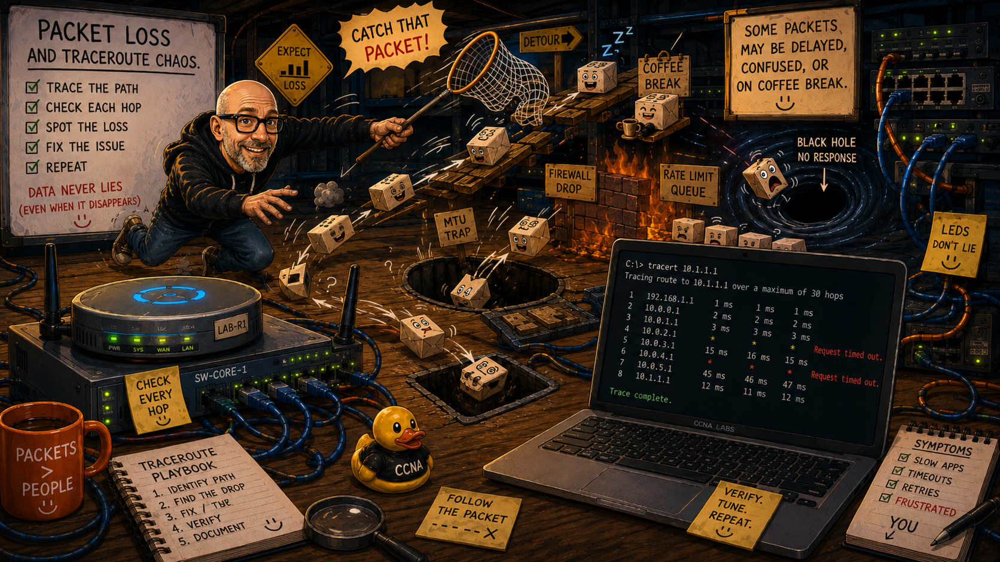

# CCNA Learning Path

<table>
<tr>
<td valign="top">

This document outlines the structured resources I am using to study for the CCNA certification and build practical networking skills.

</td>
</tr>
<tr>

<td valign="top">

</td>

</tr>
</table>

## Current Study Plan

**I am currently following a combination of:**

- NetworkChuck Academy (Summer of CCNA)
- Jeremy’s IT Lab structured CCNA course
- Cisco official documentation and learning resources
- Hands-on lab practice using Cisco Packet Tracer / CLI emulators

---

## Study Approach

**My learning approach is:**

1. Watch structured video lessons
2. Take notes and summarise concepts
3. Apply concepts in hands-on labs
4. Document configuration and troubleshooting
5. Reinforce learning through repetition

---

## Goal

**To develop strong foundational networking knowledge aligned with CCNA exam objectives and real-world networking skills.**
